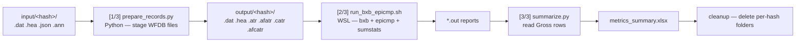

# HES FDA Validation — from zero to advanced

> Companion to [tool-hes-validation.md](../pdf/tool-check-overhead/md/tool-hes-validation.md) (HES FDA Toolkit — Usage Guide, v1.0, Hau Pham).
> That document is the *user manual*. This one is the *explainer*: it assumes you know nothing about ECG, EC57, or the toolkit, and walks from the basic ideas up to the internals.
>
> **Two code generations exist.** The guide describes the **UI toolkit** (one `run.bat`, seven tabs). This repo contains the **CLI ancestor** of its Validate tab: [hes-fda-validation/validation-tool/](../../hes-fda-validation/validation-tool/) (driven by `config.json` instead of UI fields) and [hes-fda-validation/cut-ann/](../../hes-fda-validation/cut-ann/). Everything in *Part 5 — Under the hood* is read out of that source, so it is verified behaviour, not guesswork. Where the UI could plausibly have changed something, it is flagged.

---

## Table of contents

- [0. TL;DR](#0-tldr)
- [Part 1 — Background from zero](#part-1--background-from-zero)
- [Part 2 — The data](#part-2--the-data)
- [Part 3 — The metrics, from first principles](#part-3--the-metrics-from-first-principles)
- [Part 4 — The toolkit, tab by tab](#part-4--the-toolkit-tab-by-tab)
- [Part 5 — Under the hood](#part-5--under-the-hood)
- [Part 6 — Dataset curation and the FDA story](#part-6--dataset-curation-and-the-fda-story)
- [Part 7 — Recipes, pitfalls, troubleshooting](#part-7--recipes-pitfalls-troubleshooting)
- [Part 8 — Glossary and cheat sheets](#part-8--glossary-and-cheat-sheets)

---

## 0. TL;DR

**HES** is the arrhythmia algorithm that runs *on the BTCY device*. To submit it to the FDA, you must prove — with numbers, on a fixed dataset, using a published standard — that it finds heartbeats correctly and finds atrial fibrillation correctly.

The standard is **ANSI/AAMI EC57:1998**. The scoring programs are **`bxb`, `epicmp`, `sumstats`** from the **WFDB 10.7.0** package (Linux binaries, hence WSL Ubuntu). The toolkit is the wrapper that:

1. takes an ECG event + what the device said + what a human said,
2. converts both into the WFDB annotation format those binaries understand,
3. runs them, and
4. pools the raw counts into one table of twelve percentages.

Everything else in the toolkit exists to *feed* or *curate* that comparison: rebuild missing device annotations (**Cut ann**), push device results back to the review portal (**Ann to device**), classify events by rhythm (**Event types**), pool six sub-runs into one (**Merge**), select a defensible subset (**Filter**), and report heart rate (**HR report**).

The locked result for the 900-event FDA set:

| Strip | Q_Se | Q_+P | V_Se | V_+P | S_Se | S_+P | E_Se | E_+P | D_Se | D_+P | D_Spec | D_NPV |
| --- | --- | --- | --- | --- | --- | --- | --- | --- | --- | --- | --- | --- |
| 900 | 97.04 | 98.43 | 82.41 | 14.74 | 23.39 | 9.85 | 96.5 | 97.31 | 95.54 | 95.59 | 85.68 | 85.54 |

---

## Part 1 — Background from zero

### 1.1 What is being tested

An ECG (electrocardiogram) is a voltage-vs-time signal from the heart. Digitised, it is just a long array of numbers; position in that array is a **sample index**, and dividing by the **sampling frequency** gives seconds.

Two things must be extracted from that signal:

- **Beats** — where each heartbeat is (a *sample index*), and what kind it is (normal, ventricular ectopic, supraventricular ectopic).
- **Rhythm episodes** — stretches of time in an abnormal rhythm. The one that matters here is **AFIB** (atrial fibrillation), which has a *start* and a *stop*.

**HES** is the firmware algorithm that does this on the device, in real time. Validation asks one question: *does HES agree with a human expert?*


The same ECG record goes down two paths — HES on the device, and a technician reviewing it — and the two annotation sets are compared.

### 1.2 Reference vs test — the single most important idea

Every metric in this document is built from comparing **two annotation sets over the same ECG**:

| Role | Also called | What it is | Where it lives |
| --- | --- | --- | --- |
| **Reference** | ground truth, "truth", ref | What we *declare* to be correct | The event `.json` — `strip` (technician) or `aiPrediction` (AI) |
| **Test** | actual, algorithm output | What HES on the device produced | The event `.ann` file |

The reference is a *choice*, set by the **SourceVerify** parameter:

- **`Tech`** — the reference is a human technician's review. This is the real ground truth, used for the FDA submission.
- **`AI`** — the reference is the backend AI's annotation. Not truth, but available immediately for thousands of events. Used during early iteration to find weak spots without waiting weeks for human review.

Everything downstream is identical; only which JSON section is read changes.

### 1.3 Who does what


| Actor | Role |
| --- | --- |
| **Backend (BE) team** | Owns the event database and the ECG labeling portal. Exports event datasets (`.dat/.hea/.json`) and the study `.anb` files. |
| **Firmware (FW) team** | Owns HES and this toolkit. Runs the EC57 comparison, curates the dataset, reports metrics. |
| **Technician** | A trained human who reviews events on the portal and produces the reference annotation. Slow and expensive — hence the AI phase first. |

The process is a **loop, in two phases**:

- **Phase 1 — validate against AI.** Cheap and fast. Run EC57 with `SourceVerify = AI`, look at where HES is weak, filter/drop bad events, and iterate until the candidate set looks sound. Output: a **locked event set**.
- **Phase 2 — validate against the technician.** The locked set goes onto the labeling portal; technicians annotate it; those annotations come back and become the reference. Re-run EC57 with `SourceVerify = Tech`. If the result is good *and* there are enough events, done. If not enough events, BE searches for more and the loop repeats.

### 1.4 Why EC57 and not "just compute accuracy"

FDA submissions for arrhythmia algorithms are expected to follow **ANSI/AAMI EC57** — a published standard that fixes *exactly* how you score a beat detector and a rhythm detector: what counts as a match, which beat classes are reported, how per-record results are aggregated. Using it means the numbers are comparable with every other device and are not something the vendor invented.

The standard's reference implementation is the **WFDB software package** (PhysioNet). Three programs do all the arithmetic:

| Program | Compares | Produces |
| --- | --- | --- |
| **`bxb`** | beat annotations, one beat at a time | per-record confusion matrix + Q/V/S sensitivity and positive predictivity |
| **`epicmp`** | rhythm-episode annotations | per-record AFIB episode counts and AFIB duration |
| **`sumstats`** | the per-record report files above | the aggregate `Sum` / `Gross` / `Average` rows |

They are Linux command-line tools, which is the entire reason **WSL Ubuntu-22.04** is a prerequisite. The toolkit never re-implements their maths; it prepares their input, runs them, and reads their output.

---

## Part 2 — The data

### 2.1 An "event" and its four files

The unit of work is an **event**: one ECG strip, typically about **10 minutes** long, from one patient study. On disk each event is a folder whose name is a **record hash** (or eventId), containing exactly four files:

| File | Produced by | What it holds |
| --- | --- | --- |
| `.dat` | BE export | the raw ECG samples |
| `.hea` | BE export | WFDB header — record name, sampling frequency, format, number of samples. It *describes* the `.dat`. |
| `.json` | BE export | event metadata as shown on the labeling portal: the **AI** annotation and the **technician** annotation |
| `.ann` | the **device** | beats + AFIB produced by **HES running on the device** |


An event folder missing any of the four cannot be scored. (The Cut ann tab exists precisely because `.ann` is usually the missing one — see [§4.3](#43-cut-ann-tab).)

### 2.2 Inside the `.json` — the reference

Two sibling sections carry annotations, with the same shape:

```jsonc
{
  "friendlyId": "...",                  // human-readable event id
  "realtimeData": { "samplingFrequency": 250 },
  "strip": {                            // TECHNICIAN — used when SourceVerify = Tech
    "beats":         [ 312, 566, 820, ... ],   // sample indices
    "hesBeatStatus": [ 1, 1, 60, ... ],        // per-beat class, same length
    "rhythm": [
      { "type": "AFIB", "isDeleted": false, "start": 47, "stop": 149942 }
    ],
    "interpretation": "Atrial Fibrillation/Flutter"
  },
  "aiPrediction": { /* same fields — used when SourceVerify = AI */ }
}
```

Reading rules used by the pipeline:

- `beats` and `hesBeatStatus` are **parallel arrays**; if lengths differ they are truncated to the shorter one.
- `hesBeatStatus` maps to a beat class: **`1 → N`**, **`60 → V`**, **`70 → S`**, anything else → `N`.
- Only `rhythm` entries with `type == "AFIB"` **and** `isDeleted != true` count. Overlapping episodes are merged; a reversed `start`/`stop` pair is swapped.
- `interpretation` is free text written by the reviewer — it drives the **Event types** classification, not the scoring.

### 2.3 Inside the `.ann` — the device output

A tab-separated text file with a header row and a trailing `End` row:

```
Time  SampleCnt  DetectedBeatSample  HesBeatStatus  HesEventSampleDiff  HesEventStatus  HesEventStatus2  HesMeanRrInSamples  HeartRate
...
End   End        End                 End            End                 End             End             End                 End
```

Only three columns matter:

| Column | Use |
| --- | --- |
| `DetectedBeatSample` | the beat's sample index |
| `HesBeatStatus` | beat class — same `1 / 60 / 70 → N / V / S` mapping |
| `HesEventStatus` | hex bitmask; **AFIB is active when `status & 0x0f00 == 0x0800`** |

Parsing rules: rows that are malformed or start with `End` are skipped; if the same `DetectedBeatSample` appears twice, **the last occurrence wins**; the result is sorted by sample index.

A file with a header and no data rows is a **blank `.ann`** — the device detected nothing on that strip. That case is counted and, with `RemoveBlankAnn = on`, the event is dropped instead of being scored as "missed every beat".

### 2.4 Sample frames — the 200 Hz / 250 Hz conversion

This trips everyone up once.

- The reference (`.json` beats, `rhythm.start/stop`) is in the **record's** sample frame, read from `realtimeData.samplingFrequency`, **250 Hz** in practice.
- The device emits `DetectedBeatSample` in **200 Hz** firmware ticks.

So every device sample is rescaled before comparison:

```
sample_250 = sample_200 * 250 // 200
```

Sanity check: the JSON snippet above ends an AFIB episode at sample `149942`; at 250 Hz that is 599.8 s ≈ the 10-minute strip length. The same event in device ticks ends near 120 000 — which is why the Cut ann tool discards any beat whose recomputed sample is `<= 0` or `> 120000`.

> ⚠️ **Discrepancy worth checking.** The usage guide's input table calls `.dat` "raw ECG samples (**200 Hz**)". The CLI source in this repo treats the `.dat`/JSON frame as **250 Hz** (`fs` is read from `realtimeData.samplingFrequency`, default 250) and rescales the device's 200 Hz `.ann` up to it — see [parse_ann.py:32-36](../../hes-fda-validation/validation-tool/src/parse_ann.py#L32-L36) and [prepare_records.py](../../hes-fda-validation/validation-tool/src/prepare_records.py). The HR formula in the guide (`60/mean(RR/250)`) also implies 250 Hz. Treat the "200 Hz" line in the guide as describing the device tick rate, not the record.

### 2.5 How a dataset folder is organised

```
<dataset>/
  validate_config.json       <- optional; pre-fills the UI parameters
  exclude_records.txt        <- optional; at most ONE .txt, manual exclusions
  <hash-1>/  {.dat .hea .json .ann}
  <hash-2>/  {.dat .hea .json .ann}
  ...
```

`exclude_records.txt` is a plain list of record hashes, one or more per line (comma/semicolon separated), `#` starts a comment. Comment headers double as **categories** — `# Low Amplitude`, `# Wrong Label`, `# Miss AFib`, `# Other Symptoms`, `# Low AFib Duration` — and every hash under a header inherits that category, which then appears in the report so exclusions are auditable. More than one `.txt` in the folder is a hard error, by design.

---

## Part 3 — The metrics, from first principles

### 3.1 The matching game

Take one event. The reference says beats are at certain times; the device says beats are at other times. Line the two up and pair each device beat with a reference beat **if they are within ±`BeatErr` seconds of each other** (default **0.15 s**). Then:

| Outcome | Meaning |
| --- | --- |
| **TP** (true positive) | a device beat matched to a reference beat — correct detection |
| **FP** (false positive) | a device beat with no reference beat nearby — a false detection |
| **FN** (false negative) | a reference beat with no device beat nearby — a missed beat |


There is no "TN" for beats: you cannot count the infinite number of places where neither side put a beat. (TN reappears for AFIB *duration*, where time is finite — see [§3.5](#35-the-negative-side-specificity-and-npv).)


`BeatErr` is the half-width of that window. Widen it and marginal detections start counting as TP; narrow it and correct-but-slightly-late detections become FP **and** FN at once (double penalty). 0.15 s is `bxb`'s own default and is what EC57 work uses — do not tune it to make numbers look better.

### 3.2 Sensitivity and positive predictivity

Two ratios are computed from those three counts. The distinction is the whole game:

```
Se  (sensitivity)          = TP / (TP + FN)     "of everything that was really there, how much did we find?"
+P  (positive predictivity) = TP / (TP + FP)    "of everything we claimed, how much was really there?"
```

Notice the denominators: **Se is judged against the reference, +P against the device's own output.** A detector that marks a beat every 100 ms would have near-perfect Se and terrible +P; a detector that reports only one very obvious beat would have perfect +P and terrible Se. Both are needed.

### 3.3 Beat classes — Q, V, S

EC57 does not just ask "was there a beat", it asks "was it the right *kind* of beat". Four gradings are reported:

| Class | Meaning |
| --- | --- |
| **N** | normal beat |
| **V** | ventricular ectopic beat (PVC) |
| **S** | supraventricular ectopic beat (PAC) |
| **Q** | *all* beats, regardless of class — pure detection performance |

which yields six numbers:

| Metric | Formula | Reads as |
| --- | --- | --- |
| **Q_Se** | TP / (TP + FN) | of all reference beats, how many did the device find |
| **Q_+P** | TP / (TP + FP) | of all device beats, how many were real |
| **V_Se** | VTP / (VTP + VFN) | of reference V beats, how many were called V |
| **V_+P** | VTP / (VTP + VFP) | of device V calls, how many were really V |
| **S_Se** | STP / (STP + SFN) | of reference S beats, how many were called S |
| **S_+P** | STP / (STP + SFP) | of device S calls, how many were really S |

**Why the 900-set V/S numbers look alarming.** `V_+P = 14.74` and `S_+P = 9.85` are not typos. V and S beats are *rare* relative to N beats, so their denominators are small: a handful of N beats mislabelled V produces a large FP count relative to a small VTP, and the ratio collapses. Q_Se/Q_+P near 97–98 % says beat *detection* is solid; the V/S columns say beat *classification* is the weak axis.

### 3.4 AFIB — two levels of scoring

AFIB is scored twice, at two different granularities, and both are reported.

**Episode level.** Each AFIB episode in the reference and each in the device output is one object. An episode is a **TP if it overlaps** a reference episode, **FN** if a reference episode has no overlapping device episode, and **FP** if a device episode overlaps nothing.


**Duration level.** Forget episodes; walk the strip second by second and label each second TP / FN / FP by whether each side called it AFIB.


| Metric | Level | Formula | Reads as |
| --- | --- | --- | --- |
| **E_Se** | episode | detected / reference | share of real AFIB episodes the device caught |
| **E_+P** | episode | true detected / detected | share of the device's episodes that were real |
| **D_Se** | duration | TP / (TP + FN) | share of true AFIB *time* the device flagged |
| **D_+P** | duration | TP / (TP + FP) | share of the device's AFIB *time* that was true |

The two levels answer different questions. A device that catches every episode but only marks the first 10 seconds of each has excellent E_Se and poor D_Se. A device that fires one long AFIB block across two real episodes can score well on duration while the episode count is wrong.

### 3.5 The negative side — specificity and NPV

For duration only, the fourth cell of the confusion matrix exists: **TN** = time that *both* sides agree is **not** AFIB. That enables the two "negative" metrics:


| Metric | Formula | Denominator is | Reads as |
| --- | --- | --- | --- |
| **D_Spec** (specificity) | TN / (TN + FP) | the **reference's** non-AFIB time | of the truly non-AFIB time, how much did the device correctly leave alone |
| **D_NPV** (negative predictive value) | TN / (TN + FN) | the **device's** non-AFIB time | of the time the device called non-AFIB, how much really was |

Same relationship as Se vs +P, mirrored onto the negative class. They matter because Se and +P alone can be gamed by declaring AFIB everywhere — that costs you specificity immediately.

The Validate tab has a switch, **"Spec/NPV on AFIB records only"**. It decides whether records with no reference AFIB at all contribute their (large, easy) TN time. Including them inflates specificity, because a Sinus strip is trivially "correctly non-AFIB" for its entire length. Keep the setting consistent across every run you intend to merge.

### 3.6 Gross, not average — read this twice

Every number in every report is **gross (pooled)**: sum the raw counts across **all** records first, then take **one** ratio. Never average per-record percentages.

| Record | TP | FN | per-record Q_Se |
| --- | --- | --- | --- |
| A | 90 | 10 | 90.0 % |
| B | 990 | 10 | 99.0 % |
| **Gross** | **1080** | **20** | **1080 / 1100 = 98.2 %** |

The average of the two percentages is 94.5 %; the gross is 98.2 %. Averaging would let a 20-beat record outweigh a 2 000-beat one, and a record with no reference beats has no percentage to average at all.

This is why the **Merge** and **Filter** tabs re-pool raw counts from the per-record sheets instead of averaging the summary percentages — and why you cannot reproduce a merged result by averaging six summary rows in Excel.

> `sumstats` prints both a `Gross` and an `Average` row. The toolkit reads **`Gross`**. If you ever open a raw `.out` file, do not read the wrong line.

---

## Part 4 — The toolkit, tab by tab

### 4.0 Install and launch

```bat
python --version                  :: Python 3.x on PATH
wsl --install -d Ubuntu-22.04     :: WFDB 10.7.0 binaries run here
setup.bat                         :: once: venv + pip + install bxb/epicmp/sumstats inside WSL
run.bat                           :: launch the UI
```

`setup.bat` is idempotent: it reuses an existing `.venv`, and skips the WFDB install if `bxb` is already callable inside the auto-detected distro. It may prompt once for the WSL user's sudo password.

The seven tabs, in the order you would actually meet them:

| Tab | Purpose |
| --- | --- |
| **Cut ann** | rebuild the missing `.ann` files so an event folder is scoreable |
| **Event types** | label each event with one rhythm, for dataset accounting |
| **Validate** | the EC57 comparison itself |
| **Merge** | pool several validation runs into one gross result |
| **Filter** | curate a subset (greedy / flag) |
| **Ann to device** | push device results into the JSON so technicians can review them |
| **HR report** | average heart rate over AFIB episodes |

### 4.1 Validate tab — the EC57 comparison


Fill the fields, press **Run**. Metrics appear in the report table under the log and are written to the output `.xlsx`.

#### Parameters

| Parameter | Default | What it does |
| --- | --- | --- |
| **SourceVerify** | AI | which JSON section is the reference: `Tech` (= `strip`) or `AI` (= `aiPrediction`) |
| **FilterByDetectedSample (FBD)** | on | score only from the device's first detected beat onward |
| **CalibTime** | 0 | skip the first N seconds of *both* sides; only meaningful when FBD is off |
| **BeatErr** | 0.15 | beat match window in seconds (`bxb -w`) |
| **RemoveBlankAnn** | on | drop events whose `.ann` has zero beats instead of scoring them |
| **Add Spec/NPV to output** | on | add the `D_Spec` / `D_NPV` columns |
| **Spec/NPV on AFIB records only** | on | compute Spec/NPV from AFIB records only |

#### FBD — the one parameter you must understand


When the original `.ann` cannot be found, the event is **re-run on a device**. A device starting cold spends a **calibration warm-up** during which it detects nothing. Scored naively, every reference beat in that window becomes an FN and sensitivity is destroyed by an artefact of the replay, not by the algorithm.

**FBD = on** trims the reference up to the device's **first detected beat**:

- reference beats before that sample are dropped;
- an AFIB episode entirely before it is dropped; one straddling it has its `start` clamped to it; one after it is untouched;
- `CalibTime` is then unused, and `bxb`/`epicmp` are told `-f 0` because Python already did the trimming.

**FBD = off** scores the full strip and `-f CalibTime` is passed to the binaries instead. Use it when the `.ann` is the original device recording (no replay warm-up to hide).

This is exactly why the 900-event set is split into `FBD_true` and `FBD_false` folders: they are two different scoring conventions and must be validated as separate runs, then merged.

#### CalibTime and BeatErr


`CalibTime` skips the first N seconds of both reference and device; `0` keeps everything. `BeatErr` is the ± match window described in [§3.1](#31-the-matching-game).

#### Worked example — validating the Brady group


1. **Download** the Brady folder from the 900-event source.
2. **Input data folder** → that Brady folder.
3. **Output folder** → a real project path (e.g. `..\test-data\metric-merge`), *not* a temp folder — you will need this file again for Merge. The file name auto-fills.
4. The folder's `validate_config.json` **auto-fills** the parameters: `SourceVerify = Tech · FBD = off · CalibTime = 0 · BeatErr = 0.15 · RemoveBlankAnn = on`.
5. **Run**, then **Open output** to open `brady.xlsx`. **Copy table** copies the metrics for pasting into a mail or report.

#### Output workbook — six sheets


| Sheet | Contents |
| --- | --- |
| **summary** | the gross metrics, one row |
| **report** / **mail_table** | the same view shown under the log, formatted for pasting |
| **bxb_line_sumstats** | **per-record** beat counts (Q / V / S confusion matrix) behind Q_Se / V_Se / S_Se |
| **epicmp_sumstats** | **per-record** AFIB episode + duration counts behind E_Se / D_Se and Spec/NPV |
| **excluded_records** | records dropped from scoring, with the reason |

The two per-record sheets are the raw material: **Merge** and **Filter** re-pool *those counts*, never the summary percentages.

### 4.2 Merge tab — pooling sub-sets


The 900-event set is six sub-sets (rhythm × FBD), each validated separately because their parameters differ. Merge pools them into one gross result.

1. **Inputs** — add the six `.xlsx` files, or point at a folder containing them.
2. **Run** — merge.
3. **Pooled** — check the merged counts total 900 events. If they do not, a group is missing or was validated twice.
4. **Result** — the pooled EC57 metrics; **Copy table** to copy.

Pooling the six groups produces the locked 900-set table shown in [§0](#0-tldr).

### 4.3 Cut ann tab


**The problem:** BE gives you event folders with `.dat/.hea/.json` but **no `.ann`** — device annotations are not stored per event, they live inside the study-level **`.anb`** file covering the whole recording.

**What the tab does:** for each event (identified by `studyId`, `start`, `stop` in its JSON), find the right slice of the study's annotations, cut it out, and write it into the event folder as `.ann`.

**Run it:**

1. **JSON folder** = `..\test-data\cut-ann\afib\json`
2. **Study data folder** = `..\test-data\cut-ann\afib\anb`
3. **Output folder** = the event folders (`..\test-data\cut-ann\afib\event`) holding `.dat/.hea/.json`; Cut ann adds the `.ann`.
4. **Run** — cuts each event's `.ann`, renames all four files to the same `<base>`, and updates the record name inside the `.hea`. **Remove incomplete** deletes any folder still missing one of the four files.

**Mechanism** (verified in [cut-ann/afib_cut.py](../../hes-fda-validation/cut-ann/afib_cut.py), the CLI version):

- Entries are grouped by `studyId`; for each study the `.anb` files are converted to `.ann` by a bundled converter (`anb2ann_v4_utc0.exe`).
- Each converted `.ann` filename carries a timestamp and a timezone offset in quarter-hours (`...-MM-DD-YY-HH-MM-SS<±q>.ann`), converted to UTC.
- For an event, the chosen file is the one whose UTC timestamp is the **largest one strictly earlier than** the event's `start`.
- `thresholdSample = (start_utc − file_ts_utc) seconds × 200` (device ticks). Every `DetectedBeatSample` has that offset subtracted; rows landing `<= 0` or `> 120000` are dropped — i.e. outside the ~10-minute event window.
- Files that cannot be matched are logged to `error.txt` rather than silently skipped.

The renaming step matters: WFDB requires the record name inside the `.hea` to match the file basenames, otherwise `bxb` refuses the record.

### 4.4 Ann to device tab


Copies the **device's** beats and AFIB out of `.ann` and writes them into the event JSON's **`aiPrediction`** section — beats, `hesBeatStatus`, and AFIB `rhythm` runs — replacing the AI result.

**Why:** the technician reviews annotations on the ECG portal, and the portal renders `aiPrediction`. Overwriting it with the device output lets a human look at *what HES actually did* on the real signal, instead of the metrics telling them something is wrong.

**Run it:**

1. **Source folder** = the event folders with `.ann/.dat/.hea/.json`.
2. **Output folder** = anywhere.
3. **Run** — writes device `.ann` data into each `.json`'s `aiPrediction`.
4. **Result** e.g. `5/5 events converted · 3,221 beats · 4 AFIB runs`.

**The self-check.** Re-run **Validate** on the output with `SourceVerify = AI`. Every metric must come out **100 %** — reference and test are now the same data. If they do not, something in the conversion or in the sample-rate handling is broken. This is the cheapest end-to-end test in the toolkit; use it whenever you touch the parsing code.


### 4.5 Event types tab

Assigns each event exactly **one** rhythm — AFIB, Brady, Tachy, Pause, or Sinus/Other — for dataset accounting (how many of each rhythm are in the submission).

**Classification source:** the `strip` section of the JSON (the technician label). If `strip.interpretation` is blank or literally `"agree"`, `aiPrediction.interpretation` is used instead.

| Rhythm | Fires when |
| --- | --- |
| **AFIB** | `strip.rhythm` contains a run with `type = AFIB` that is not deleted — **structured field, not text** |
| **Pause** | `strip.interpretation` contains `pause` |
| **Tachy** | `strip.interpretation` contains `tachy` |
| **Brady** | `strip.interpretation` contains `brady` |
| **Sinus/Other** | none of the above |

Real events are frequently multi-rhythm ("Bradycardia 29 bpm and Pause 4.4 s; Atrial Fibrillation/Flutter 35-69; Sinus 52"), so a **priority** decides the single bucket:

```
AFIB  >  Pause  >  Tachy  >  Brady  >  Sinus/Other
```

| Example interpretation | Rules matched | Kept |
| --- | --- | --- |
| "Bradycardia 29 bpm and Pause 4.4 s; Atrial Fibrillation/Flutter 35-69; Sinus 52" | AFIB · Pause · Brady | **AFIB** |
| "2nd degree AV Block 26 bpm and Pause 2.5 s; Bradycardia 27; Sinus 54" | Pause · Brady | **Pause** |
| "Atrial Fibrillation/Flutter 93-233; Sinus Tachycardia 144" | AFIB · Tachy | **AFIB** |

**Run it:** point **Event folder** at the folder holding the event groups, choose an output `.xlsx`, **Run**. On the 900-event set the result is `TOTAL 900` — **AFIB 300 · Brady 125 · Tachy 125 · Pause 50 · Sinus/Other 300**, with a source split of `car5 130 / tech 770`. The workbook has a **Summary** sheet plus one sheet per rhythm listing `friendlyId / recordHash / source / interpretation`.


### 4.6 Filter tab — curating the set

One tab, two modes. Both recompute the gross metrics over the *remaining* records and output a **selected** set; `flag` additionally outputs a **flagged** sheet listing what it removed. Input is one or more validation `.xlsx` files.

- **greedy** — keep the best **N** records, chosen to lift the weakest metric.
- **flag** — remove every record failing a fixed threshold.

Demo pools: `demo_filter.xlsx` (10 records, greedy + all flag modes) and `demo_ceil.xlsx` (6 records, Ceil mode only).

#### greedy


| Field | Meaning |
| --- | --- |
| **N** | how many records to keep |
| **Objective** | which metrics to optimise — `E_Se=0, E_+P=1, D_Se=2, D_+P=3, D_Spec=4, D_NPV=5` |
| **Ceil E_Se** | optional upper cap on E_Se |
| **Prefilter** | drop records with any metric ≤ 0 or missing `D_Se` before selection — keep on |

**The algorithm** (a *maximin* loop — it maximises the minimum objective metric). Each round:

1. Compute the gross metrics of the records still kept.
2. Find the **weakest** metric among the Objective set.
3. Remove the single record whose removal improves that metric the most.
4. Repeat until **N** records remain.

No weights are involved — only "which metric is currently worst". The Objective set decides which metrics are even looked at, and that choice drives everything:

| Objective | Behaviour on the demo pool |
| --- | --- |
| **all6** | watches all six; the weakest metric shifts from `D_+P` (rounds 1–2) to `D_Se` (round 3) |
| **spec-npv** | only `D_Spec` / `D_NPV`; removes `LowSpec1`, then `LowSpec2`; once `D_Spec` recovers, `D_NPV` becomes weakest and `LowDSe1` goes |
| **sens** | only `E_Se` / `D_Se`; `D_Se` is weakest so `LowDSe1` goes and the low-specificity records are *kept* — final `D_Spec` drops to 83.0 |

The `sens` row is the cautionary tale: optimising two metrics silently degrades the four you did not name.

**Ceil E_Se** caps how far E_Se may rise: greedy skips any removal that would push E_Se above the cap, letting Spec/NPV improve without inflating E_Se. Demonstrated with `demo_ceil.xlsx` at cap `95.5`.

**Prefilter** effect: demo `10 → 7` clean records; the real 701-AFIB pool `701 → 575`.

**Output:** `summary` (selected count + 6 gross metrics), `epicmp_sumstats` (one row per selected record), `selected` (the selected record hashes).

#### flag modes


Threshold-based removal, then recompute. Five modes:

| Mode | Targets |
| --- | --- |
| **Low Q_Se / Q_+P** | beat detection |
| **Low V_Se / V_+P** | beat classification |
| **Low D_Se** | AFIB duration sensitivity |
| **Device miss/false AFIB** | AFIB detection errors |
| **AFIB all-zero** | records where every AFIB metric is zero |

Example: `Low D_Se < 90` removes every record below 90 and recomputes the rest. The greedy fields are disabled while a flag mode is selected.

### 4.7 HR report tab

Average heart rate over AFIB episodes, plus a band split.

```
avg_hr = 60 / mean(RR / 250)          RR in samples, 250 Hz
bands  = <60 bpm | 60–120 bpm | >120 bpm
```

**Run it:** **Source folder** = the event folder to score; **Verify** = which annotation the HR is read from (`ai` or `tech`); **Run**. On the 479-event `Tech/AFIB/FBD_true` folder the result is: 479 events, avg HR **min 31.4 / mean 91.1 / max 216.2** bpm, bands **<60 = 89**, **60–120 = 294**, **>120 = 96**.

---

## Part 5 — Under the hood

Everything below is read from the CLI version in this repo, [hes-fda-validation/validation-tool/](../../hes-fda-validation/validation-tool/), which is the Validate tab without the UI. The UI replaces `config.json` with form fields and lets you choose the output path; the pipeline is the same.

### 5.1 Three stages



Orchestrated by [run_pipeline.py](../../hes-fda-validation/validation-tool/src/run_pipeline.py). Three cross-boundary details are load-bearing and worth knowing before you debug anything:

- The WSL distro is **auto-detected** with `wsl.exe -l -q`, whose output is UTF-16 — decoded defensively; the first `Ubuntu*` wins.
- Windows paths are translated to `/mnt/<drive>/...` **in Python**, not via `wslpath`, to avoid escaping wars.
- Every `shell_scripts/*.sh` is **CRLF → LF normalised in place** before invocation, because git `autocrlf` otherwise makes bash fail with `$'\r': command not found`.

### 5.2 Stage 1 — staging (Python)

For each `input/<hash>/`, six files are written into `output/<hash>/`:

| Staged file | Side | Content |
| --- | --- | --- |
| `<hash>.dat` | — | hard-linked (or copied) from the source `.dat` |
| `<hash>.hea` | — | source header with the record name rewritten to `<hash>` |
| `<hash>.atr` | **reference** | beat annotation — samples + `N/V/S` symbols from the JSON |
| `<hash>.afatr` | **reference** | AFIB annotation |
| `<hash>.catr` | **test** | beat annotation from the device `.ann`, rescaled 200 → 250 Hz |
| `<hash>.afcatr` | **test** | AFIB annotation from `HesEventStatus & 0x0f00 == 0x0800` |

**How AFIB is encoded.** WFDB has no "episode" record type here, so an episode list is written as *one annotation per beat sample* with symbol `+` and an `aux_note` of `(AFIB` or `(N`. `epicmp` reconstructs episodes from where that label changes. Consequence worth internalising: **AFIB boundaries are only as precise as the beats around them** — an episode is delimited by the first and last beat inside it, not by the raw `start`/`stop` sample.

Other staging rules:

- Empty annotation sets get one dummy `N` at sample 0, because WFDB rejects an empty annotation file.
- A record is skipped ("skip") if it lacks `.ann`, `.json`, `.dat`, `.hea`, or if the JSON has no section for the chosen `SourceVerify`.
- "manual" = hash listed in the exclude `.txt`; "blank" = zero-beat `.ann` with `RemoveBlankAnn` on. All three land in `excluded_records.csv`, which becomes the `excluded_records` sheet.
- The previous run's `output/` per-record folders are wiped first, so a stale record cannot leak into a new run.

### 5.3 Stage 2 — scoring (WSL)

[run_bxb_epicmp.sh](../../hes-fda-validation/validation-tool/shell_scripts/run_bxb_epicmp.sh) loops over every staged record and runs three commands:

```bash
# AAMI EC57 Tables A.2/A.3 line format, incl. SVEB -> aggregated by sumstats
bxb -r "$rec" -a atr catr -f "$F" -w "$W" -L bxb_line.out bxb_sveb.out
# EC57 Table 3 standard report, per-record confusion matrices
bxb -r "$rec" -a atr catr -f "$F" -w "$W" -S bxb_std.out
# AFIB episode + duration comparison, appended, line format
epicmp -r "$rec" -a afatr afcatr -f "$F" -A epicmp.out -L
```

then aggregates:

```bash
sumstats bxb_line.out > bxb_line_sumstats.out
sumstats epicmp.out   > epicmp_sumstats.out
```

Reading the flags (option meanings verified against the WFDB man pages linked in [§5.7](#57-references)):

| Flag | Meaning |
| --- | --- |
| `-r <rec>` | record name |
| `-a ref test` | reference annotator, then test annotator — **order matters**; swapping them swaps Se and +P |
| `-f <time>` | begin the comparison at this time. **Default is 5 minutes** — on a 10-minute event that would silently discard half the strip, which is why the toolkit *always* passes `-f` explicitly |
| `-w <time>` | match window, default 0.15 s (`BeatErr`) |
| `-L` | line-format report, one line per record (what `sumstats` consumes) |
| `-S <file>` | standard EC57 Table 3 report |
| `-A <file>` | append the AF detection report (epicmp) |

**The `-f` translation rule:** `FilterByDetectedSample = true` ⇒ `-f 0` (Python already trimmed the reference, so the binaries must not trim again); otherwise `-f CalibTime`.

`bxb` failures on individual records are swallowed (`|| true`) so one bad record cannot abort a 900-record run — check the record count printed at the end against what you expected.

### 5.4 Stage 3 — summarize (Python)

[summarize.py](../../hes-fda-validation/validation-tool/src/summarize.py) does **no arithmetic on metrics**. It reads the line beginning with `Gross` from each `*_sumstats.out` and re-shapes the text into a workbook:

- from `bxb_line_sumstats.out`: `Q_Se, Q_+P, V_Se, V_+P, S_Se, S_+P`
- from `epicmp_sumstats.out`: `E_Se, E_+P, D_Se, D_+P`

It also adds bookkeeping that the `.out` files do not carry: a **blank-`.ann` census** (total / blank / non-blank / ratio %, computed regardless of the `RemoveBlankAnn` setting), three per-record beat-count columns (**device** from the `.ann`, **technician** from `strip.beats`, **AI** from `aiPrediction.beats`), and the **manual-exclusion breakdown** by category.

That "device vs technician vs AI beat count" triplet is the fastest sanity check in the whole workbook: if the device count is a fifth of the technician count, you are looking at a truncated or mis-scaled `.ann`, not at an algorithm problem.

### 5.5 Reading the raw per-record sheets

**`bxb_line_sumstats`** — the AAMI beat confusion matrix. Column names read **`<reference><test>`**: the first letter is the class the *reference* assigned, the second (primed) letter the class the *algorithm* assigned.

```
Record | Nn' Sn' Vn' Fn' On' | Ns Ss Vs Fs' Os' | Nv Sv Vv Fv' Ov' | No' So' Vo' Fo' | Q_Se Q_+P V_Se V_+P S_Se S_+P | RR_err
         └ test called N ──┘   └ test called S ┘   └ test called V ┘   └ test called O ┘
```

So `Nn'` = reference N and test N (correct N); `Nv` = reference N but the test called it **V** (a false PVC); `Vn'` = a real PVC the test called normal. The last rows of the sheet are `Sum`, `Gross`, `Average`.

**`epicmp_sumstats`** — per record: `TPs FN TPp FP ESe E+P DSe D+P Ref_duration Test_duration`. `TPs` / `FN` are sensitivity-side episode counts, `TPp` / `FP` predictivity-side, and the two duration columns are wall-clock strings like `9:57.376`.

### 5.6 UI ↔ CLI mapping

| UI field (Validate tab) | `config.json` key | Notes |
| --- | --- | --- |
| Input data folder | `SourceData` | folder of `<hash>/` subfolders |
| SourceVerify | `SourceVerify` | `"AI"` or `"Tech"` — anything else is a hard error |
| FilterByDetectedSample | `FilterByDetectedSample` | bool |
| CalibTime | `CalibTime` | seconds; ignored when FBD is on |
| BeatErr | `BeatErr` | seconds |
| RemoveBlankAnn | `RemoveBlankAnn` | bool |
| Output folder / file | — | CLI is fixed to `output/metrics_summary.xlsx` |
| Add Spec/NPV, Spec/NPV on AFIB only | — | UI-only; not present in the CLI version in this repo |

### 5.7 References

Verified WFDB documentation for the three binaries the toolkit shells out to:

- [`bxb` — beat-by-beat comparison](https://physionet.org/physiotools/wag/bxb-1.htm) — confirms `-f` defaults to 5 minutes and `-w` to 0.15 s.
- [`epicmp` — episode-by-episode comparison](https://physionet.org/physiotools/wag/epicmp-1.htm) — confirms `-A` appends AF detection reports and `-L` selects line format.
- [`sumstats` — aggregate statistics](https://physionet.org/physiotools/wag/sumsta-1.htm) — derives the aggregate statistics of the AAMI standard from line-format reports.

---

## Part 6 — Dataset curation and the FDA story

### 6.1 The two datasets

**Full dataset** — 12 870 events, of which **1 452 are technician-labeled** and **11 418 are not**:

| Group | AFIB | Brady | Pause | Sinus | Tachy | Total |
| --- | --- | --- | --- | --- | --- | --- |
| **Tech** | 222 (FBD off) + **479 (FBD on)** | 159 | 111 | 383 | 98 | **1 452** |
| **AI** | 11 129 | 70 | 90 | 8 | 121 | **11 418** |

All rows use `CalibTime = 0`, `BeatErr = 0.15`; only the Tech AFIB `FBD_true` group is validated with FBD on.

**The 900-event FDA set** — six folders, each validated separately then merged:

| Folder | Events | Settings |
| --- | --- | --- |
| `AFIB/FBD_true/` | 269 | Tech · **FBD = on** |
| `AFIB/FBD_false/` | 31 | Tech · FBD = off |
| `BRADY/FBD_false/` | 125 | Tech · FBD = off |
| `TACHY/FBD_false/` | 125 | Tech · FBD = off |
| `PAUSE/FBD_false/` | 50 | Tech · FBD = off |
| `SINUS/FBD_false/` | 300 | Tech · FBD = off |
| **Total** | **900** | |

Cross-check with the Event types tab: `AFIB 300 · Brady 125 · Tachy 125 · Pause 50 · Sinus/Other 300`, source split `car5 130 / tech 770`. Note the Tachy group (125) is larger than the technician-labeled Tachy pool (98) — consistent with the 130 events whose source is not `tech`.

### 6.2 End-to-end: how the 300-AFIB set was produced


```
701 Tech AFIB events (479 FBD_true + 222 FBD_false)
   └─ Filter · prefilter on                 -> 575 clean records
      └─ Filter · greedy, objective = spec-npv, Ceil E_Se = 95.5, N = 300
         └─ 300-AFIB set  (269 FBD_true + 31 FBD_false)
            └─ + BRADY 125 + TACHY 125 + PAUSE 50 + SINUS 300
               └─ Merge -> the locked 900-event result
```

Reproducing it means: validate each group → Filter to select → Merge to pool. The intermediate `.xlsx` files are the contract between steps, which is why the Validate tab insists on a real output folder rather than a temp one.

### 6.3 A caveat about curation

Greedy and flag modes *remove records to improve the reported metrics*. That is legitimate dataset construction only when the selection rule is pre-specified and documented — the tool makes that possible by emitting the `selected` and `flagged` sheets and the categorised exclusion list. Keep those artefacts with the submission; a metric without its selection rule is not reproducible.

---

## Part 7 — Recipes, pitfalls, troubleshooting

### 7.1 First run, from nothing

```
1. wsl --install -d Ubuntu-22.04   -> verify: wsl -l -v shows Ubuntu-22.04, Running
2. setup.bat                       -> verify: no error; `wsl bxb -h` prints usage
3. run.bat                         -> verify: UI opens
4. Validate on a known folder      -> verify: metrics table appears; .xlsx written
5. Ann to device on 5 events,
   then Validate with SourceVerify=AI -> verify: every metric is 100 %
```

Step 5 is the real installation test: it exercises parsing, staging, WSL, and the binaries end to end with a known-correct answer.

### 7.2 Decision rules

| Question | Answer |
| --- | --- |
| `Tech` or `AI`? | `AI` while iterating (fast, no human in the loop); `Tech` for anything reported |
| FBD on or off? | **on** when the `.ann` came from a *replay* on a device (calibration warm-up to exclude); **off** when the `.ann` is the original recording. Do not mix conventions inside one run — split into two folders and merge. |
| `CalibTime`? | leave at 0 unless FBD is off *and* you deliberately want to skip a known-bad opening window |
| `BeatErr`? | leave at 0.15 |
| `RemoveBlankAnn`? | on — a blank `.ann` measures a failed replay, not the algorithm. The blank census in the summary sheet still tells you how many there were. |

### 7.3 Pitfalls

- **Averaging percentages.** Six summary rows averaged in Excel ≠ the merged result. Always merge through the tool, which re-pools the counts ([§3.6](#36-gross-not-average--read-this-twice)).
- **Temp output folders.** The Merge and Filter tabs consume the Validate `.xlsx`. Write them somewhere permanent.
- **Mixed FBD in one folder.** Two scoring conventions pooled into one number; the result means nothing. Split, then merge.
- **Inconsistent Spec/NPV switches** across the six runs being merged — same problem, quieter.
- **Missing `.ann`.** Run Cut ann first; use **Remove incomplete** so no half-populated folder reaches Validate.
- **Two `.txt` files** in the source folder. Deliberate hard error — the tool cannot guess which is the exclusion list.
- **Excel holding the output file open** when a run finishes — the write fails at the very end of a long job.
- **Reading `Average` instead of `Gross`** when inspecting a raw `.out` file.

### 7.4 Troubleshooting

| Symptom | Cause | Fix |
| --- | --- | --- |
| `wsl.exe not found` / `no WSL distro registered` | WSL missing or no distro | `wsl --install -d Ubuntu-22.04`, then `wsl -l -v` |
| `$'\r': command not found` from bash | CRLF line endings in a `.sh` | the pipeline self-heals this; if it persists, check `core.autocrlf` and re-normalise |
| `bxb: command not found` inside WSL | WFDB not installed in the distro | re-run `setup.bat` (installs into the auto-detected distro) |
| `No 'Gross' line in ...` | stage 2 produced empty reports — usually zero staged records | check the stage 1 log: how many `ok` vs `skip` / `blank` / `manual` |
| `JSON has no 'strip' entry` | `SourceVerify = Tech` on an AI-only dataset | switch to `AI`, or get technician annotations first |
| Metrics far worse than expected on a replayed dataset | FBD is off, so the calibration warm-up is scored as missed beats | turn FBD on |
| Q_Se near 0 for a whole group | `-a` order or a mis-scaled `.ann` (200/250 Hz) | compare the device / technician beat-count columns in `bxb_line_sumstats` |
| Merged event count ≠ 900 | a group missing or added twice | recount the six inputs on the Merge tab |

---

## Part 8 — Glossary and cheat sheets

### 8.1 Glossary

| Term | Meaning (EN) | Gloss (VN) |
| --- | --- | --- |
| **HES** | the arrhythmia algorithm running on the BTCY device — the thing under test | thuật toán chạy trên thiết bị |
| **EC57** | ANSI/AAMI EC57:1998, the standard test method for these algorithms | tiêu chuẩn đánh giá |
| **WFDB** | PhysioNet's waveform database toolkit; supplies `bxb`, `epicmp`, `sumstats` | bộ công cụ chấm điểm |
| **Event / strip** | one ~10-minute ECG segment, the unit of validation | một đoạn ECG |
| **Record hash** | the folder name identifying an event | mã định danh sự kiện |
| **Reference** | the annotation declared correct (technician or AI) | chuẩn đối chiếu |
| **Test** | the device annotation being judged | kết quả thiết bị |
| **Beat** | one heartbeat, stored as a sample index + class | nhịp tim |
| **N / V / S / Q** | normal / ventricular ectopic (PVC) / supraventricular ectopic (PAC) / all beats | các loại nhịp |
| **AFIB** | atrial fibrillation — the rhythm being detected | rung nhĩ |
| **Episode** | one continuous AFIB run, with a start and a stop | một đợt rung nhĩ |
| **TP / FP / FN / TN** | true positive / false positive / false negative / true negative | đúng-dương / sai-dương / sai-âm / đúng-âm |
| **Se** | sensitivity — of the truth, how much was found | độ nhạy |
| **+P** | positive predictivity — of what was claimed, how much was true | giá trị tiên đoán dương |
| **Spec** | specificity — of the true negatives, how much was left alone | độ đặc hiệu |
| **NPV** | negative predictive value | giá trị tiên đoán âm |
| **Gross** | pooled across all records: sum counts, then divide once | gộp tổng |
| **FBD** | FilterByDetectedSample — score only from the device's first detected beat | cắt bỏ phần hiệu chuẩn |
| **CalibTime** | seconds skipped at the start of both sides | thời gian bỏ đầu |
| **BeatErr** | ± beat match window, 0.15 s | cửa sổ khớp nhịp |
| **`.anb`** | study-level annotation file that `.ann` slices are cut from | file chú thích của cả study |

### 8.2 Metric cheat sheet

| Metric | Level | Formula | Denominator belongs to |
| --- | --- | --- | --- |
| Q_Se | beats, all | TP / (TP + FN) | reference |
| Q_+P | beats, all | TP / (TP + FP) | device |
| V_Se / S_Se | beats, V or S | TP / (TP + FN) | reference |
| V_+P / S_+P | beats, V or S | TP / (TP + FP) | device |
| E_Se | AFIB episodes | detected / reference | reference |
| E_+P | AFIB episodes | true detected / detected | device |
| D_Se | AFIB seconds | TP / (TP + FN) | reference |
| D_+P | AFIB seconds | TP / (TP + FP) | device |
| D_Spec | non-AFIB seconds | TN / (TN + FP) | reference |
| D_NPV | non-AFIB seconds | TN / (TN + FN) | device |

Memory aid: **`_Se` and `_Spec` are judged against the reference; `_+P` and `_NPV` are judged against the device's own claims.**

### 8.3 File and extension map

| Extension | Side | Meaning |
| --- | --- | --- |
| `.dat` | — | raw ECG samples |
| `.hea` | — | WFDB header describing the `.dat`; its record name must match the basenames |
| `.json` | reference | portal metadata — `strip` (tech) and `aiPrediction` (AI) |
| `.ann` | test | device HES output, tab-separated text, 200 Hz ticks |
| `.anb` | test, study-level | the file Cut ann slices `.ann` out of |
| `.atr` | reference | staged WFDB beat annotation |
| `.afatr` | reference | staged WFDB AFIB annotation |
| `.catr` | test | staged WFDB beat annotation |
| `.afcatr` | test | staged WFDB AFIB annotation |
| `.out` | — | raw `bxb` / `epicmp` / `sumstats` reports |
| `.xlsx` | — | the workbook the toolkit writes and the Merge/Filter tabs consume |
