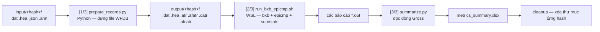

# HES FDA Validation — từ số 0 đến nâng cao

> Bản tiếng Việt của [hes_validation.md](hes_validation.md).
> Tài liệu gốc: [tool-hes-validation.md](../pdf/tool-check-overhead/md/tool-hes-validation.md) (HES FDA Toolkit — Usage Guide, v1.0, Hau Pham). Tài liệu đó là *hướng dẫn sử dụng*; tài liệu này là *giải thích*: giả định người đọc chưa biết gì về ECG, EC57 hay bộ tool, đi từ khái niệm cơ bản đến phần bên trong.
>
> **Có hai thế hệ code.** Bản guide mô tả **tool UI** (một `run.bat`, bảy tab). Repo này chứa **bản CLI tiền thân** của tab Validate: [hes-fda-validation/validation-tool/](../../hes-fda-validation/validation-tool/) (chạy bằng `config.json` thay vì các ô nhập trên UI) và [hes-fda-validation/cut-ann/](../../hes-fda-validation/cut-ann/). Toàn bộ *Phần 5 — Bên trong tool* được đọc trực tiếp từ source đó, nên là hành vi đã kiểm chứng, không phải suy đoán. Chỗ nào UI có thể đã thay đổi thì đều được ghi chú.

---

## Mục lục

- [0. Tóm tắt nhanh](#0-tóm-tắt-nhanh)
- [Phần 1 — Kiến thức nền từ số 0](#phần-1--kiến-thức-nền-từ-số-0)
- [Phần 2 — Dữ liệu](#phần-2--dữ-liệu)
- [Phần 3 — Các chỉ số, từ gốc](#phần-3--các-chỉ-số-từ-gốc)
- [Phần 4 — Bộ tool, từng tab](#phần-4--bộ-tool-từng-tab)
- [Phần 5 — Bên trong tool](#phần-5--bên-trong-tool)
- [Phần 6 — Chọn lọc dataset và câu chuyện FDA](#phần-6--chọn-lọc-dataset-và-câu-chuyện-fda)
- [Phần 7 — Quy trình, lỗi thường gặp, xử lý sự cố](#phần-7--quy-trình-lỗi-thường-gặp-xử-lý-sự-cố)
- [Phần 8 — Thuật ngữ và bảng tra nhanh](#phần-8--thuật-ngữ-và-bảng-tra-nhanh)

---

## 0. Tóm tắt nhanh

**HES** là thuật toán phát hiện loạn nhịp chạy *trên thiết bị BTCY*. Để nộp hồ sơ FDA, phải chứng minh — bằng con số, trên một dataset cố định, theo một tiêu chuẩn đã công bố — rằng nó phát hiện đúng nhịp tim và đúng rung nhĩ.

Tiêu chuẩn là **ANSI/AAMI EC57:1998**. Chương trình chấm điểm là **`bxb`, `epicmp`, `sumstats`** trong gói **WFDB 10.7.0** (binary Linux, nên mới cần WSL Ubuntu). Bộ tool là lớp bọc quanh chúng:

1. lấy một event ECG + kết quả thiết bị nói + kết quả con người nói,
2. chuyển cả hai sang định dạng annotation WFDB mà các binary đó hiểu,
3. chạy chúng, rồi
4. gộp các số đếm thô thành một bảng 12 phần trăm.

Mọi thứ còn lại trong bộ tool tồn tại để *cấp dữ liệu* hoặc *chọn lọc* cho phép so sánh đó: dựng lại annotation thiết bị bị thiếu (**Cut ann**), đẩy kết quả thiết bị lên portal review (**Ann to device**), phân loại event theo nhịp (**Event types**), gộp sáu lần chạy con thành một (**Merge**), chọn tập con có căn cứ (**Filter**), và báo cáo nhịp tim (**HR report**).

Kết quả chốt của bộ 900 event nộp FDA:

| Strip | Q_Se | Q_+P | V_Se | V_+P | S_Se | S_+P | E_Se | E_+P | D_Se | D_+P | D_Spec | D_NPV |
| --- | --- | --- | --- | --- | --- | --- | --- | --- | --- | --- | --- | --- |
| 900 | 97.04 | 98.43 | 82.41 | 14.74 | 23.39 | 9.85 | 96.5 | 97.31 | 95.54 | 95.59 | 85.68 | 85.54 |

---

## Phần 1 — Kiến thức nền từ số 0

### 1.1 Cái gì đang được kiểm tra

ECG (điện tâm đồ) là tín hiệu điện áp theo thời gian của tim. Sau khi số hóa, nó chỉ là một mảng số rất dài; vị trí trong mảng đó gọi là **sample index**, chia cho **tần số lấy mẫu** thì ra giây.

Từ tín hiệu đó phải rút ra hai thứ:

- **Nhịp (beat)** — mỗi nhịp tim nằm ở đâu (một *sample index*), và thuộc loại gì (bình thường, ngoại tâm thu thất, ngoại tâm thu trên thất).
- **Đợt nhịp (rhythm episode)** — các khoảng thời gian đang ở một nhịp bất thường. Loại quan trọng ở đây là **AFIB** (rung nhĩ), có *start* và *stop*.

**HES** là thuật toán firmware làm việc này ngay trên thiết bị, theo thời gian thực. Validation chỉ hỏi một câu: *HES có khớp với chuyên gia con người không?*


Cùng một bản ghi ECG đi theo hai nhánh — HES trên thiết bị, và kỹ thuật viên đọc tay — rồi hai bộ annotation được đem so.

### 1.2 Reference và test — ý tưởng quan trọng nhất

Mọi chỉ số trong tài liệu này đều sinh ra từ việc so **hai bộ annotation trên cùng một ECG**:

| Vai trò | Còn gọi là | Là cái gì | Nằm ở đâu |
| --- | --- | --- | --- |
| **Reference** | ground truth, "chuẩn", ref | Cái ta *tuyên bố* là đúng | File `.json` của event — `strip` (kỹ thuật viên) hoặc `aiPrediction` (AI) |
| **Test** | kết quả thuật toán | Cái HES trên thiết bị tạo ra | File `.ann` của event |

Reference là một *lựa chọn*, đặt bằng tham số **SourceVerify**:

- **`Tech`** — reference là bản đọc của kỹ thuật viên. Đây mới là ground truth thật, dùng cho hồ sơ FDA.
- **`AI`** — reference là annotation của AI phía backend. Không phải chân lý, nhưng có ngay cho hàng nghìn event. Dùng trong giai đoạn lặp ban đầu để tìm điểm yếu mà không phải chờ nhiều tuần review thủ công.

Phần phía sau hoàn toàn giống nhau; chỉ thay đổi việc đọc section nào trong JSON.

### 1.3 Ai làm gì


| Bên | Vai trò |
| --- | --- |
| **Team Backend (BE)** | Sở hữu database event và portal gán nhãn ECG. Export dataset event (`.dat/.hea/.json`) và file `.anb` của study. |
| **Team Firmware (FW)** | Sở hữu HES và bộ tool này. Chạy so sánh EC57, chọn lọc dataset, báo cáo chỉ số. |
| **Kỹ thuật viên** | Người được đào tạo, đọc event trên portal và tạo annotation reference. Chậm và tốn kém — nên mới phải làm pha AI trước. |

Quy trình là một **vòng lặp, hai pha**:

- **Pha 1 — validate với AI.** Rẻ và nhanh. Chạy EC57 với `SourceVerify = AI`, xem HES yếu ở đâu, lọc bỏ event xấu, lặp đến khi tập ứng viên ổn. Kết quả: một **tập event đã chốt**.
- **Pha 2 — validate với kỹ thuật viên.** Tập đã chốt được đưa lên portal; kỹ thuật viên gán nhãn; nhãn đó quay về làm reference. Chạy lại EC57 với `SourceVerify = Tech`. Nếu kết quả tốt *và* đủ số event thì xong. Nếu chưa đủ event, BE đi tìm thêm và vòng lặp lặp lại.

### 1.4 Vì sao phải EC57 mà không "tự tính accuracy"

Hồ sơ FDA cho thuật toán loạn nhịp được yêu cầu theo **ANSI/AAMI EC57** — tiêu chuẩn quy định *chính xác* cách chấm một bộ phát hiện nhịp và một bộ phát hiện rhythm: thế nào là khớp, báo cáo những lớp nhịp nào, gộp kết quả từng bản ghi ra sao. Dùng nó thì con số mới so sánh được với mọi thiết bị khác, và không phải do hãng tự nghĩ ra.

Bản triển khai tham chiếu của tiêu chuẩn là gói phần mềm **WFDB** (PhysioNet). Ba chương trình làm toàn bộ phần tính toán:

| Chương trình | So sánh | Cho ra |
| --- | --- | --- |
| **`bxb`** | annotation nhịp, từng nhịp một | ma trận nhầm lẫn từng bản ghi + sensitivity / positive predictivity cho Q/V/S |
| **`epicmp`** | annotation đợt nhịp | số đợt AFIB và thời lượng AFIB từng bản ghi |
| **`sumstats`** | các file báo cáo từng bản ghi ở trên | các dòng tổng hợp `Sum` / `Gross` / `Average` |

Chúng là công cụ dòng lệnh Linux — đó là toàn bộ lý do **WSL Ubuntu-22.04** là điều kiện bắt buộc. Bộ tool không bao giờ tự cài lại phần toán của chúng; nó chỉ chuẩn bị đầu vào, chạy chúng, và đọc đầu ra.

---

## Phần 2 — Dữ liệu

### 2.1 Một "event" và bốn file của nó

Đơn vị làm việc là một **event**: một đoạn ECG, thường dài khoảng **10 phút**, lấy từ một study của bệnh nhân. Trên đĩa, mỗi event là một thư mục tên là **record hash** (hoặc eventId), chứa đúng bốn file:

| File | Do ai tạo | Chứa gì |
| --- | --- | --- |
| `.dat` | BE export | mẫu ECG thô |
| `.hea` | BE export | header WFDB — tên record, tần số lấy mẫu, format, số mẫu. Nó *mô tả* file `.dat`. |
| `.json` | BE export | metadata event như hiển thị trên portal gán nhãn: annotation của **AI** và của **kỹ thuật viên** |
| `.ann` | **thiết bị** | nhịp + AFIB do **HES chạy trên thiết bị** tạo ra |


Thư mục event thiếu bất kỳ file nào trong bốn file trên đều không chấm được. (Tab Cut ann tồn tại chính vì `.ann` thường là file bị thiếu — xem [§4.3](#43-tab-cut-ann).)

### 2.2 Bên trong `.json` — phần reference

Hai section anh em cùng cấu trúc chứa annotation:

```jsonc
{
  "friendlyId": "...",                  // id event dạng người đọc được
  "realtimeData": { "samplingFrequency": 250 },
  "strip": {                            // KỸ THUẬT VIÊN — dùng khi SourceVerify = Tech
    "beats":         [ 312, 566, 820, ... ],   // sample index
    "hesBeatStatus": [ 1, 1, 60, ... ],        // lớp của từng nhịp, cùng độ dài
    "rhythm": [
      { "type": "AFIB", "isDeleted": false, "start": 47, "stop": 149942 }
    ],
    "interpretation": "Atrial Fibrillation/Flutter"
  },
  "aiPrediction": { /* cùng các field — dùng khi SourceVerify = AI */ }
}
```

Quy tắc đọc mà pipeline áp dụng:

- `beats` và `hesBeatStatus` là **hai mảng song song**; nếu lệch độ dài thì cắt về mảng ngắn hơn.
- `hesBeatStatus` ánh xạ sang lớp nhịp: **`1 → N`**, **`60 → V`**, **`70 → S`**, còn lại → `N`.
- Chỉ các phần tử `rhythm` có `type == "AFIB"` **và** `isDeleted != true` mới được tính. Các đợt chồng lấn được gộp; cặp `start`/`stop` bị đảo thì hoán lại.
- `interpretation` là chữ tự do do người review viết — nó chi phối phần phân loại của **Event types**, không ảnh hưởng việc chấm điểm.

### 2.3 Bên trong `.ann` — đầu ra của thiết bị

File text phân tách bằng tab, có dòng header và dòng `End` ở cuối:

```
Time  SampleCnt  DetectedBeatSample  HesBeatStatus  HesEventSampleDiff  HesEventStatus  HesEventStatus2  HesMeanRrInSamples  HeartRate
...
End   End        End                 End            End                 End             End             End                 End
```

Chỉ ba cột có ý nghĩa:

| Cột | Dùng để |
| --- | --- |
| `DetectedBeatSample` | sample index của nhịp |
| `HesBeatStatus` | lớp nhịp — vẫn ánh xạ `1 / 60 / 70 → N / V / S` |
| `HesEventStatus` | bitmask hex; **AFIB đang bật khi `status & 0x0f00 == 0x0800`** |

Quy tắc parse: dòng sai định dạng hoặc bắt đầu bằng `End` thì bỏ; nếu cùng một `DetectedBeatSample` xuất hiện hai lần thì **lấy lần cuối**; kết quả được sắp theo sample index.

File chỉ có header, không có dòng dữ liệu, là **`.ann` rỗng** — thiết bị không phát hiện gì trên đoạn đó. Trường hợp này được đếm lại, và với `RemoveBlankAnn = on` thì event bị loại thay vì bị chấm là "miss toàn bộ nhịp".

### 2.4 Hệ quy chiếu mẫu — chuyển đổi 200 Hz / 250 Hz

Chỗ này ai cũng vấp một lần.

- Reference (`beats` trong `.json`, `rhythm.start/stop`) nằm trong hệ mẫu của **bản ghi**, đọc từ `realtimeData.samplingFrequency`, thực tế là **250 Hz**.
- Thiết bị phát `DetectedBeatSample` theo tick firmware **200 Hz**.

Nên mọi sample của thiết bị đều được scale lại trước khi so:

```
sample_250 = sample_200 * 250 // 200
```

Kiểm chứng nhanh: đoạn JSON ở trên kết thúc đợt AFIB tại sample `149942`; ở 250 Hz là 599.8 s ≈ đúng độ dài 10 phút. Cùng event đó tính theo tick thiết bị kết thúc quanh 120 000 — đó là lý do tool Cut ann loại mọi nhịp có sample sau khi tính lại `<= 0` hoặc `> 120000`.

> ⚠️ **Điểm vênh cần kiểm tra.** Bảng input trong guide ghi `.dat` là "raw ECG samples (**200 Hz**)". Source CLI trong repo này coi hệ mẫu của `.dat`/JSON là **250 Hz** (`fs` đọc từ `realtimeData.samplingFrequency`, mặc định 250) rồi scale `.ann` 200 Hz của thiết bị lên — xem [parse_ann.py:32-36](../../hes-fda-validation/validation-tool/src/parse_ann.py#L32-L36) và [prepare_records.py](../../hes-fda-validation/validation-tool/src/prepare_records.py). Công thức HR trong guide (`60/mean(RR/250)`) cũng hàm ý 250 Hz. Nên hiểu dòng "200 Hz" trong guide là mô tả tick của thiết bị, không phải của bản ghi.

### 2.5 Cách tổ chức thư mục dataset

```
<dataset>/
  validate_config.json       <- tùy chọn; điền sẵn tham số cho UI
  exclude_records.txt        <- tùy chọn; nhiều nhất MỘT file .txt, danh sách loại thủ công
  <hash-1>/  {.dat .hea .json .ann}
  <hash-2>/  {.dat .hea .json .ann}
  ...
```

`exclude_records.txt` là danh sách record hash dạng text, mỗi dòng một hoặc nhiều hash (phân tách bằng dấu phẩy/chấm phẩy), `#` bắt đầu comment. Dòng comment còn đóng vai trò **nhóm lý do** — `# Low Amplitude`, `# Wrong Label`, `# Miss AFib`, `# Other Symptoms`, `# Low AFib Duration` — mọi hash nằm dưới một tiêu đề sẽ mang nhóm đó, và nhóm này xuất hiện trong báo cáo nên việc loại bỏ luôn truy vết được. Có hơn một file `.txt` trong thư mục là lỗi cứng, cố ý thiết kế như vậy.

---

## Phần 3 — Các chỉ số, từ gốc

### 3.1 Trò chơi ghép cặp

Lấy một event. Reference nói nhịp nằm ở các thời điểm này; thiết bị nói nhịp nằm ở các thời điểm kia. Xếp hai bên lại và ghép mỗi nhịp thiết bị với một nhịp reference **nếu chúng cách nhau trong khoảng ±`BeatErr` giây** (mặc định **0.15 s**). Khi đó:

| Kết quả | Ý nghĩa |
| --- | --- |
| **TP** (true positive) | nhịp thiết bị ghép được với nhịp reference — phát hiện đúng |
| **FP** (false positive) | nhịp thiết bị không có nhịp reference nào gần — phát hiện thừa |
| **FN** (false negative) | nhịp reference không có nhịp thiết bị nào gần — bỏ sót |


Với nhịp thì **không có "TN"**: không thể đếm vô số vị trí mà cả hai bên đều không đặt nhịp. (TN quay lại ở phần *thời lượng* AFIB, nơi thời gian là hữu hạn — xem [§3.5](#35-mặt-âm-specificity-và-npv).)


`BeatErr` là nửa độ rộng của cửa sổ đó. Nới rộng thì các phát hiện lệch cũng thành TP; thu hẹp thì phát hiện đúng-nhưng-trễ-chút biến thành FP **và** FN cùng lúc (phạt kép). 0.15 s là mặc định của chính `bxb` và là giá trị dùng trong công việc EC57 — đừng chỉnh nó để con số đẹp hơn.

### 3.2 Sensitivity và positive predictivity

Từ ba số đếm đó tính ra hai tỷ lệ. Phân biệt được hai cái này là hiểu được toàn bộ:

```
Se  (sensitivity, độ nhạy)            = TP / (TP + FN)   "trong tất cả những gì thực sự có, ta tìm được bao nhiêu?"
+P  (positive predictivity, GTTĐ dương) = TP / (TP + FP)  "trong tất cả những gì ta khai báo, bao nhiêu là thật?"
```

Chú ý mẫu số: **Se chấm theo reference, +P chấm theo chính đầu ra của thiết bị.** Một bộ phát hiện cứ 100 ms đánh dấu một nhịp sẽ có Se gần hoàn hảo và +P thảm hại; một bộ chỉ báo đúng một nhịp cực rõ sẽ có +P hoàn hảo và Se thảm hại. Cần cả hai.

### 3.3 Lớp nhịp — Q, V, S

EC57 không chỉ hỏi "có nhịp hay không", mà còn hỏi "có đúng *loại* nhịp không". Bốn cách chấm được báo cáo:

| Lớp | Ý nghĩa |
| --- | --- |
| **N** | nhịp bình thường |
| **V** | ngoại tâm thu thất (PVC) |
| **S** | ngoại tâm thu trên thất (PAC) |
| **Q** | *tất cả* nhịp, không phân biệt loại — thuần năng lực phát hiện |

cho ra sáu con số:

| Chỉ số | Công thức | Đọc là |
| --- | --- | --- |
| **Q_Se** | TP / (TP + FN) | trong toàn bộ nhịp reference, thiết bị tìm được bao nhiêu |
| **Q_+P** | TP / (TP + FP) | trong toàn bộ nhịp thiết bị báo, bao nhiêu là thật |
| **V_Se** | VTP / (VTP + VFN) | trong các nhịp V của reference, bao nhiêu được gọi là V |
| **V_+P** | VTP / (VTP + VFP) | trong các nhịp thiết bị gọi là V, bao nhiêu thật sự là V |
| **S_Se** | STP / (STP + SFN) | trong các nhịp S của reference, bao nhiêu được gọi là S |
| **S_+P** | STP / (STP + SFP) | trong các nhịp thiết bị gọi là S, bao nhiêu thật sự là S |

**Vì sao V/S của bộ 900 nhìn đáng sợ.** `V_+P = 14.74` và `S_+P = 9.85` không phải lỗi đánh máy. Nhịp V và S *hiếm* so với nhịp N, nên mẫu số của chúng rất nhỏ: chỉ vài nhịp N bị gán nhầm thành V đã tạo ra số FP lớn so với VTP bé, và tỷ lệ sụp. Q_Se/Q_+P quanh 97–98 % nói rằng *phát hiện* nhịp tốt; các cột V/S nói rằng *phân loại* nhịp mới là điểm yếu.

### 3.4 AFIB — chấm ở hai cấp

AFIB được chấm hai lần, ở hai độ mịn khác nhau, và cả hai đều được báo cáo.

**Cấp đợt (episode).** Mỗi đợt AFIB bên reference và mỗi đợt bên thiết bị là một đối tượng. Một đợt là **TP nếu nó chồng lấn** với một đợt reference, là **FN** nếu đợt reference không có đợt thiết bị nào chồng lấn, và là **FP** nếu đợt thiết bị không chồng lấn với gì cả.


**Cấp thời lượng (duration).** Quên đợt đi; đi dọc đoạn ECG từng giây một và gán mỗi giây là TP / FN / FP tùy theo mỗi bên có gọi giây đó là AFIB hay không.


| Chỉ số | Cấp | Công thức | Đọc là |
| --- | --- | --- | --- |
| **E_Se** | đợt | detected / reference | tỷ lệ đợt AFIB thật mà thiết bị bắt được |
| **E_+P** | đợt | true detected / detected | tỷ lệ đợt thiết bị báo là đợt thật |
| **D_Se** | thời lượng | TP / (TP + FN) | tỷ lệ *thời gian* AFIB thật mà thiết bị đánh dấu |
| **D_+P** | thời lượng | TP / (TP + FP) | tỷ lệ *thời gian* thiết bị gọi là AFIB mà đúng là AFIB |

Hai cấp trả lời hai câu hỏi khác nhau. Thiết bị bắt được mọi đợt nhưng chỉ đánh dấu 10 giây đầu mỗi đợt sẽ có E_Se rất tốt và D_Se rất tệ. Thiết bị bắn một khối AFIB dài trùm qua hai đợt thật có thể được điểm cao ở thời lượng trong khi số đợt lại sai.

### 3.5 Mặt âm: specificity và NPV

Chỉ ở cấp thời lượng mới có ô thứ tư của ma trận nhầm lẫn: **TN** = khoảng thời gian *cả hai* bên đều đồng ý là **không** AFIB. Nhờ đó có hai chỉ số "âm":


| Chỉ số | Công thức | Mẫu số thuộc về | Đọc là |
| --- | --- | --- | --- |
| **D_Spec** (specificity, độ đặc hiệu) | TN / (TN + FP) | thời gian không-AFIB của **reference** | trong thời gian thật sự không AFIB, thiết bị để yên đúng được bao nhiêu |
| **D_NPV** (negative predictive value) | TN / (TN + FN) | thời gian không-AFIB của **thiết bị** | trong thời gian thiết bị gọi là không AFIB, bao nhiêu đúng là không |

Đúng quan hệ Se và +P, chỉ soi sang lớp âm. Chúng quan trọng vì chỉ nhìn Se và +P thì có thể lách bằng cách khai AFIB khắp nơi — làm vậy là specificity rơi ngay.

Tab Validate có công tắc **"Spec/NPV on AFIB records only"**. Nó quyết định các bản ghi hoàn toàn không có AFIB trong reference có được đóng góp phần TN (rất lớn, rất dễ) của chúng hay không. Cho vào thì specificity bị thổi lên, vì một đoạn Sinus mặc nhiên "không-AFIB đúng" suốt cả chiều dài. Giữ thiết lập này **thống nhất** giữa mọi lần chạy mà bạn định merge với nhau.

### 3.6 Gross chứ không phải average

Mọi con số trong mọi báo cáo đều là **gross (gộp tổng)**: cộng các số đếm thô của **tất cả** bản ghi trước, rồi mới lấy **một** tỷ lệ. Tuyệt đối không lấy trung bình các phần trăm của từng bản ghi.

| Bản ghi | TP | FN | Q_Se từng bản ghi |
| --- | --- | --- | --- |
| A | 90 | 10 | 90.0 % |
| B | 990 | 10 | 99.0 % |
| **Gross** | **1080** | **20** | **1080 / 1100 = 98.2 %** |

Trung bình hai phần trăm là 94.5 %; gross là 98.2 %. Lấy trung bình sẽ khiến bản ghi 20 nhịp nặng ký ngang bản ghi 2 000 nhịp, và bản ghi không có nhịp reference nào thì thậm chí không có phần trăm để mà trung bình.

Đó là lý do tab **Merge** và **Filter** gộp lại từ số đếm thô trong các sheet từng-bản-ghi thay vì trung bình các phần trăm ở sheet summary — và cũng là lý do bạn không thể tái tạo kết quả merge bằng cách trung bình sáu dòng summary trong Excel.

> `sumstats` in ra cả dòng `Gross` lẫn dòng `Average`. Bộ tool đọc dòng **`Gross`**. Nếu có mở file `.out` thô, đừng đọc nhầm dòng.

---

## Phần 4 — Bộ tool, từng tab

### 4.0 Cài đặt và khởi chạy

```bat
python --version                  :: Python 3.x có trên PATH
wsl --install -d Ubuntu-22.04     :: binary WFDB 10.7.0 chạy trong đây
setup.bat                         :: chạy một lần: venv + pip + cài bxb/epicmp/sumstats vào WSL
run.bat                           :: mở UI
```

`setup.bat` idempotent: dùng lại `.venv` nếu đã có, và bỏ qua bước cài WFDB nếu `bxb` đã gọi được trong distro tự dò. Có thể hỏi mật khẩu sudo của user WSL đúng một lần.

Bảy tab, theo thứ tự bạn thực sự gặp chúng:

| Tab | Mục đích |
| --- | --- |
| **Cut ann** | dựng lại file `.ann` còn thiếu để thư mục event chấm được |
| **Event types** | gán mỗi event một nhịp duy nhất, phục vụ thống kê dataset |
| **Validate** | chính phần so sánh EC57 |
| **Merge** | gộp nhiều lần validate thành một kết quả gross |
| **Filter** | chọn lọc tập con (greedy / flag) |
| **Ann to device** | đẩy kết quả thiết bị vào JSON để kỹ thuật viên review |
| **HR report** | nhịp tim trung bình trên các đợt AFIB |

### 4.1 Tab Validate — phép so sánh EC57


Điền các ô rồi bấm **Run**. Chỉ số hiện trong bảng report ngay dưới log và được ghi ra file `.xlsx`.

#### Tham số

| Tham số | Mặc định | Tác dụng |
| --- | --- | --- |
| **SourceVerify** | AI | section nào trong JSON là reference: `Tech` (= `strip`) hay `AI` (= `aiPrediction`) |
| **FilterByDetectedSample (FBD)** | on | chỉ chấm từ nhịp đầu tiên thiết bị phát hiện trở đi |
| **CalibTime** | 0 | bỏ N giây đầu của *cả hai* bên; chỉ có ý nghĩa khi FBD tắt |
| **BeatErr** | 0.15 | cửa sổ khớp nhịp, tính bằng giây (`bxb -w`) |
| **RemoveBlankAnn** | on | loại event có `.ann` không nhịp nào thay vì đem chấm |
| **Add Spec/NPV to output** | on | thêm cột `D_Spec` / `D_NPV` |
| **Spec/NPV on AFIB records only** | on | chỉ tính Spec/NPV trên các bản ghi có AFIB |

#### FBD — tham số bắt buộc phải hiểu


Khi không tìm được file `.ann` gốc, event được **chạy lại trên thiết bị**. Thiết bị khởi động nguội sẽ mất một khoảng **hiệu chuẩn (calibration warm-up)** không phát hiện gì. Nếu chấm thẳng, mọi nhịp reference trong khoảng đó thành FN và độ nhạy bị phá bởi tạo tác của việc phát lại, chứ không phải bởi thuật toán.

**FBD = on** cắt bỏ phần reference nằm trước **nhịp đầu tiên thiết bị phát hiện**:

- nhịp reference trước sample đó bị bỏ;
- đợt AFIB nằm hoàn toàn trước đó bị bỏ; đợt vắt qua điểm đó bị kẹp `start` về đúng điểm đó; đợt nằm sau giữ nguyên;
- khi đó `CalibTime` không dùng đến, và `bxb`/`epicmp` được truyền `-f 0` vì Python đã cắt sẵn rồi.

**FBD = off** chấm nguyên đoạn và thay vào đó truyền `-f CalibTime` cho các binary. Dùng khi `.ann` là bản ghi gốc của thiết bị (không có warm-up phát lại nào phải giấu).

Đây chính là lý do bộ 900 event bị tách thành thư mục `FBD_true` và `FBD_false`: đó là hai quy ước chấm khác nhau, phải validate thành hai lần chạy riêng rồi mới merge.

#### CalibTime và BeatErr


`CalibTime` bỏ N giây đầu của cả reference lẫn thiết bị; `0` là giữ hết. `BeatErr` là cửa sổ khớp ± đã mô tả ở [§3.1](#31-trò-chơi-ghép-cặp).

#### Ví dụ thực tế — validate nhóm Brady


1. **Tải** thư mục Brady từ nguồn 900 event.
2. **Input data folder** → đúng thư mục Brady đó.
3. **Output folder** → một đường dẫn project thật (ví dụ `..\test-data\metric-merge`), *không* dùng thư mục temp — file này còn cần cho Merge. Tên file tự điền.
4. File `validate_config.json` trong thư mục sẽ **tự điền** tham số: `SourceVerify = Tech · FBD = off · CalibTime = 0 · BeatErr = 0.15 · RemoveBlankAnn = on`.
5. **Run**, rồi **Open output** để mở `brady.xlsx`. **Copy table** copy bảng chỉ số để dán vào mail hoặc báo cáo.

#### File kết quả — sáu sheet


| Sheet | Nội dung |
| --- | --- |
| **summary** | các chỉ số gross, một dòng |
| **report** / **mail_table** | đúng bảng hiển thị dưới log, định dạng sẵn để dán |
| **bxb_line_sumstats** | số đếm nhịp **từng bản ghi** (ma trận nhầm lẫn Q / V / S) đứng sau Q_Se / V_Se / S_Se |
| **epicmp_sumstats** | số đếm đợt + thời lượng AFIB **từng bản ghi** đứng sau E_Se / D_Se và Spec/NPV |
| **excluded_records** | các bản ghi bị loại khỏi việc chấm, kèm lý do |

Hai sheet từng-bản-ghi là nguyên liệu thô: **Merge** và **Filter** gộp lại từ *các số đếm đó*, không bao giờ từ phần trăm ở summary.

### 4.2 Tab Merge — gộp các tập con


Bộ 900 event gồm sáu tập con (nhịp × FBD), mỗi tập validate riêng vì tham số khác nhau. Merge gộp chúng thành một kết quả gross.

1. **Inputs** — thêm sáu file `.xlsx`, hoặc trỏ vào thư mục chứa chúng.
2. **Run** — merge.
3. **Pooled** — kiểm tra tổng số đếm sau khi gộp đúng 900 event. Nếu không, tức là thiếu một nhóm hoặc một nhóm bị validate hai lần.
4. **Result** — chỉ số EC57 sau khi gộp; **Copy table** để copy.

Gộp sáu nhóm ra đúng bảng chốt của bộ 900 ở [§0](#0-tóm-tắt-nhanh).

### 4.3 Tab Cut ann


**Vấn đề:** BE đưa thư mục event có `.dat/.hea/.json` nhưng **không có `.ann`** — annotation của thiết bị không lưu theo từng event, chúng nằm trong file **`.anb`** ở cấp study bao trùm cả bản ghi dài.

**Tab này làm gì:** với mỗi event (nhận diện bằng `studyId`, `start`, `stop` trong JSON), tìm đúng lát annotation của study, cắt ra, và ghi vào thư mục event thành `.ann`.

**Cách chạy:**

1. **JSON folder** = `..\test-data\cut-ann\afib\json`
2. **Study data folder** = `..\test-data\cut-ann\afib\anb`
3. **Output folder** = các thư mục event (`..\test-data\cut-ann\afib\event`) đang chứa `.dat/.hea/.json`; Cut ann thêm file `.ann` vào.
4. **Run** — cắt `.ann` cho từng event, đổi tên cả bốn file về cùng một `<base>`, và cập nhật tên record bên trong `.hea`. **Remove incomplete** xóa các thư mục vẫn thiếu một trong bốn file.

**Cơ chế** (kiểm chứng trong [cut-ann/afib_cut.py](../../hes-fda-validation/cut-ann/afib_cut.py), bản CLI):

- Các entry được gom theo `studyId`; với mỗi study, file `.anb` được chuyển sang `.ann` bằng converter đi kèm (`anb2ann_v4_utc0.exe`).
- Tên mỗi file `.ann` sau chuyển đổi mang một timestamp và một offset múi giờ tính theo đơn vị 15 phút (`...-MM-DD-YY-HH-MM-SS<±q>.ann`), được đổi về UTC.
- Với một event, file được chọn là file có timestamp UTC **lớn nhất mà vẫn nhỏ hơn hẳn** `start` của event.
- `thresholdSample = (start_utc − file_ts_utc) giây × 200` (tick thiết bị). Mọi `DetectedBeatSample` bị trừ đi offset đó; dòng nào ra `<= 0` hoặc `> 120000` thì bị loại — tức nằm ngoài cửa sổ ~10 phút của event.
- File không khớp được sẽ ghi vào `error.txt` chứ không âm thầm bỏ qua.

Bước đổi tên rất quan trọng: WFDB yêu cầu tên record bên trong `.hea` phải khớp tên file, nếu không `bxb` sẽ từ chối bản ghi.

### 4.4 Tab Ann to device


Copy nhịp và AFIB **của thiết bị** từ `.ann` rồi ghi vào section **`aiPrediction`** trong JSON của event — beats, `hesBeatStatus`, và các đợt AFIB trong `rhythm` — thay thế kết quả AI.

**Để làm gì:** kỹ thuật viên review annotation trên portal ECG, mà portal thì hiển thị `aiPrediction`. Ghi đè bằng kết quả thiết bị cho phép con người nhìn thấy *HES thực sự đã làm gì* trên tín hiệu thật, thay vì chỉ nghe chỉ số nói rằng có gì đó sai.

**Cách chạy:**

1. **Source folder** = các thư mục event có `.ann/.dat/.hea/.json`.
2. **Output folder** = bất kỳ đâu.
3. **Run** — ghi dữ liệu `.ann` của thiết bị vào `aiPrediction` của từng `.json`.
4. **Result** ví dụ `5/5 events converted · 3,221 beats · 4 AFIB runs`.

**Phép tự kiểm.** Chạy lại **Validate** trên thư mục output với `SourceVerify = AI`. Mọi chỉ số phải ra **100 %** — vì reference và test giờ là cùng một dữ liệu. Nếu không ra 100 %, tức là có gì đó hỏng ở khâu chuyển đổi hoặc ở xử lý tần số lấy mẫu. Đây là bài test end-to-end rẻ nhất trong bộ tool; dùng nó mỗi khi động vào code parse.


### 4.5 Tab Event types

Gán cho mỗi event đúng **một** nhịp — AFIB, Brady, Tachy, Pause, hoặc Sinus/Other — để thống kê dataset (trong hồ sơ có bao nhiêu event mỗi loại).

**Nguồn phân loại:** section `strip` trong JSON (nhãn của kỹ thuật viên). Nếu `strip.interpretation` rỗng hoặc đúng chữ `"agree"`, thì dùng `aiPrediction.interpretation`.

| Nhịp | Kích hoạt khi |
| --- | --- |
| **AFIB** | `strip.rhythm` có một đợt `type = AFIB` chưa bị xóa — **field có cấu trúc, không phải chữ** |
| **Pause** | `strip.interpretation` chứa `pause` |
| **Tachy** | `strip.interpretation` chứa `tachy` |
| **Brady** | `strip.interpretation` chứa `brady` |
| **Sinus/Other** | không rơi vào các trường hợp trên |

Event thật rất hay đa nhịp ("Bradycardia 29 bpm and Pause 4.4 s; Atrial Fibrillation/Flutter 35-69; Sinus 52"), nên có **thứ tự ưu tiên** để chọn một nhóm duy nhất:

```
AFIB  >  Pause  >  Tachy  >  Brady  >  Sinus/Other
```

| Interpretation ví dụ | Luật khớp | Giữ lại |
| --- | --- | --- |
| "Bradycardia 29 bpm and Pause 4.4 s; Atrial Fibrillation/Flutter 35-69; Sinus 52" | AFIB · Pause · Brady | **AFIB** |
| "2nd degree AV Block 26 bpm and Pause 2.5 s; Bradycardia 27; Sinus 54" | Pause · Brady | **Pause** |
| "Atrial Fibrillation/Flutter 93-233; Sinus Tachycardia 144" | AFIB · Tachy | **AFIB** |

**Cách chạy:** trỏ **Event folder** vào thư mục chứa các nhóm event, chọn file `.xlsx` output, bấm **Run**. Trên bộ 900 event kết quả là `TOTAL 900` — **AFIB 300 · Brady 125 · Tachy 125 · Pause 50 · Sinus/Other 300**, với phân bố nguồn `car5 130 / tech 770`. File kết quả có sheet **Summary** cộng thêm mỗi nhịp một sheet liệt kê `friendlyId / recordHash / source / interpretation`.


### 4.6 Tab Filter — chọn lọc tập dữ liệu

Một tab, hai chế độ. Cả hai đều tính lại chỉ số gross trên các bản ghi *còn lại* và xuất ra tập **selected**; riêng `flag` xuất thêm sheet **flagged** liệt kê những gì đã loại. Đầu vào là một hoặc nhiều file `.xlsx` của Validate.

- **greedy** — giữ **N** bản ghi tốt nhất, chọn theo hướng nâng chỉ số yếu nhất lên.
- **flag** — loại mọi bản ghi không đạt một ngưỡng cố định.

Bộ demo: `demo_filter.xlsx` (10 bản ghi, cho greedy + mọi chế độ flag) và `demo_ceil.xlsx` (6 bản ghi, chỉ cho chế độ Ceil).

#### greedy


| Ô | Ý nghĩa |
| --- | --- |
| **N** | giữ lại bao nhiêu bản ghi |
| **Objective** | tối ưu chỉ số nào — `E_Se=0, E_+P=1, D_Se=2, D_+P=3, D_Spec=4, D_NPV=5` |
| **Ceil E_Se** | trần tùy chọn cho E_Se |
| **Prefilter** | loại trước các bản ghi có chỉ số ≤ 0 hoặc thiếu `D_Se` — nên để bật |

**Thuật toán** (vòng lặp *maximin* — tối đa hóa chỉ số nhỏ nhất). Mỗi vòng:

1. Tính chỉ số gross của các bản ghi còn giữ.
2. Tìm chỉ số **yếu nhất** trong nhóm Objective.
3. Loại đúng một bản ghi mà việc loại nó cải thiện chỉ số đó nhiều nhất.
4. Lặp đến khi còn **N** bản ghi.

Không có trọng số nào cả — chỉ có "chỉ số nào đang tệ nhất". Nhóm Objective quyết định những chỉ số nào được nhìn tới, và lựa chọn đó chi phối toàn bộ kết quả:

| Objective | Hành vi trên bộ demo |
| --- | --- |
| **all6** | theo dõi cả sáu; chỉ số yếu nhất chuyển từ `D_+P` (vòng 1–2) sang `D_Se` (vòng 3) |
| **spec-npv** | chỉ `D_Spec` / `D_NPV`; loại `LowSpec1`, rồi `LowSpec2`; khi `D_Spec` khá lên thì `D_NPV` thành yếu nhất và `LowDSe1` bị loại |
| **sens** | chỉ `E_Se` / `D_Se`; `D_Se` yếu nhất nên `LowDSe1` bị loại còn các bản ghi specificity thấp thì *được giữ* — cuối cùng `D_Spec` tụt còn 83.0 |

Dòng `sens` là bài học cảnh báo: tối ưu hai chỉ số thì âm thầm làm hỏng bốn chỉ số bạn không nêu tên.

**Ceil E_Se** chặn trần E_Se: greedy bỏ qua mọi phép loại làm E_Se vượt trần, nhờ đó Spec/NPV cải thiện mà không thổi E_Se lên. Minh họa bằng `demo_ceil.xlsx` với trần `95.5`.

**Tác dụng của Prefilter:** demo `10 → 7` bản ghi sạch; pool 701 AFIB thật `701 → 575`.

**Output:** `summary` (số bản ghi chọn + 6 chỉ số gross), `epicmp_sumstats` (mỗi bản ghi được chọn một dòng), `selected` (hash các bản ghi được chọn).

#### các chế độ flag


Loại theo ngưỡng, rồi tính lại. Năm chế độ:

| Chế độ | Nhắm vào |
| --- | --- |
| **Low Q_Se / Q_+P** | phát hiện nhịp |
| **Low V_Se / V_+P** | phân loại nhịp |
| **Low D_Se** | độ nhạy thời lượng AFIB |
| **Device miss/false AFIB** | lỗi phát hiện AFIB |
| **AFIB all-zero** | bản ghi mà mọi chỉ số AFIB đều bằng 0 |

Ví dụ: `Low D_Se < 90` loại mọi bản ghi dưới 90 rồi tính lại phần còn lại. Khi chọn chế độ flag thì các ô của greedy bị vô hiệu hóa.

### 4.7 Tab HR report

Nhịp tim trung bình trên các đợt AFIB, kèm phân dải.

```
avg_hr = 60 / mean(RR / 250)          RR tính bằng sample, 250 Hz
dải    = <60 bpm | 60–120 bpm | >120 bpm
```

**Cách chạy:** **Source folder** = thư mục event cần tính; **Verify** = đọc HR từ annotation nào (`ai` hay `tech`); **Run**. Trên thư mục 479 event `Tech/AFIB/FBD_true`, kết quả là: 479 event, HR trung bình **min 31.4 / mean 91.1 / max 216.2** bpm, các dải **<60 = 89**, **60–120 = 294**, **>120 = 96**.

---

## Phần 5 — Bên trong tool

Toàn bộ phần dưới được đọc từ bản CLI trong repo này, [hes-fda-validation/validation-tool/](../../hes-fda-validation/validation-tool/), tức là tab Validate không có UI. Bản UI thay `config.json` bằng các ô nhập và cho chọn đường dẫn output; pipeline thì giống nhau.

### 5.1 Ba giai đoạn



Điều phối bởi [run_pipeline.py](../../hes-fda-validation/validation-tool/src/run_pipeline.py). Ba chi tiết bắc cầu Windows–Linux mang tính sống còn, nên biết trước khi debug bất cứ thứ gì:

- Distro WSL được **tự dò** bằng `wsl.exe -l -q`, output là UTF-16 — decode phòng thủ; cái tên `Ubuntu*` đầu tiên thắng.
- Đường dẫn Windows được đổi sang `/mnt/<drive>/...` **bằng Python**, không qua `wslpath`, để tránh cuộc chiến escape ký tự.
- Mọi file `shell_scripts/*.sh` được **chuẩn hóa CRLF → LF tại chỗ** trước khi gọi, vì `autocrlf` của git nếu không sẽ làm bash lỗi `$'\r': command not found`.

### 5.2 Giai đoạn 1 — dựng file (Python)

Với mỗi `input/<hash>/`, sáu file được ghi ra `output/<hash>/`:

| File dựng ra | Thuộc bên | Nội dung |
| --- | --- | --- |
| `<hash>.dat` | — | hardlink (hoặc copy) từ `.dat` nguồn |
| `<hash>.hea` | — | header nguồn với tên record đổi thành `<hash>` |
| `<hash>.atr` | **reference** | annotation nhịp — sample + ký hiệu `N/V/S` lấy từ JSON |
| `<hash>.afatr` | **reference** | annotation AFIB |
| `<hash>.catr` | **test** | annotation nhịp từ `.ann` của thiết bị, đã scale 200 → 250 Hz |
| `<hash>.afcatr` | **test** | annotation AFIB từ `HesEventStatus & 0x0f00 == 0x0800` |

**AFIB được mã hóa thế nào.** WFDB ở đây không có kiểu bản ghi "episode", nên danh sách đợt được ghi thành *mỗi sample nhịp một annotation*, ký hiệu `+` và `aux_note` là `(AFIB` hoặc `(N`. `epicmp` dựng lại các đợt từ chỗ nhãn đó đổi. Hệ quả cần nhớ: **biên của đợt AFIB chỉ chính xác đến mức các nhịp xung quanh nó** — một đợt được giới hạn bởi nhịp đầu và nhịp cuối nằm trong nó, không phải bởi giá trị `start`/`stop` thô.

Các quy tắc dựng file khác:

- Bộ annotation rỗng được ghi một nhịp `N` giả tại sample 0, vì WFDB từ chối file annotation rỗng.
- Bản ghi bị bỏ ("skip") nếu thiếu `.ann`, `.json`, `.dat`, `.hea`, hoặc JSON không có section ứng với `SourceVerify` đã chọn.
- "manual" = hash nằm trong file `.txt` loại trừ; "blank" = `.ann` không nhịp nào khi `RemoveBlankAnn` bật. Cả ba đều rơi vào `excluded_records.csv`, sau đó thành sheet `excluded_records`.
- Các thư mục từng bản ghi của lần chạy trước trong `output/` bị xóa trước, nên bản ghi cũ không lẫn sang lần chạy mới.

### 5.3 Giai đoạn 2 — chấm điểm (WSL)

[run_bxb_epicmp.sh](../../hes-fda-validation/validation-tool/shell_scripts/run_bxb_epicmp.sh) duyệt mọi bản ghi đã dựng và chạy ba lệnh:

```bash
# Định dạng line theo AAMI EC57 Tables A.2/A.3, có cả SVEB -> để sumstats gộp
bxb -r "$rec" -a atr catr -f "$F" -w "$W" -L bxb_line.out bxb_sveb.out
# Báo cáo chuẩn EC57 Table 3, ma trận nhầm lẫn từng bản ghi
bxb -r "$rec" -a atr catr -f "$F" -w "$W" -S bxb_std.out
# So sánh đợt + thời lượng AFIB, ghi nối tiếp, định dạng line
epicmp -r "$rec" -a afatr afcatr -f "$F" -A epicmp.out -L
```

rồi gộp:

```bash
sumstats bxb_line.out > bxb_line_sumstats.out
sumstats epicmp.out   > epicmp_sumstats.out
```

Đọc các cờ (ý nghĩa đã đối chiếu với man page WFDB ở [§5.7](#57-tài-liệu-tham-chiếu)):

| Cờ | Ý nghĩa |
| --- | --- |
| `-r <rec>` | tên bản ghi |
| `-a ref test` | annotator reference trước, annotator test sau — **thứ tự có ý nghĩa**; đảo là đảo luôn Se với +P |
| `-f <time>` | bắt đầu so sánh từ thời điểm này. **Mặc định là 5 phút** — với event 10 phút thì sẽ âm thầm vứt mất nửa đoạn, nên tool *luôn* truyền `-f` tường minh |
| `-w <time>` | cửa sổ khớp, mặc định 0.15 s (`BeatErr`) |
| `-L` | báo cáo định dạng line, mỗi bản ghi một dòng (đầu vào của `sumstats`) |
| `-S <file>` | báo cáo chuẩn EC57 Table 3 |
| `-A <file>` | ghi nối tiếp báo cáo phát hiện AF (epicmp) |

**Quy tắc quy đổi `-f`:** `FilterByDetectedSample = true` ⇒ `-f 0` (Python đã cắt reference rồi, các binary không được cắt lần nữa); ngược lại `-f CalibTime`.

Lỗi của `bxb` trên từng bản ghi bị nuốt (`|| true`) để một bản ghi hỏng không làm chết cả lần chạy 900 bản ghi — hãy đối chiếu số bản ghi in ra ở cuối với con số bạn mong đợi.

### 5.4 Giai đoạn 3 — summarize (Python)

[summarize.py](../../hes-fda-validation/validation-tool/src/summarize.py) **không tính toán gì trên chỉ số**. Nó đọc dòng bắt đầu bằng `Gross` trong từng file `*_sumstats.out` và sắp chữ đó thành workbook:

- từ `bxb_line_sumstats.out`: `Q_Se, Q_+P, V_Se, V_+P, S_Se, S_+P`
- từ `epicmp_sumstats.out`: `E_Se, E_+P, D_Se, D_+P`

Nó bổ sung thêm phần sổ sách mà file `.out` không có: **thống kê `.ann` rỗng** (tổng / rỗng / không rỗng / tỷ lệ %, tính bất kể thiết lập `RemoveBlankAnn`), ba cột số đếm nhịp từng bản ghi (**device** từ `.ann`, **technician** từ `strip.beats`, **AI** từ `aiPrediction.beats`), và **bảng phân nhóm lý do loại trừ thủ công**.

Bộ ba "số nhịp device / technician / AI" là phép kiểm tra nhanh nhất trong cả workbook: nếu số của device chỉ bằng một phần năm số của technician thì bạn đang nhìn một file `.ann` bị cắt cụt hoặc sai tỷ lệ sample, chứ không phải vấn đề của thuật toán.

### 5.5 Đọc các sheet từng bản ghi

**`bxb_line_sumstats`** — ma trận nhầm lẫn nhịp theo AAMI. Tên cột đọc là **`<reference><test>`**: chữ đầu là lớp mà *reference* gán, chữ sau (có dấu phẩy trên) là lớp mà *thuật toán* gán.

```
Record | Nn' Sn' Vn' Fn' On' | Ns Ss Vs Fs' Os' | Nv Sv Vv Fv' Ov' | No' So' Vo' Fo' | Q_Se Q_+P V_Se V_+P S_Se S_+P | RR_err
         └ test gọi là N ──┘   └ test gọi là S ┘  └ test gọi là V ┘   └ test gọi là O ┘
```

Vậy `Nn'` = reference N và test N (N đúng); `Nv` = reference N nhưng test gọi là **V** (PVC giả); `Vn'` = PVC thật mà test gọi là bình thường. Các dòng cuối của sheet là `Sum`, `Gross`, `Average`.

**`epicmp_sumstats`** — mỗi bản ghi: `TPs FN TPp FP ESe E+P DSe D+P Ref_duration Test_duration`. `TPs` / `FN` là số đếm đợt phía sensitivity, `TPp` / `FP` phía predictivity, còn hai cột duration là chuỗi thời gian kiểu `9:57.376`.

### 5.6 Ánh xạ UI ↔ CLI

| Ô trên UI (tab Validate) | Khóa trong `config.json` | Ghi chú |
| --- | --- | --- |
| Input data folder | `SourceData` | thư mục chứa các thư mục con `<hash>/` |
| SourceVerify | `SourceVerify` | `"AI"` hoặc `"Tech"` — khác đi là lỗi cứng |
| FilterByDetectedSample | `FilterByDetectedSample` | bool |
| CalibTime | `CalibTime` | giây; bị bỏ qua khi FBD bật |
| BeatErr | `BeatErr` | giây |
| RemoveBlankAnn | `RemoveBlankAnn` | bool |
| Output folder / file | — | bản CLI cố định ở `output/metrics_summary.xlsx` |
| Add Spec/NPV, Spec/NPV on AFIB only | — | chỉ có trên UI; bản CLI trong repo này không có |

### 5.7 Tài liệu tham chiếu

Tài liệu WFDB đã kiểm chứng cho ba binary mà bộ tool gọi:

- [`bxb` — so sánh từng nhịp](https://physionet.org/physiotools/wag/bxb-1.htm) — xác nhận `-f` mặc định 5 phút và `-w` mặc định 0.15 s.
- [`epicmp` — so sánh từng đợt](https://physionet.org/physiotools/wag/epicmp-1.htm) — xác nhận `-A` ghi nối tiếp báo cáo phát hiện AF và `-L` chọn định dạng line.
- [`sumstats` — thống kê tổng hợp](https://physionet.org/physiotools/wag/sumsta-1.htm) — tính các thống kê tổng hợp của tiêu chuẩn AAMI từ báo cáo định dạng line.

---

## Phần 6 — Chọn lọc dataset và câu chuyện FDA

### 6.1 Hai dataset

**Full dataset** — 12 870 event, trong đó **1 452 đã có nhãn kỹ thuật viên** và **11 418 chưa**:

| Nhóm | AFIB | Brady | Pause | Sinus | Tachy | Tổng |
| --- | --- | --- | --- | --- | --- | --- |
| **Tech** | 222 (FBD off) + **479 (FBD on)** | 159 | 111 | 383 | 98 | **1 452** |
| **AI** | 11 129 | 70 | 90 | 8 | 121 | **11 418** |

Mọi dòng dùng `CalibTime = 0`, `BeatErr = 0.15`; chỉ nhóm Tech AFIB `FBD_true` được validate với FBD bật.

**Bộ 900 event nộp FDA** — sáu thư mục, validate riêng từng thư mục rồi merge:

| Thư mục | Số event | Thiết lập |
| --- | --- | --- |
| `AFIB/FBD_true/` | 269 | Tech · **FBD = on** |
| `AFIB/FBD_false/` | 31 | Tech · FBD = off |
| `BRADY/FBD_false/` | 125 | Tech · FBD = off |
| `TACHY/FBD_false/` | 125 | Tech · FBD = off |
| `PAUSE/FBD_false/` | 50 | Tech · FBD = off |
| `SINUS/FBD_false/` | 300 | Tech · FBD = off |
| **Tổng** | **900** | |

Đối chiếu với tab Event types: `AFIB 300 · Brady 125 · Tachy 125 · Pause 50 · Sinus/Other 300`, phân bố nguồn `car5 130 / tech 770`. Lưu ý nhóm Tachy (125) lớn hơn pool Tachy có nhãn kỹ thuật viên (98) — phù hợp với 130 event có nguồn không phải `tech`.

### 6.2 Toàn trình: bộ 300 AFIB được tạo ra thế nào


```
701 event AFIB của Tech (479 FBD_true + 222 FBD_false)
   └─ Filter · bật prefilter                  -> 575 bản ghi sạch
      └─ Filter · greedy, objective = spec-npv, Ceil E_Se = 95.5, N = 300
         └─ bộ 300 AFIB  (269 FBD_true + 31 FBD_false)
            └─ + BRADY 125 + TACHY 125 + PAUSE 50 + SINUS 300
               └─ Merge -> kết quả chốt của bộ 900 event
```

Tái lập nó nghĩa là: validate từng nhóm → Filter để chọn → Merge để gộp. Các file `.xlsx` trung gian chính là hợp đồng giữa các bước, nên tab Validate mới bắt buộc chọn thư mục output thật thay vì thư mục temp.

### 6.3 Một lưu ý về việc chọn lọc

Chế độ greedy và flag *loại bỏ bản ghi để chỉ số báo cáo đẹp hơn*. Việc đó chỉ hợp lệ khi luật chọn được định trước và ghi lại đầy đủ — tool hỗ trợ điều đó bằng cách xuất sheet `selected`, `flagged` và danh sách loại trừ đã phân nhóm. Hãy giữ các artifact đó cùng hồ sơ; một chỉ số mà thiếu luật chọn kèm theo thì không tái lập được.

---

## Phần 7 — Quy trình, lỗi thường gặp, xử lý sự cố

### 7.1 Lần chạy đầu tiên, từ con số 0

```
1. wsl --install -d Ubuntu-22.04   -> kiểm: wsl -l -v thấy Ubuntu-22.04, Running
2. setup.bat                       -> kiểm: không lỗi; `wsl bxb -h` in ra usage
3. run.bat                         -> kiểm: UI mở lên
4. Validate trên một thư mục đã biết -> kiểm: bảng chỉ số hiện ra; file .xlsx được ghi
5. Ann to device trên 5 event,
   rồi Validate với SourceVerify=AI -> kiểm: mọi chỉ số bằng 100 %
```

Bước 5 mới là bài test cài đặt thật sự: nó chạy qua parse, dựng file, WSL và các binary từ đầu đến cuối với một đáp án đã biết trước.

### 7.2 Luật quyết định

| Câu hỏi | Trả lời |
| --- | --- |
| `Tech` hay `AI`? | `AI` khi đang lặp thử (nhanh, không cần con người); `Tech` cho mọi thứ đem báo cáo |
| FBD bật hay tắt? | **bật** khi `.ann` sinh ra từ việc *phát lại* trên thiết bị (có warm-up hiệu chuẩn cần loại); **tắt** khi `.ann` là bản ghi gốc. Đừng trộn hai quy ước trong một lần chạy — tách hai thư mục rồi merge. |
| `CalibTime`? | để 0 trừ khi FBD tắt *và* bạn cố ý muốn bỏ một khoảng đầu đã biết là xấu |
| `BeatErr`? | để 0.15 |
| `RemoveBlankAnn`? | bật — `.ann` rỗng đo một lần phát lại thất bại, không đo thuật toán. Phần thống kê rỗng ở sheet summary vẫn cho biết có bao nhiêu file như vậy. |

### 7.3 Lỗi thường gặp

- **Lấy trung bình phần trăm.** Trung bình sáu dòng summary trong Excel ≠ kết quả merge. Luôn merge bằng tool, vì tool gộp lại từ số đếm ([§3.6](#36-gross-chứ-không-phải-average)).
- **Thư mục output tạm.** Tab Merge và Filter ăn chính file `.xlsx` của Validate. Hãy ghi vào chỗ lưu lâu dài.
- **Trộn FBD trong một thư mục.** Hai quy ước chấm bị gộp thành một con số; kết quả vô nghĩa. Tách ra rồi merge.
- **Công tắc Spec/NPV không thống nhất** giữa sáu lần chạy đem merge — cùng vấn đề, nhưng khó phát hiện hơn.
- **Thiếu `.ann`.** Chạy Cut ann trước; dùng **Remove incomplete** để không thư mục nửa vời nào lọt vào Validate.
- **Hai file `.txt`** trong thư mục nguồn. Lỗi cứng có chủ ý — tool không thể đoán file nào là danh sách loại trừ.
- **Excel đang mở file output** lúc lần chạy kết thúc — ghi file lỗi ngay ở phút cuối của một job dài.
- **Đọc `Average` thay vì `Gross`** khi mở file `.out` thô.

### 7.4 Xử lý sự cố

| Hiện tượng | Nguyên nhân | Cách xử lý |
| --- | --- | --- |
| `wsl.exe not found` / `no WSL distro registered` | chưa có WSL hoặc chưa có distro | `wsl --install -d Ubuntu-22.04`, rồi `wsl -l -v` |
| bash báo `$'\r': command not found` | file `.sh` bị CRLF | pipeline tự sửa; nếu vẫn còn, kiểm tra `core.autocrlf` và chuẩn hóa lại |
| `bxb: command not found` trong WSL | chưa cài WFDB vào distro | chạy lại `setup.bat` (cài vào distro được tự dò) |
| `No 'Gross' line in ...` | giai đoạn 2 ra báo cáo rỗng — thường do không dựng được bản ghi nào | xem log giai đoạn 1: bao nhiêu `ok` so với `skip` / `blank` / `manual` |
| `JSON has no 'strip' entry` | `SourceVerify = Tech` trên dataset chỉ có AI | chuyển sang `AI`, hoặc lấy nhãn kỹ thuật viên trước |
| Chỉ số tệ bất thường trên dataset phát lại | FBD đang tắt nên khoảng hiệu chuẩn bị chấm là nhịp bỏ sót | bật FBD |
| Q_Se gần 0 cho cả một nhóm | sai thứ tự `-a` hoặc `.ann` sai tỷ lệ sample (200/250 Hz) | so ba cột số nhịp device / technician trong `bxb_line_sumstats` |
| Số event sau merge ≠ 900 | thiếu một nhóm hoặc thêm trùng | đếm lại sáu input trên tab Merge |

---

## Phần 8 — Thuật ngữ và bảng tra nhanh

### 8.1 Thuật ngữ

| Thuật ngữ | Nghĩa |
| --- | --- |
| **HES** | thuật toán loạn nhịp chạy trên thiết bị BTCY — đối tượng được kiểm tra |
| **EC57** | ANSI/AAMI EC57:1998, tiêu chuẩn phương pháp đánh giá cho loại thuật toán này |
| **WFDB** | bộ công cụ waveform database của PhysioNet; cung cấp `bxb`, `epicmp`, `sumstats` |
| **Event / strip** | một đoạn ECG ~10 phút, đơn vị của việc validate |
| **Record hash** | tên thư mục định danh một event |
| **Reference** | annotation được tuyên bố là đúng (kỹ thuật viên hoặc AI) |
| **Test** | annotation của thiết bị, cái đang bị chấm |
| **Beat** | một nhịp tim, lưu dưới dạng sample index + lớp |
| **N / V / S / Q** | bình thường / ngoại tâm thu thất (PVC) / ngoại tâm thu trên thất (PAC) / tất cả nhịp |
| **AFIB** | rung nhĩ — rhythm cần phát hiện |
| **Episode** | một đợt AFIB liên tục, có start và stop |
| **TP / FP / FN / TN** | đúng-dương / sai-dương / sai-âm / đúng-âm |
| **Se** | sensitivity, độ nhạy — trong sự thật, tìm được bao nhiêu |
| **+P** | positive predictivity, giá trị tiên đoán dương — trong cái đã khai, đúng bao nhiêu |
| **Spec** | specificity, độ đặc hiệu — trong phần âm thật, để yên đúng bao nhiêu |
| **NPV** | negative predictive value, giá trị tiên đoán âm |
| **Gross** | gộp tổng toàn bộ bản ghi: cộng số đếm trước, chia một lần |
| **FBD** | FilterByDetectedSample — chỉ chấm từ nhịp đầu tiên thiết bị phát hiện |
| **CalibTime** | số giây bỏ ở đầu, cho cả hai bên |
| **BeatErr** | cửa sổ khớp nhịp ±, 0.15 s |
| **`.anb`** | file annotation cấp study, nơi các lát `.ann` được cắt ra |

### 8.2 Bảng tra chỉ số

| Chỉ số | Cấp | Công thức | Mẫu số thuộc về |
| --- | --- | --- | --- |
| Q_Se | nhịp, tất cả | TP / (TP + FN) | reference |
| Q_+P | nhịp, tất cả | TP / (TP + FP) | thiết bị |
| V_Se / S_Se | nhịp, V hoặc S | TP / (TP + FN) | reference |
| V_+P / S_+P | nhịp, V hoặc S | TP / (TP + FP) | thiết bị |
| E_Se | đợt AFIB | detected / reference | reference |
| E_+P | đợt AFIB | true detected / detected | thiết bị |
| D_Se | giây AFIB | TP / (TP + FN) | reference |
| D_+P | giây AFIB | TP / (TP + FP) | thiết bị |
| D_Spec | giây không-AFIB | TN / (TN + FP) | reference |
| D_NPV | giây không-AFIB | TN / (TN + FN) | thiết bị |

Mẹo nhớ: **`_Se` và `_Spec` chấm theo reference; `_+P` và `_NPV` chấm theo chính lời khai của thiết bị.**

### 8.3 Bảng tra file và phần mở rộng

| Phần mở rộng | Thuộc bên | Ý nghĩa |
| --- | --- | --- |
| `.dat` | — | mẫu ECG thô |
| `.hea` | — | header WFDB mô tả `.dat`; tên record bên trong phải khớp tên file |
| `.json` | reference | metadata portal — `strip` (tech) và `aiPrediction` (AI) |
| `.ann` | test | đầu ra HES của thiết bị, text phân tách tab, tick 200 Hz |
| `.anb` | test, cấp study | file mà Cut ann cắt `.ann` ra từ đó |
| `.atr` | reference | annotation nhịp WFDB đã dựng |
| `.afatr` | reference | annotation AFIB WFDB đã dựng |
| `.catr` | test | annotation nhịp WFDB đã dựng |
| `.afcatr` | test | annotation AFIB WFDB đã dựng |
| `.out` | — | báo cáo thô của `bxb` / `epicmp` / `sumstats` |
| `.xlsx` | — | workbook tool ghi ra và là đầu vào của tab Merge/Filter |
