# Check Device Overheat Tool Guide

## Revision History

| **Date**   | **Version** | **Author** | **Note**        |
| ---------- | ----------- | ---------- | --------------- |
| 2026-08-11 | 1.0         | Hau Pham   | Initial version |

## Prerequisites

- **Python 3.10 installed** (via the `py` launcher, so `py -3.10` resolves) — pinned, not "3.10 or later": the pinned `PyQt5`/`PyQtWebEngine`/`matplotlib` wheel versions in `requirements.txt` aren't published for newer Python versions (e.g. 3.14). Other Python versions can coexist on the same machine; 3.10 just needs to be one of them.
- AWS SSO access (profile `fw-btcy-sso`). Check session validity with:

  ```
  aws sts get-caller-identity --profile fw-btcy-sso
  ```

  A printed account/ARN means the session is valid.

- If expired, the tool will show `Error when retrieving token from sso: Token has expired` when calling SSH/S3. Fix: run

  ```
  aws sso login --profile fw-btcy-sso
  ```

  Open the link, enter the code printed, sign in via the browser, then retry.

- `setup.bat` already run once in `check-overheat-tool/` (creates `.venv` + installs dependencies):

  ```
  setup.bat
  ```

  If `database/cell_towers.db` (the local cell-tower lookup DB, ~595MB — needed for the Map tab) isn't there yet, `setup.bat` opens its SharePoint download page and **fails** — download can't be scripted (needs an interactive Microsoft login):

  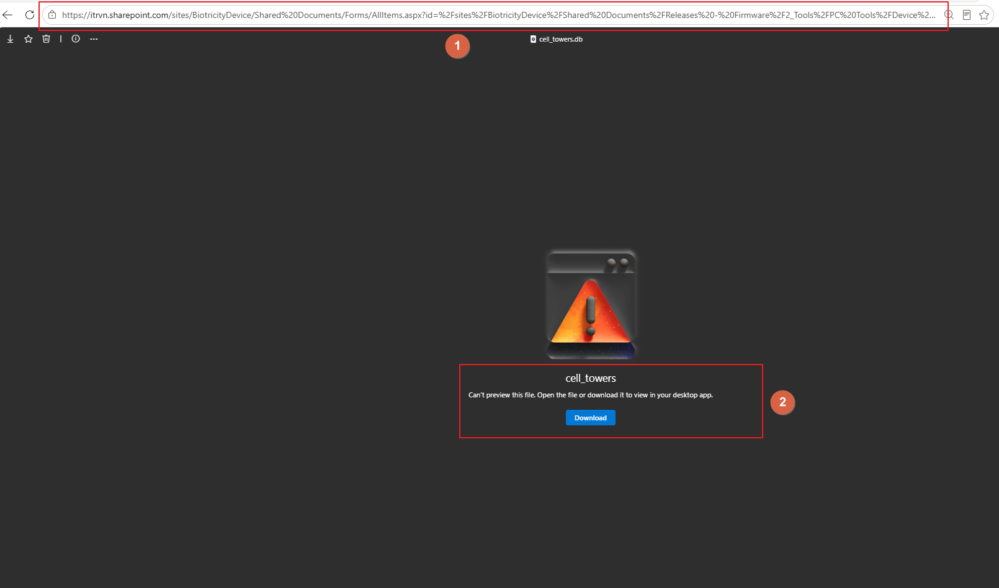

  ① Note the page (can't preview a `.db` file), ② click **Download**. Move the downloaded file to `check-overheat-tool\database\cell_towers.db` (create the `database` folder if needed), then re-run `setup.bat` to verify.

- Launch the tool:

  ```
  run.bat
  ```

## Tab Reference

General overview of every control on the tool's 4 tabs. For an actual usage flow, see the Example 1 / Example 2 walkthroughs below.

### "Add Device" tab

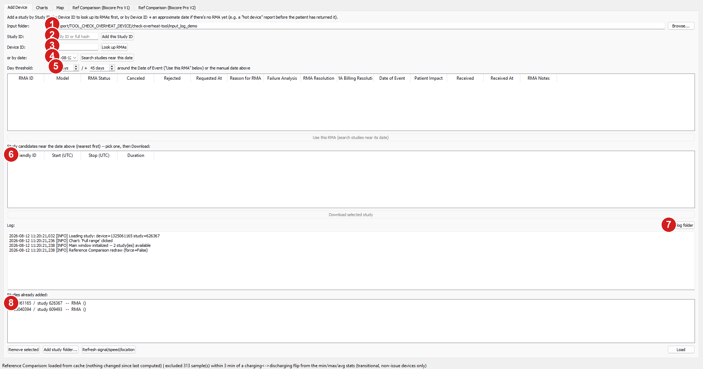

1. **Input folder** — where a downloaded study is saved.
2. **Study ID** — already known (friendly ID or full hash).
3. **Device ID → Look up RMAs** — pick a row, **Use this RMA**.
4. **or by date** — no RMA yet, use an approximate date instead.
5. **Day threshold** — search window around that date (default ±45 days).
6. **Study Candidates** — ranked nearest-first, then **Download**.
7. **Open log folder** — opens the currently loaded study's folder.
8. **Studies already added** — **Refresh signal/speed/location** (needed before RSRP/RSRQ/Upload Speed/Map show data), **Load**, **Remove selected**, **Add study folder...** (logs already on disk).

### "Charts" tab

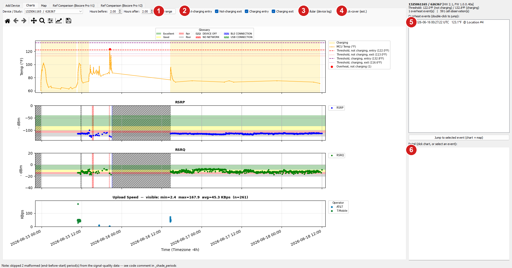

1. **Full range** / Hours before/after — zoom controls (the double-click-to- event zoom window size).
2. **Not-charging entry/exit, Charging entry/exit** — show/hide the threshold-crossing markers on the Temperature chart.
3. **Cellular (device log)** — off by default (slower on long studies); fills in brief cellular wakeups the server-reported mode misses.
4. **Back-cover (est.)** — an estimated skin-contact temperature line, not a real per-device measurement.
5. **Overheat events** — double-click to jump; **Jump to selected event**.
6. **Detail** — click the chart, or select an event.

### "Map" tab

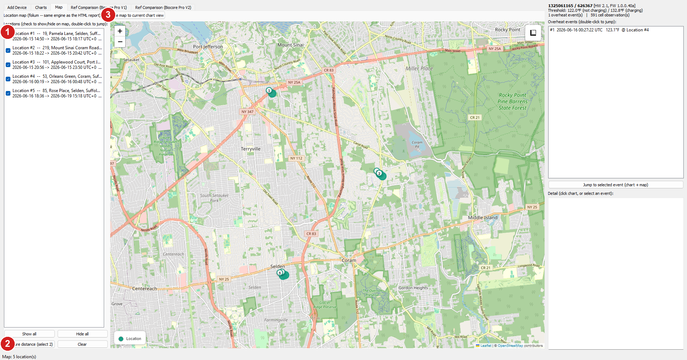

1. **Locations** — check/uncheck to show/hide, double-click to jump, **Show all** / **Hide all**.
2. **Measure distance (select 2)** — straight-line, not driving distance — / **Clear**.
3. **Update map to current chart view** — limits the map to whatever the Charts tab is zoomed to.

### "Ref Comparison" tabs

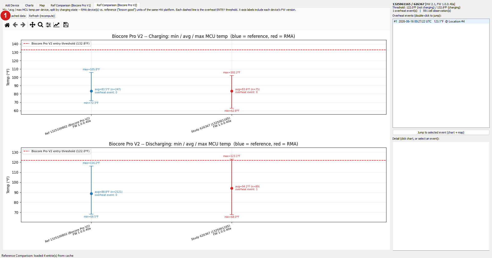

One tab per HW platform (V1 / V2 — different thresholds, never mixed). Each device's min/avg/max MCU temp vs. a reference ("known good") device, split by charging state; dashed line = overheat entry threshold.

1. **Load cached data** (instant, no recompute) / **Refresh (recompute)** (slow with many devices).

## Example 1: "HOT DEVICE REPORTED — Device ID 1325061165 CareMedPrimary and Urgent Care PC (Heart Smart Group)"

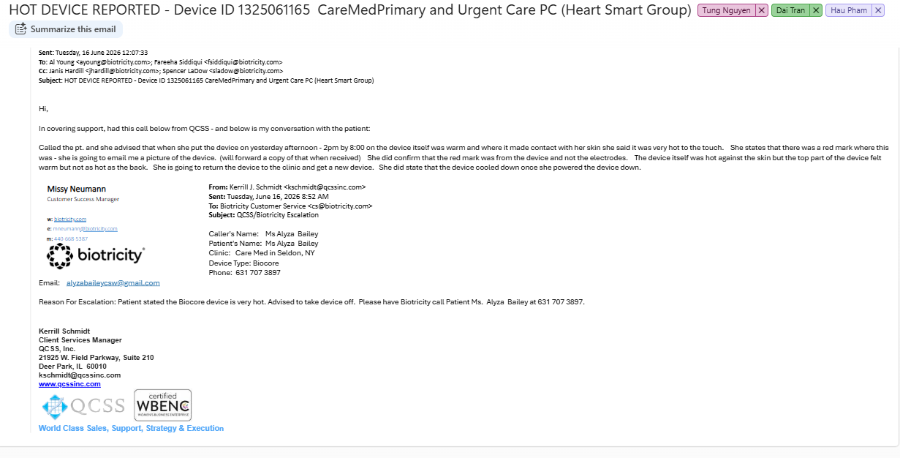

Device ID `1325061165`, email sent 2026-06-16 → the incident = "yesterday" = 2026-06-15, around 2pm-8pm. **No RMA yet** (patient hasn't returned the device).

### Step 1 — "Add Device" tab: enter Device ID + approximate date

Since there's no RMA yet, use the **"or by date"** field instead of "Look up RMAs":

1. **Device ID** field: enter `1325061165`.
2. **"or by date"** field: pick `2026-06-15` (the date inferred from "yesterday" in the email).
3. Click **"Search studies near this date"**.

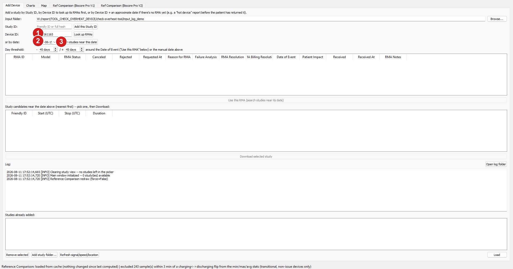

### Step 2 — "Study candidates" table: pick the right study

The tool calls issue 494, lists every study for the device within ±45 days of the date entered, **ranked nearest-first** — it does NOT auto-download, allowing manual confirmation of the right one first.

Study `626367` (2026-06-15 18:04 → 2026-06-16 01:11 UTC) is ranked first — it lines up closely with "2pm" (18:04 UTC − 4h = 2:04 PM local). Select this row, then click **"Download selected study"**.

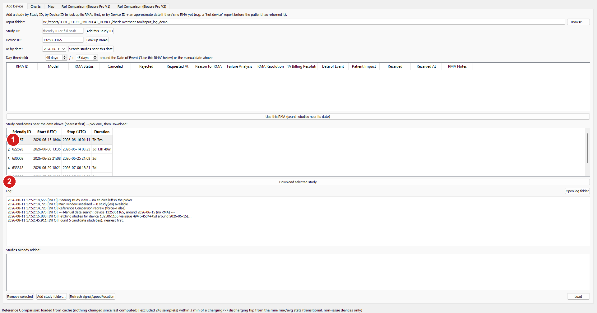

### Step 3 — After downloading, run "Refresh signal/speed/location"

Once downloaded, the study shows up under **"Studies already added"**. At this point the Temperature chart already has data, but **RSRP/RSRQ/Upload Speed/Map are still empty** — the just-downloaded logs are only enough for the temperature chart; RSRP/speed/location need a separate step.

**Select that row** in the list, then click **"Refresh signal/speed/location"** (can take a few minutes — it runs issue 495 to fetch server logs, then resolves RSRP/speed/cell-location for this specific device).

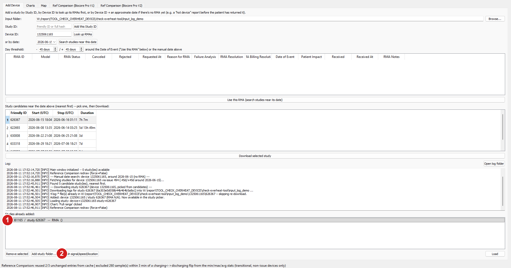

### Step 4 — "Charts" tab: investigate the overheat event

First, read the FW version and threshold straight off the info panel (top right):

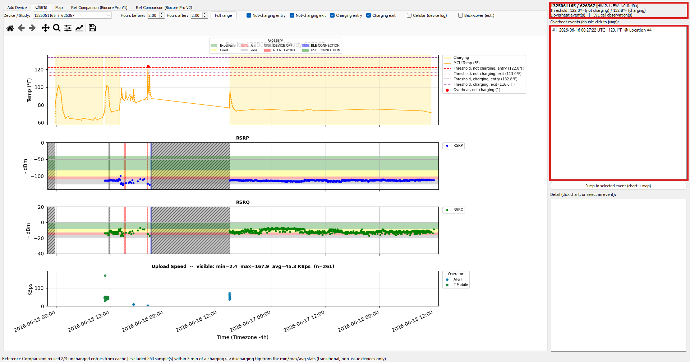

- **HW 2.1, FW 1.0.0.40a**
- **Threshold: 122.0°F (not charging)** — a reduced threshold (vs. 131°F on FW 1.0.0.38c — that comparison number comes from general firmware knowledge, not something the tool computes).
- **1 overheat event**: `2026-06-16 00:27:22 UTC, 123.1°F, @ Location #4`.

①

**Double-click the event** in the list to zoom the chart right into it:

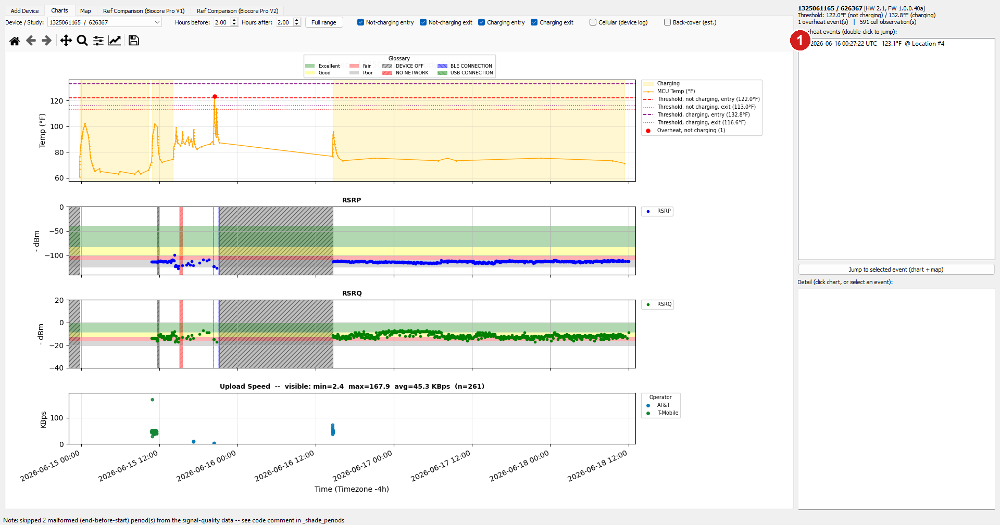

Zoomed in, the story becomes clear:

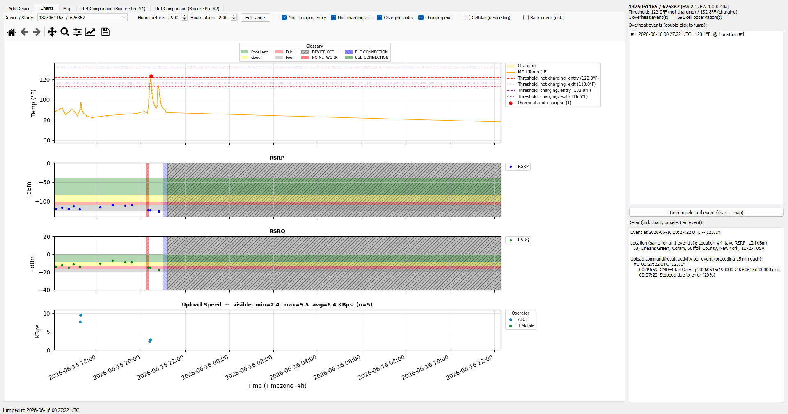

- Right before the overheat, RSRP/RSRQ are sitting in the **Poor/Fair** band (bottom bands) and upload speed is low (a handful of points under 10 KBps) — network quality was poor, so the modem had to work harder/longer to get data out, which is what drove the temperature up to the threshold.
- Right after the event, the device goes into a long gray **"DEVICE OFF"** band — the user powered it off.

Click **"Full range"** (top toolbar) to zoom back out — in the earlier overview screenshot above, notice that **after** the DEVICE OFF gap ends, RSRP/RSRQ jump back into the **Good/Excellent** band and upload speed picks back up — network quality recovered once the device came back on.

②

**Switch to the Map tab** to see *where* that recovery happened — see Step 5.

### Step 5 — "Map" tab: confirm the location change, measure the distance

The study has 5 locations total, but only **#4** (where the overheat happened) and **#5** (where the device resumed) are relevant to this incident. Declutter the map first:

①② ③

**Uncheck Location #1, #2, #3** (leaves only #4/#5 visible on the map — these 3 are just earlier stops

the patient passed through that day, unrelated to the overheat):

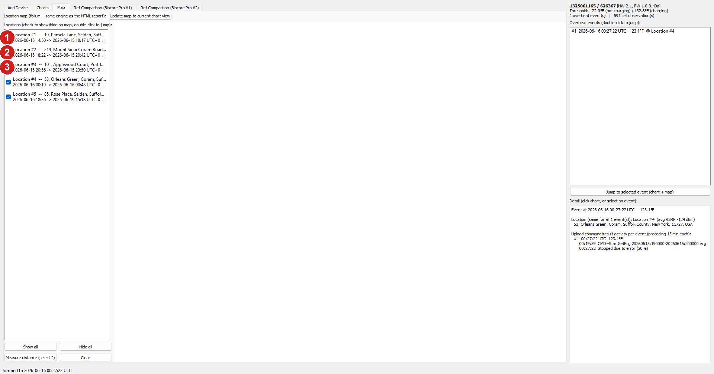

① ②

**Click Location #4, Ctrl/Shift-click Location #5** to select both (selecting is a separate action from the

checkboxes above — checkboxes control what's *drawn* on the map, selection picks *which 2* to measure

③

between), then **click "Measure distance (select 2)"**:

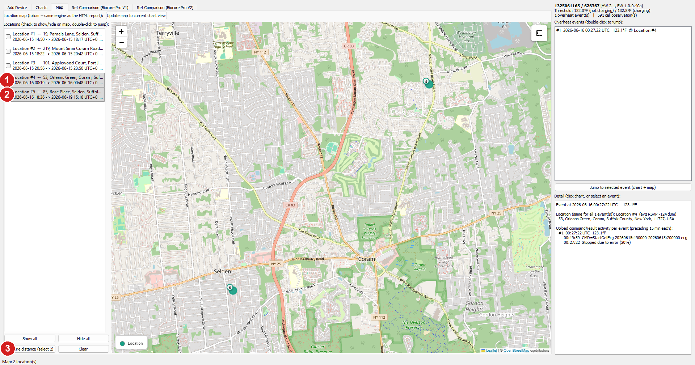

Result — a clean map with just the 2 relevant locations and the measured distance:

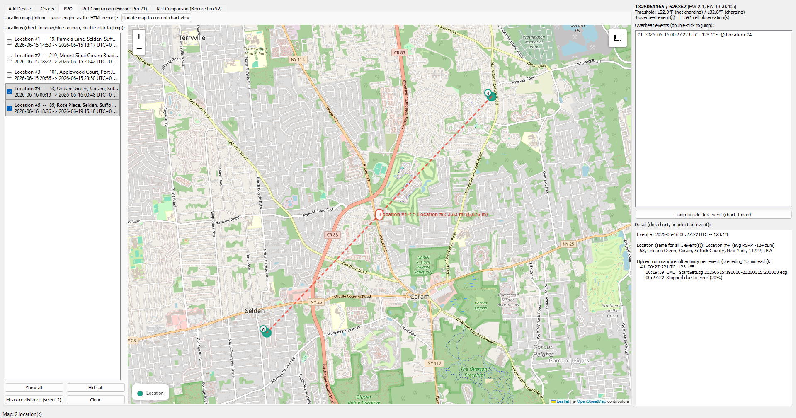

**Location #4 <-> Location #5: 3.53 mi (5,676 m)** — straight-line (great-circle) distance, which can come out slightly lower than the real driving distance (~3.67 mi, as written in the reply below) since real roads aren't a straight line.

This confirms the full picture: the device was at Location #4 when it overheated (poor signal there), the user powered it off, and by the time it powered back on it had physically moved ~3.5 miles away to Location #5 (where signal was back to normal) — **conclusion: signal quality was poor specifically at Location #4**, not a general device defect.

### Putting it together → drafting the reply

Every figure below came directly from the tool:

> We investigated the operational logs for Device ID 1325061165 during the timeframe when the patient reported the heating issue.
>
> During this study, the device was running **FW version 1.0.0.40a** with a reduced MCU overheat threshold of **122°F** (previously 131°F in FW version 1.0.0.38c).
>
> Our analysis indicates that the reported heating event occurred while the device was operating at **Location #4**. During this period, network quality and upload speed were poor, requiring the modem to operate at a higher workload for a longer duration to complete data transmission. This increased modem activity caused the device temperature to reach the configured MCU overheat threshold.
>
> The user later powered off the device. On the following day, around 2:00 PM on June 16, the device resumed operation at **Location #5**, approximately **3.67 miles** from Location #4, where network quality and upload speed had returned to normal.

## Example 2: "Required VN Assistance for BCP RMA Returns"

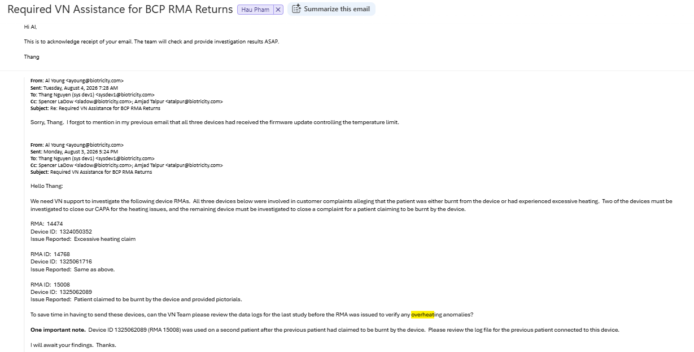

Three devices, **all with known RMA IDs already** — unlike Example 1, the **"Look up RMAs"** flow can be used (Device ID → pick the RMA row → search studies near its Date of Event) instead of the manual "or by date" field:

| **RMA ID** | **Device ID** | **Issue Reported**                                           |
| ---------- | ------------- | ------------------------------------------------------------ |
| 14474      | 1324050352    | Excessive heating claim                                      |
| 14768      | 1325061716    | Same as above                                                |
| 15008      | 1325062089    | Patient claimed to be burnt by the device, provided pictures |

### Device 1324050352 (RMA 14474) — Biocore Pro V1

① ②

**Enter the Device ID, click "Look up RMAs"**:

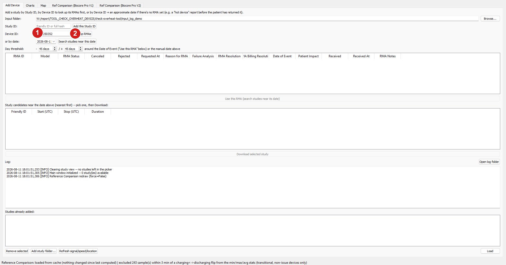

① ②

**Select the matching RMA row, click "Use this RMA"**:

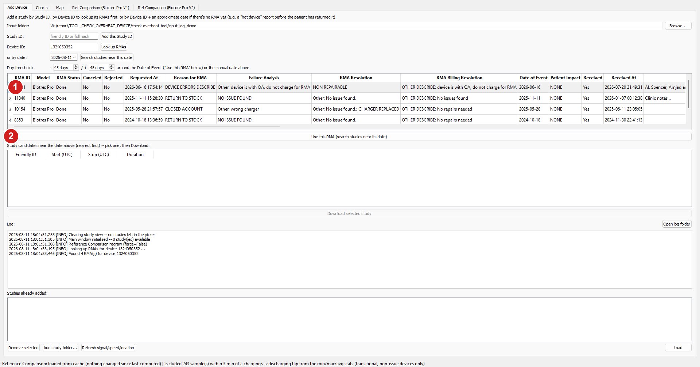

This lists study candidates near the RMA's Date of Event (2026-06-16) — same ranked-table flow as Example

① ②

1. **Pick the right one, Download**:

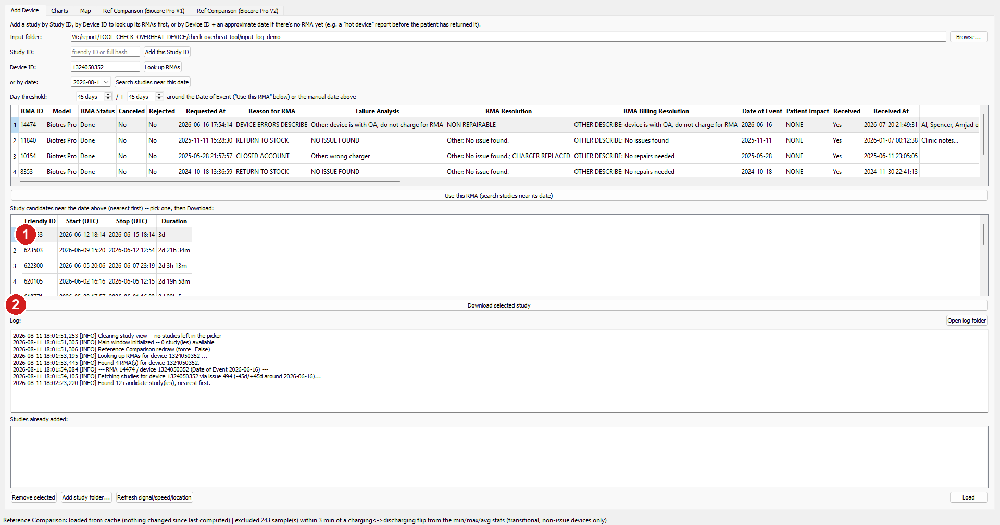

Charts tab for `623503`:

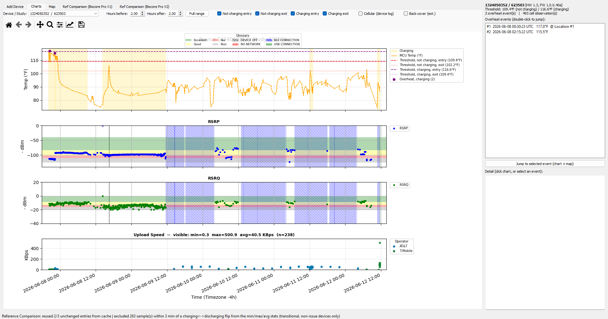

- **HW 1.3**, threshold **109.4°F (not charging) / 116.6°F (charging)**.
- **2 overheat events**, both **while charging** (purple dots, right at the charging-threshold line, peak 117.0°F).
- RSRP/RSRQ around those events sit mostly in **Good/Fair** — no sustained poor-signal period.

**Ref Comparison (Biocore Pro V1)** tab — this device (red) vs. a healthy reference unit of the same HW platform (blue), split by charging state:

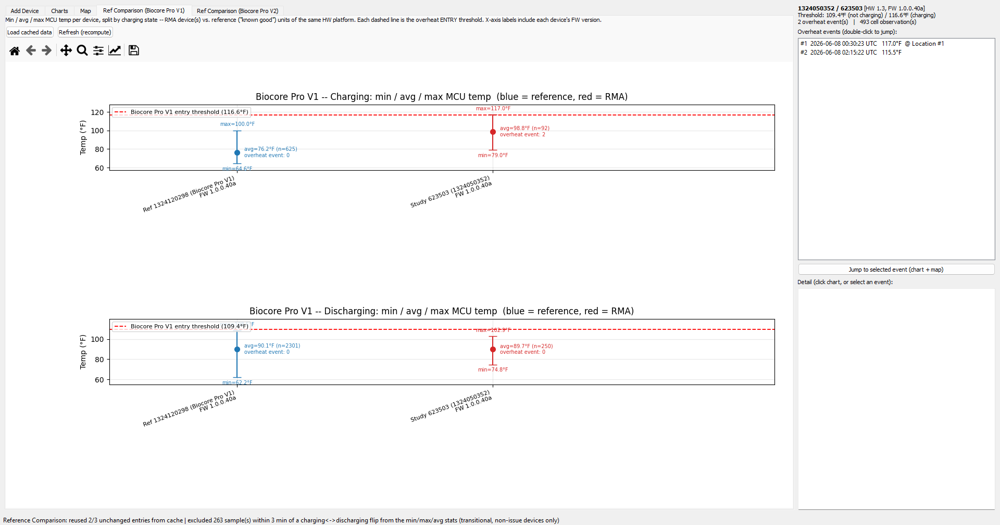

Both overheat events happened **while charging** (top chart, max 117.0°F vs. the 116.6°F threshold); **zero** overheat events while discharging (bottom chart). Since the reported complaint happened while the device was *worn* — and a device is normally not being charged while worn — this device's root cause is **not yet conclusive**.

### Device 1325061716 (RMA 14768) — Biocore Pro V2

Same flow: Device ID `1325061716` → Look up RMAs → select RMA `14768` → Use this RMA → Study Candidates → Download (candidate `637533` this time had its logs already on disk, so it just skips straight to loading).

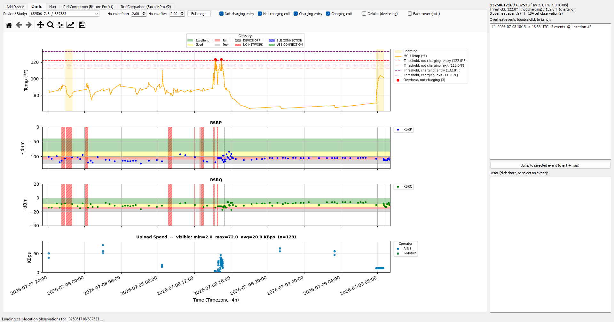

- **HW 2.1**, threshold **122.0°F (not charging) / 132.8°F (charging)**.
- **3 overheat events**, all **while discharging** (red dots, right at the not-charging threshold line).
- RSRP/RSRQ show **sustained poor signal** (gray/red bands) through most of the logged period, not just around the events.

**Ref Comparison (Biocore Pro V2)**:

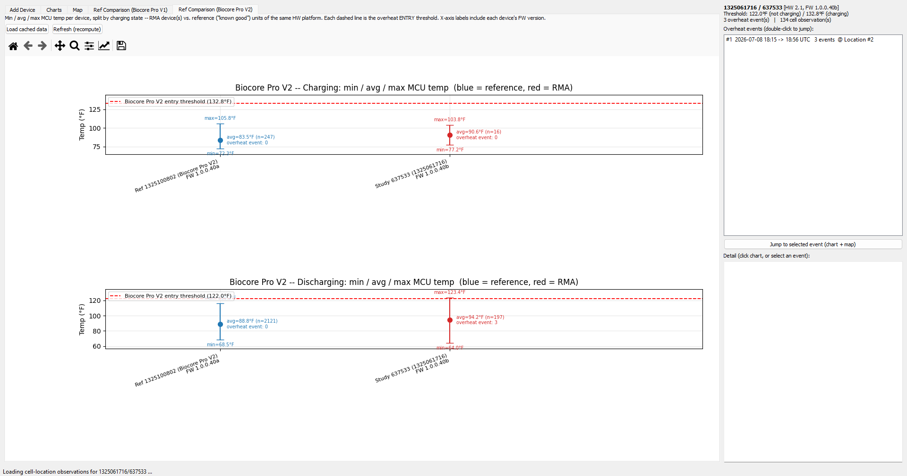

All 3 overheat events happened **while discharging** (bottom chart, max 123.4°F vs. the 122.0°F threshold); 0 events while charging. Combined with the sustained poor signal on the Charts tab, this points to **weak signal quality as the likely contributing factor**.

### Putting it together → drafting the reply

> We reviewed the logs for the 3 RMA devices. Device 1324050352 is Biocore Pro V1, the other two (Device 1325061716, Device 1325062089) are Biocore Pro V2. Since V1 and V2 have their own overheat threshold, we compared each group against a reference device of the same Hardware platform.
>
> **1. Biocore Pro V1 – Device 1324050352**
>
> Device 1324050352 overheated twice while charging (peak 117.0°F, just above the 116.6°F threshold). Signal quality around these events is mostly Good/Fair, no sustained poor-signal period. Also, since these events happened while charging, they are likely not related to the reported complaint — the complaint occurred while the device was worn on the patient, and a device is normally not being charged while worn. So the root cause for this device is not yet conclusive.
>
> **2. Biocore Pro V2 – Device 1325061716 and Device 1325062089**
>
> Both devices overheated while discharging (1325061716: 3 events, 1325062089: 5 events). Checking each device individually, both show sustained poor signal quality through most of the logged period.
>
> **Conclusion**
>
> Device 1324050352: overheated only while charging, not while worn, likely unrelated to the reported complaint. Root cause not yet conclusive.
>
> Device 1325061716 and 1325062089: overheated while discharging, both with sustained poor signal quality — weak signal is the likely contributing factor.
