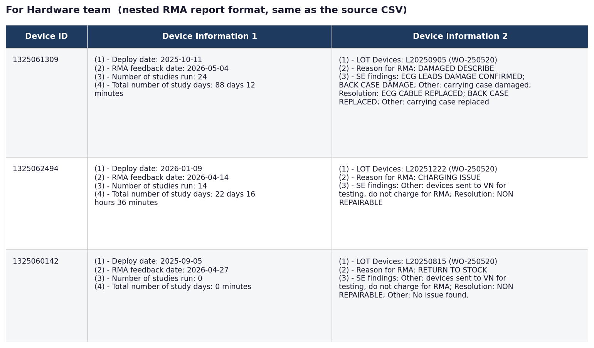
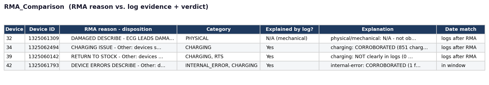
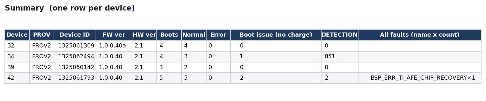
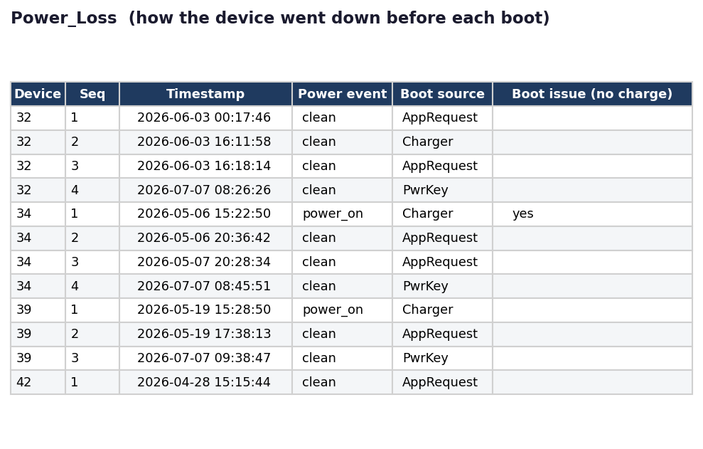
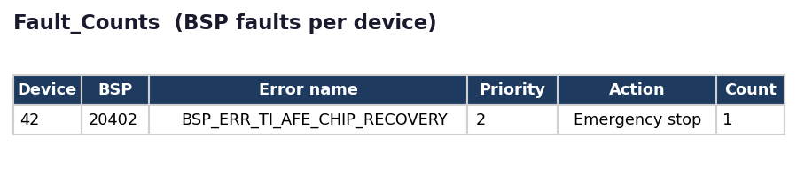
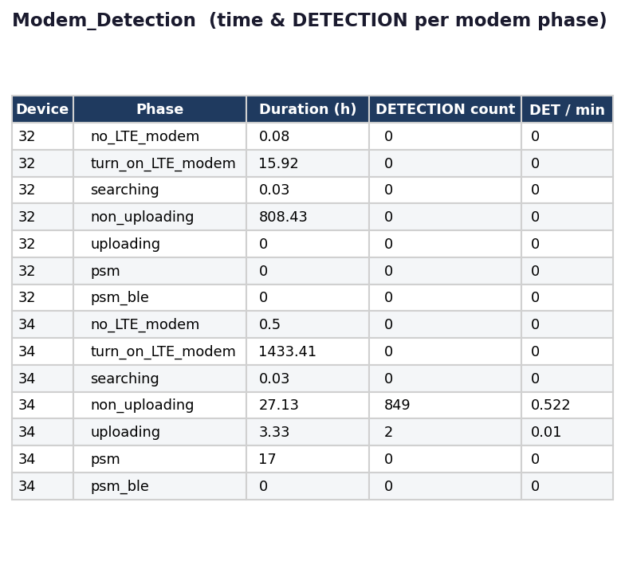
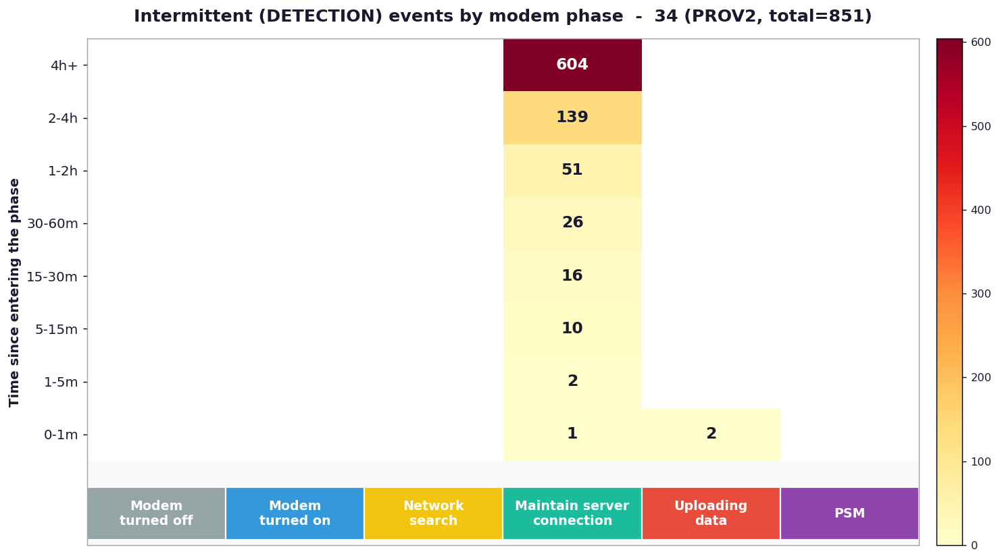

# Check RMA Device Tool Guide

## Revision History

| **Date**   | **Version** | **Author** | **Note**        |
| ---------- | ----------- | ---------- | --------------- |
| 2026-07-31 | 1.0         | Hau Pham   | Initial version |

## Overview

Hardware team receives RMA devices returned from the US, performs hardware debugging, and pulls each device's last log from its SD card. Those logs are handed to the firmware team, which runs this tool to check the logs against the stated RMA reason and decide whether the observed root cause matches it.

## Requirements

- **Python 3+** — check:

  ```
  python --version
  ```

- **SSH access to the** `customer` **host** — check:

  ```
  ssh customer "echo ok"
  ```

- Run `setup.bat` once (creates `.venv`, installs the pinned deps):

  ```
  setup.bat
  ```

## Input

`config.json` points at two things — put them anywhere on disk:

| **Field**         | **Meaning**                                         |
| ----------------- | --------------------------------------------------- |
| `device_logs_dir` | folder with one subfolder per device (the raw logs) |
| `output_dir`      | where `report_rma.xlsx` + charts are written        |

Device IDs are read from the logs automatically and used to fetch the RMA report — no device list to maintain. Paths may be absolute, or relative to `config.json`.

## Example

Point `config.json` at the bundled 4-device sample — copy this in:

```
{
  "device_logs_dir": "examples/Initial Log",
  "output_dir": "examples/my_output"
}
```

Then run the whole pipeline with one command:

```
run.bat
```

## Output — `report_rma.xlsx`

Tabs below are the report's sheets (from a sample run).

### For Hardware team

The RMA report in its **original nested format** (same 3-column layout — `Device ID` / `Device Information 1` / `Device Information 2` — as the source RMA report CSV), copied in verbatim. The landing sheet.



### RMA_Comparison

Per device: RMA reason vs. log evidence, an **Explained by log?** verdict, and a date match.



### Summary

One row per device: FW/HW, boots by reason, boot-issue / DETECTION counts, faults.

- **Error** — number of reboots caused by a firmware fault (a boot preceded by an `Error report -Begin` block). This differs from **Err reports** = the total number of fault events logged (including `AFE Recovery failed`); not every fault event causes a reboot.
- **Boot issue (no charge)** — see Power_Loss below.



### Power_Loss

How the device went down before each boot; the `Boot issue (no charge)` flag is the hard evidence for a charging defect.



**What** `Boot issue (no charge)` **means.** It flags a boot from `Boot source: Charger` (the device was off and powered on when the charger was plugged in) where charging is not healthy — either it never reaches a charging state (`FAST_CC` / `FAST_CV` / `COMPLETED` / `TRICKLE`, staying `OFF` / `DETECTION` / `SUSPEND`), or it drops out of charging back to `DETECTION` / `OFF` **twice or more** (flapping contact). Real example from device `34` (a "CHARGING ISSUE" RMA) — the charge state keeps flapping within one charger session:

```
[260506:152245] Boot source: Charger <- powered on by the charger
260506:152252 charge stat=FAST_CC
260506:181216 charge stat=DETECTION <- drop out of charging
260506:181219 charge stat=FAST_CC
260506:181220 charge stat=OFF <- drop out of charging
260506:202003 charge stat=DETECTION <- drop out of charging
260506:203525 charge stat=DETECTION <- drop out of charging
... (8 drops in this one charger session -> boot issue = yes)
```

A healthy charge is one initial `DETECTION`, then sustained `FAST_CC`/`FAST_CV` with at most one final drop (unplug) — so it never reaches the ≥2 threshold.

### Fault_Counts

BSP fault codes per device, with priority + firmware action.



### Modem_Detection + Charts

Time & `charge stat=DETECTION` count per modem phase, plus a per-device heatmap of when the intermittent detections happen (modem phase × time-into-phase).





Other sheets: `Fault_Totals` (fleet-wide fault tallies), `Error_Reports` (raw parsed error blocks), `SD_Corruption` / `Corrupt_Logfiles` (storage corruption), and the fleet health `Charts` overview.

## Reading the verdict (`Explained by log?`)

- **Yes** — logs corroborate the RMA reason (e.g. charging RMA + boot-issue / DETECTION; device-errors RMA + matching BSP faults).
- **No** — RMA claims a fault the logs do not show (worth a closer look).
- **N/A (mechanical)** — physical damage (lead/case) is not observable in logs; the logs only confirm the device was still electrically active.
- **Partial / ?** — mixed or insufficient evidence.

A device can read "No fault in logs" simply because the relevant log was overwritten by garbage — check `Corrupt_Logfiles` too.

## Notes

- No customer/patient data is committed beyond the reviewed `examples/` sample (see `../CONTRIBUTING.md` §8).
- `input-tool/run-remote-503.sh` is a backend-owned script, vendored here — do not modify it in this repo.
- Individual stages can still be run by hand (`src/append_cus503_to_report.py`,

  `src/make_input_csv.py`, `src/analyze_rma.py`) — see `CLAUDE.md`.
