# HES FDA Toolkit — Hướng dẫn sử dụng

## Lịch sử phiên bản

| **Ngày**   | **Phiên bản** | **Tác giả** | **Ghi chú**        |
| ---------- | ------------- | ----------- | ------------------ |
| 2026-08-12 | 1.0           | Hau Pham    | Phiên bản đầu tiên |

## Yêu cầu trước khi chạy

- Đã cài **Python 3.x**:

  ```
  python --version
  ```

- Đã cài **WSL Ubuntu-22.04** (bắt buộc cho **WFDB 10.7.0** — thư viện chấm điểm EC57):

  ```
  wsl --install -d Ubuntu-22.04
  ```

- Chạy **setup.bat** một lần:

  ```
  setup.bat
  ```

- **Mở giao diện:**

  ```
  run.bat
  ```

## Tổng quan

Đánh giá thuật toán loạn nhịp HES theo chuẩn ANSI/AAMI EC57:1998 (chuẩn FDA khuyến nghị) cho **Beat Detection** và **AFIB Event Detection**, lấy nhãn của kỹ thuật viên (technician) làm tham chiếu. Luồng xử lý như sau:

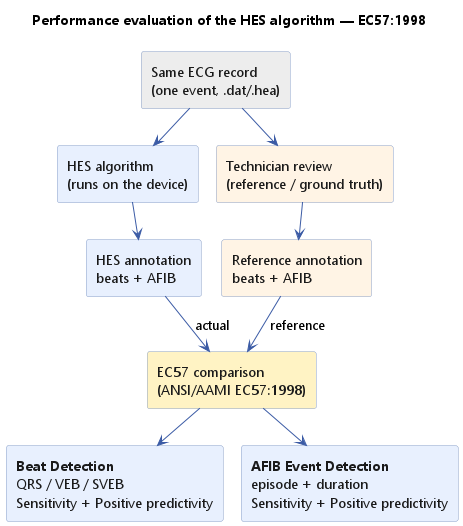

### Beat Detection (phát hiện nhịp)

Mỗi nhịp mà HES đánh dấu sẽ được đối chiếu với nhịp của kỹ thuật viên trong một cửa sổ thời gian nhỏ:

- **True Positive (TP)** — nhịp HES khớp với một nhịp tham chiếu.
- **False Positive (FP)** — nhịp HES không có nhịp tham chiếu tương ứng (phát hiện sai).
- **False Negative (FN)** — nhịp tham chiếu mà HES bỏ sót.

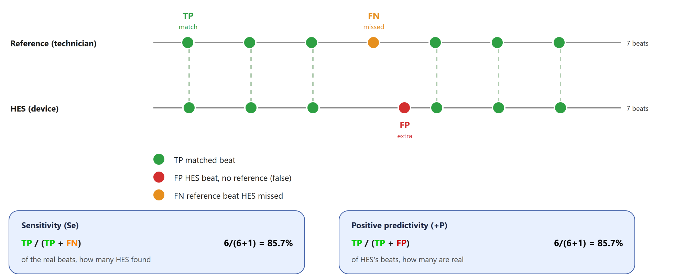

**Nhịp được chấm điểm theo lớp AAMI:**

1. **N:** nhịp bình thường (normal beat)
2. **V:** nhịp ngoại vị thất (ventricular ectopic beat — PVC)
3. **S:** nhịp ngoại vị trên thất (supraventricular ectopic beat — PAC)
4. **Q:** tất cả các nhịp

| **Chỉ số** | **Công thức**     | **Ý nghĩa**                                    |
| ---------- | ----------------- | ---------------------------------------------- |
| **Q_Se**   | TP / (TP + FN)    | Độ nhạy cho **tất cả các nhịp**                |
| **Q_+P**   | TP / (TP + FP)    | Giá trị dự đoán dương cho **tất cả các nhịp**  |
| **V_Se**   | VTP / (VTP + VFN) | Độ nhạy cho **nhịp V**                         |
| **V_+P**   | VTP / (VTP + VFP) | Giá trị dự đoán dương cho **nhịp V**           |
| **S_Se**   | STP / (STP + SFN) | Độ nhạy cho **nhịp S**                         |
| **S_+P**   | STP / (STP + SFP) | Giá trị dự đoán dương cho **nhịp S**           |

### AFIB Event Detection (phát hiện cơn rung nhĩ)

Các cơn AFIB được đối chiếu với nhãn của kỹ thuật viên theo TP/FP/FN.

Một cơn là TP nếu nó chồng lấn (overlap) với cơn tham chiếu, là FN nếu bị bỏ sót, và là FP nếu là cơn giả. Chỉ số: E_Se và E_+P.

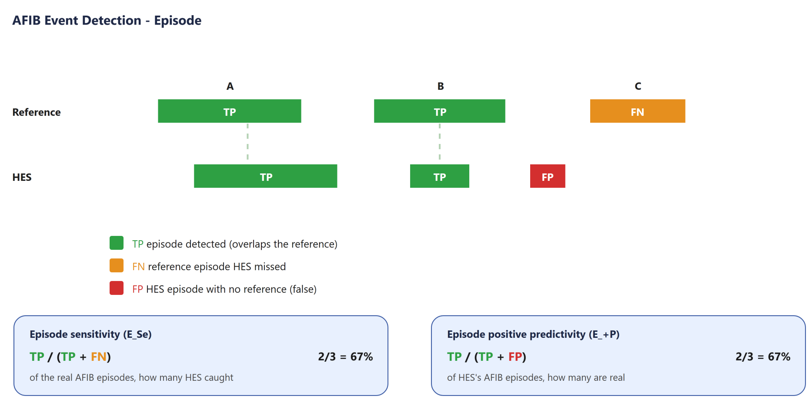

**Duration (thời lượng)** — mỗi giây đều được tính là TP / FN / FP. → **D_Se**, **D_+P**.

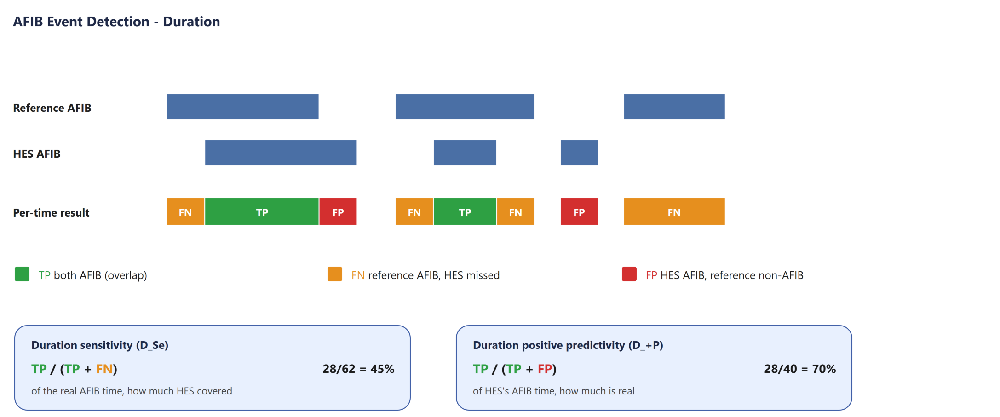

| **Chỉ số** | **Mức**    | **Công thức**                 | **Ý nghĩa**                          |
| ---------- | ---------- | ----------------------------- | ------------------------------------ |
| **E_Se**   | Cơn        | Đã phát hiện / Tham chiếu     | Số cơn AFIB được phát hiện           |
| **E_+P**   | Cơn        | Phát hiện đúng / Đã phát hiện | Số cơn đã phát hiện mà là đúng       |
| **D_Se**   | Thời lượng | TP / (TP + FN)                | Thời gian AFIB thật được phát hiện   |
| **D_+P**   | Thời lượng | TP / (TP + FP)                | Thời gian AFIB phát hiện được là đúng |

**Specificity & NPV — phía không-AFIB**

Lần chạy còn đánh giá cả phần thời gian không phải AFIB (TN). Specificity dùng thời gian không-AFIB của tham chiếu (FP + TN), còn NPV dùng thời gian không-AFIB của HES (FN + TN).

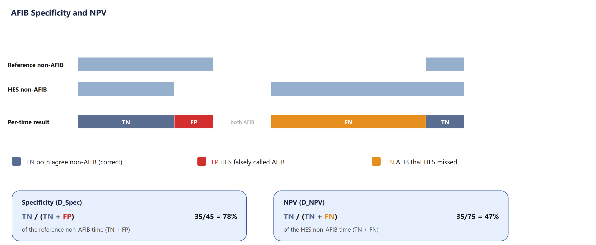

| **Chỉ số**                                     | **Công thức**          | **Ý nghĩa**                                                                |
| ---------------------------------------------- | ---------------------- | -------------------------------------------------------------------------- |
| **D_Spec** — độ đặc hiệu theo thời lượng       | **TN / (TN +** **FP)** | trong thời gian thật sự không-AFIB, HES giữ đúng là không-AFIB được bao nhiêu |
| **D_NPV** — giá trị dự đoán âm theo thời lượng | **TN / (TN +** **FN)** | trong thời gian HES cho là không-AFIB, bao nhiêu thực sự không-AFIB         |

**Gross (gộp chung), không phải trung bình**

Mọi con số trong báo cáo đều là **gross (gộp chung)**: cộng tất cả số đếm thô trên **toàn bộ** bản ghi trước, rồi mới lấy **một** tỉ lệ — không bao giờ lấy trung bình của các phần trăm theo từng bản ghi. Nếu lấy trung bình thì một bản ghi 20 nhịp sẽ có trọng số ngang với bản ghi 2.000 nhịp, và bản ghi không có nhịp tham chiếu nào thì chẳng có phần trăm nào để lấy trung bình.

Ví dụ — **Q_Se = TP / (TP + FN)** trên hai bản ghi:

| **Bản ghi** | **TP**    | **FN** | **Q_Se từng bản ghi**     |
| ----------- | --------- | ------ | ------------------------- |
| A           | 90        | 10     | 90.0%                     |
| B           | 990       | 10     | 99.0%                     |
| **Gross**   | **1,080** | **20** | **1,080 / 1,100 = 98.2%** |

**Trung bình** của hai phần trăm là 94.5%, nhưng **gross** là **98.2%** — 1.000 nhịp của bản ghi B mang trọng số lớn hơn. Mọi chỉ số đều gộp theo cách này: phần nhịp cộng TP / FN / FP; thời lượng AFIB và Spec/NPV cộng số giây AFIB và TN / FP / FN. Đây chính là lý do tab **metric merge** và **filter / greedy** gộp lại số đếm thô thay vì lấy trung bình phần trăm.

## Luồng làm việc tổng thể

Việc validate thuật toán HES để nộp FDA là một quá trình **lặp** giữa **đội backend**, **đội firmware** và **kỹ thuật viên**.

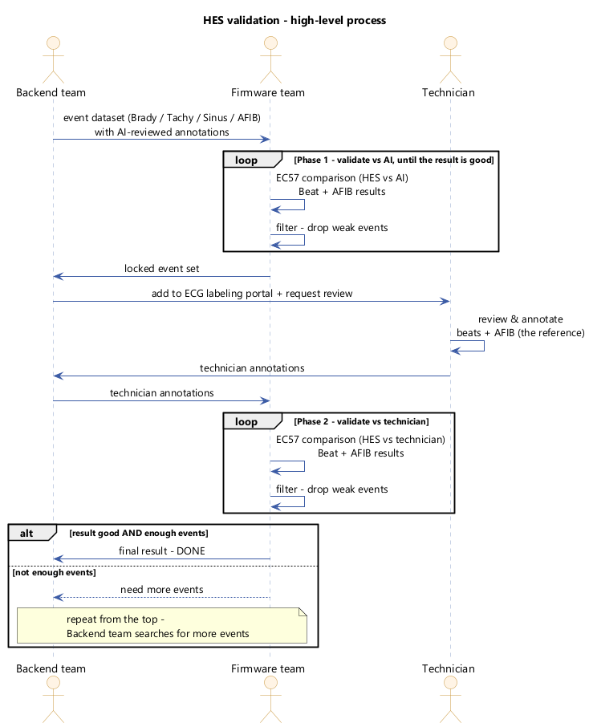

## Bộ dữ liệu

### Bộ dữ liệu đầy đủ (hiện tại)

Lưu trên SharePoint: full-dataset.

Tổng cộng **12.870** sự kiện — **1.452** đã được kỹ thuật viên gán nhãn và **11.418** chưa được gán nhãn. Được nhóm theo nguồn tham chiếu (Tech / AI), rhythm và FBD:

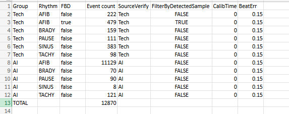

### 900 sự kiện được chọn cho FDA

Lưu trên SharePoint: 900-event set.

Bộ validate đã nộp cho FDA — **900** sự kiện thuộc năm loại rhythm:

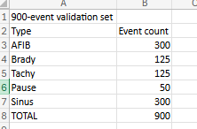

## Tab Validate - so sánh EC57

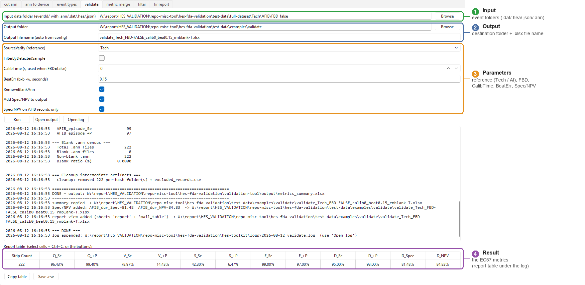

Điền các trường rồi nhấn **Run**. Các chỉ số sẽ hiện trong bảng báo cáo bên dưới log và được ghi ra file đầu ra **metrics_summary.xlsx**.

### Đầu vào

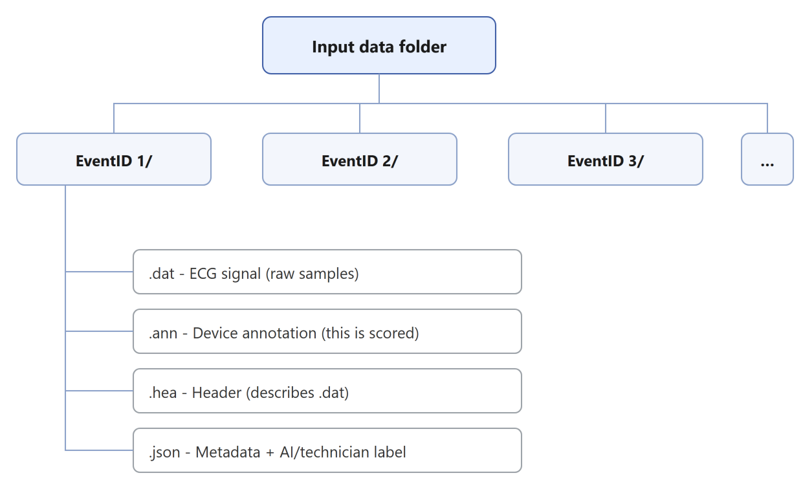

Mỗi thư mục con **<eventId>/** phải chứa đủ **bốn** file dưới đây:

| **File**  | **Nội dung**                                                                             |
| --------- | ---------------------------------------------------------------------------------------- |
| **.dat**  | File bản ghi — mẫu ECG thô (200 Hz) của sự kiện                                          |
| **.hea**  | File header — tên bản ghi, tần số lấy mẫu, định dạng, số mẫu; **mô tả cho file .dat**    |
| **.json** | Metadata hiện trên portal gán nhãn ECG — nhịp + nhãn AFIB của **AI / kỹ thuật viên**     |
| **.ann**  | Nhịp + nhãn AFIB do **thuật toán HES chạy trên thiết bị** sinh ra                        |

### Tham số

Giá trị mặc định nằm trong ngoặc. Ba trường liên quan đến thời gian được minh hoạ bên dưới.

| **Tham số**                       | **Mặc định** | **Mô tả**                                             |
| --------------------------------- | ------------ | ----------------------------------------------------- |
| **SourceVerify**                  | AI           | Nguồn tham chiếu: **Tech** hoặc **AI**                |
| **FilterByDetectedSample (FBD)**  | on           | Chỉ chấm điểm trong cửa sổ phát hiện của thiết bị     |
| **CalibTime**                     | 0            | Bỏ qua N giây đầu; dùng khi FBD tắt                   |
| **BeatErr**                       | 0.15         | Cửa sổ khớp nhịp cho **bxb**, tính bằng giây          |
| **RemoveBlankAnn**                | on           | Loại bỏ sự kiện không có phát hiện nào                |
| **Add Spec/NPV to output**        | on           | Thêm cột **D_Spec** / **D_NPV**                       |
| **Spec/NPV on AFIB records only** | on           | Chỉ tính Spec/NPV trên các bản ghi AFIB               |

**FilterByDetectedSample (FBD)**

Khi không tìm được file **.ann** gốc, sự kiện sẽ được chạy lại trên thiết bị, và thiết bị không phát hiện được gì trong giai đoạn **calibration warm-up**. **FBD = on** cắt phần tham chiếu cho đến **nhịp đầu tiên thiết bị phát hiện được**, nên giai đoạn warm-up không bị tính là nhịp bỏ sót (**CalibTime** không được dùng); **FBD = off** chấm điểm toàn bộ đoạn. Chi tiết: ecgSD Firmware Workflow and Usage Guide.

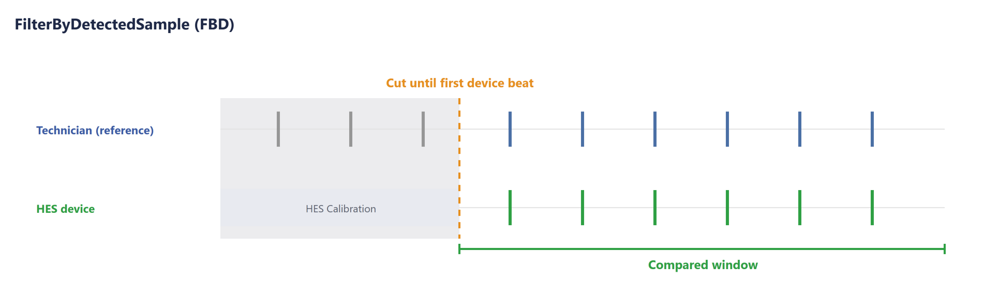

**CalibTime**

Bỏ qua **N giây đầu** của cả tham chiếu lẫn thiết bị. Giá trị 0 nghĩa là giữ tất cả.

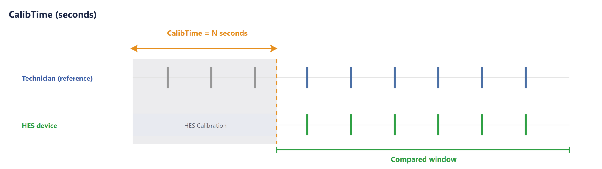

**BeatErr**

Ngưỡng dung sai của bxb khớp một nhịp của thiết bị với một nhịp tham chiếu trong phạm vi ± BeatErr giây. Nếu không khớp, nhịp của thiết bị là FP còn nhịp tham chiếu là FN. Giá trị mặc định của BeatErr là **0.15 s**, theo WFDB 10.7.0.

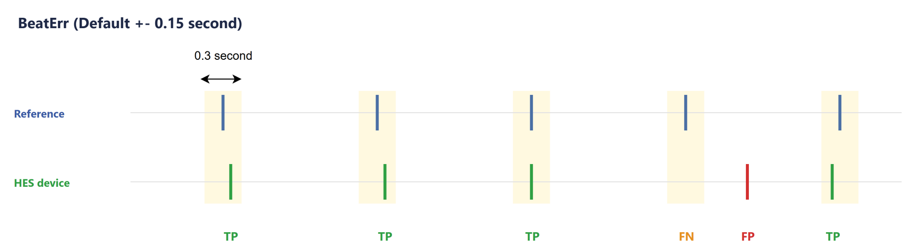

### Ví dụ - Validate bộ dữ liệu Brady

Bộ 900 sự kiện là kết quả gộp của sáu bộ dữ liệu nhỏ hơn, như hình dưới:

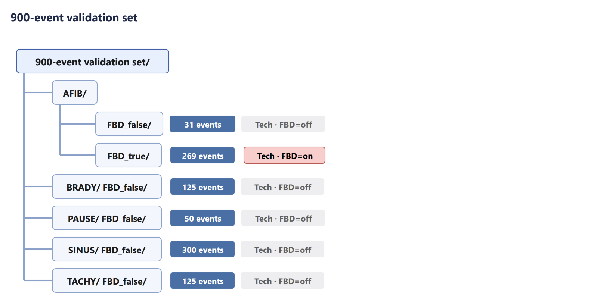

Ví dụ này validate bộ Brady trong bộ 900 sự kiện đã chọn. Làm theo các bước sau:

1. **Tải về** bộ **Brady** brady 900_event_source,

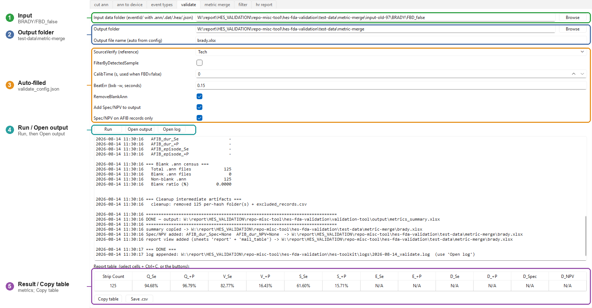

1. **Input**: đặt **Input data folder** trỏ tới thư mục Brady.
2. **Output folder**: một đường dẫn dự án thực tế như **..\test-data\metric-merge** (không dùng thư mục tạm); tên file sẽ tự động điền.
3. **Tự động điền**: file **validate_config.json** trong thư mục sẽ điền **SourceVerify = Tech · FBD = off · CalibTime = 0 · BeatErr = 0.15 · RemoveBlankAnn = on**.
4. **Run / Open output**: nhấn **Run**; khi xong, **Open output** sẽ mở file **brady.xlsx** đã lưu.
5. **Result / Copy table**: các chỉ số EC57 hiện trong bảng báo cáo; **Copy table** để sao chép.

Mở **brady.xlsx** (qua **Open output**): file có **6 sheet** (đang hiện sheet **summary**):

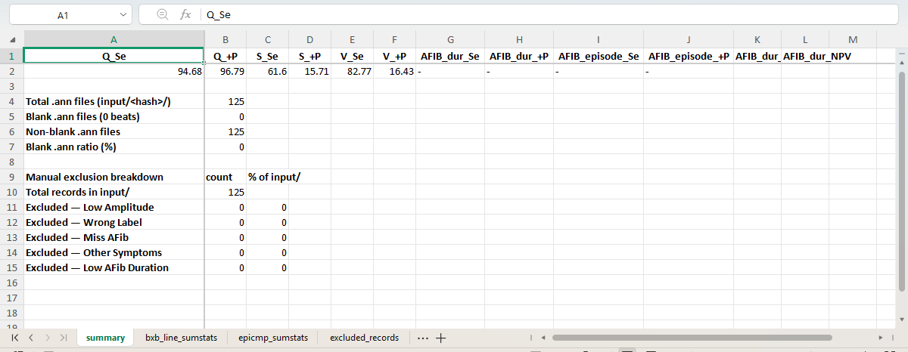

- **summary** — các chỉ số gross (một dòng).
- **report** / **mail_table** — dạng bảng báo cáo hiện bên dưới log.
- **bxb_line_sumstats** — số nhịp theo từng bản ghi (Q / V / S) đứng sau Q_Se, V_Se, S_Se.
- **epicmp_sumstats** — số cơn AFIB + thời lượng theo từng bản ghi đứng sau E_Se / D_Se và AFIB_dur_Spec / NPV.
- **excluded_records** — các bản ghi bị loại khỏi việc chấm điểm (nếu có).

Hai sheet theo từng bản ghi chính là thứ mà **metric merge** gộp lại giữa các nhóm.

## Tab Merge

Như đã nói ở trên, bộ **900 sự kiện** đã chọn là **kết quả gộp của sáu bộ con** (mỗi bộ ứng với một rhythm × FBD). Tab này gộp chúng lại thành một kết quả gross duy nhất.

**Tải về cả sáu bộ con** từ SharePoint và **validate** từng bộ → sáu file chỉ số **.xlsx** (mỗi file giống lần chạy Brady ở trên). Sau đó làm theo các đánh dấu 1-4:

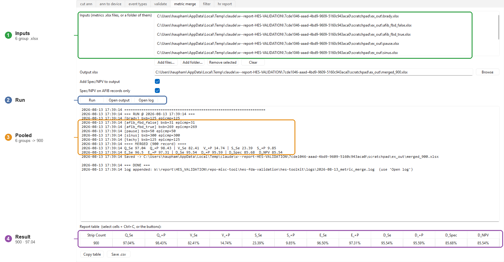

1. **Inputs** — Thêm sáu file **.xlsx** hoặc chọn thư mục chứa chúng.
2. **Run** — Gộp các bộ dữ liệu.
3. **Pooled** — Kiểm tra số đếm sau khi gộp đúng tổng 900 sự kiện.
4. **Result** — Xem các chỉ số EC57 đã gộp; nhấn **Copy table** để sao chép kết quả.

Gộp sáu nhóm lại cho ra kết quả EC57 chốt của bộ 900:

| **Strip** | **Q_Se** | **Q_+P** | **V_Se** | **V_+P** | **S_Se** | **S_+P** | **E_Se** | **E_+P** | **D_Se** | **D_+P** | **D_Spec** | **D_NPV** |
| --------- | -------- | -------- | -------- | -------- | -------- | -------- | -------- | -------- | -------- | -------- | ---------- | --------- |
| 900       | 97.04    | 98.43    | 82.41    | 14.74    | 23.39    | 9.85     | 96.5     | 97.31    | 95.54    | 95.59    | 85.68      | 85.54     |

## Tab Cut ann

Khi BE cung cấp các thư mục sự kiện, các file **.ann** bị thiếu vì nhãn được lưu trong file **.anb** của study. **Cut ann** dựng lại từng thư mục sự kiện từ file **.anb** và JSON của sự kiện (**studyId, start, stop**).

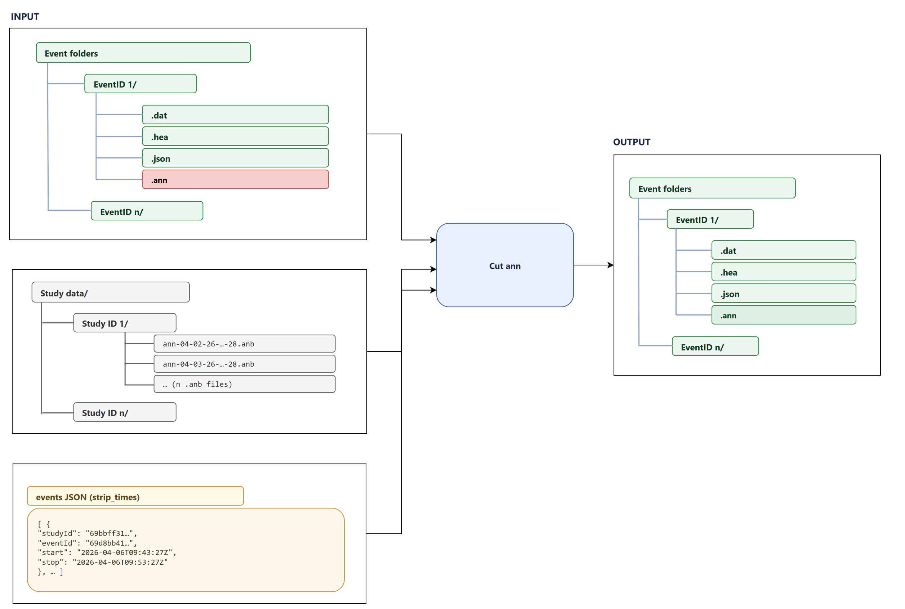

**Cách chạy:**

1. **Tải về** bộ mẫu cut-ann từ SharePoint và giải nén vào **..\test-data\cut-ann**.

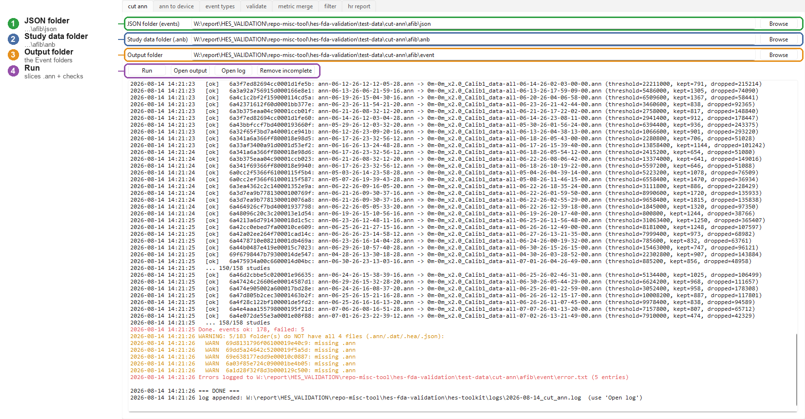

1. **JSON folder** = ..\test-data\cut-ann\afib\json
2. **Study data folder** = ..\test-data\cut-ann\afib\anb
3. **Output folder** = các thư mục sự kiện trong **..\test-data\cut-ann\afib\event** chứa **.dat/.hea/.json**; **Cut ann** sẽ thêm file **.ann**.
4. **Run** — Cắt file **.ann** cho từng sự kiện, đổi tên cả bốn file về cùng một **<base>**, và cập nhật tên bản ghi trong **.hea**. **Remove incomplete** xoá các thư mục thiếu bất kỳ file nào trong 4 file.

## Tab Ann to device

**ann to device** sao chép nhịp và AFIB của thiết bị từ file **.ann** vào trường **aiPrediction** trong JSON của sự kiện, thay thế kết quả của AI. Nhờ vậy kỹ thuật viên có thể xem lại kết quả phát hiện thực tế của thiết bị trên portal ECG.

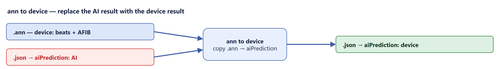

Nó ghi các nhịp, **hesBeatStatus**, và các đoạn **rhythm** AFIB vào **aiPrediction**.

**Cách chạy:**

1. **Tải về** bộ mẫu từ SharePoint và giải nén vào **..\test-data\ann-to-device\input**.

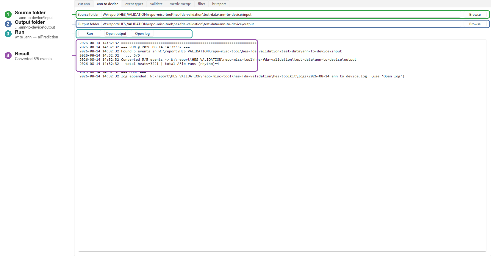

1. **Source folder** = **..\test-data\ann-to-device\input** (5 thư mục sự kiện với **.ann/.dat/.hea/.json**).
2. **Output folder** = thư mục bất kỳ (ví dụ **..\test-data\ann-to-device\output**).
3. **Run** — ghi dữ liệu **.ann** của thiết bị vào **aiPrediction** của từng file **.json**.
4. **Result** — **5/5 sự kiện đã chuyển · 3.221 nhịp · 4 đoạn AFIB**. **Confirm** — Chạy lại **validate** với **SourceVerify = AI**. Tất cả chỉ số phải bằng **100%** vì file **.ann** của thiết bị và **aiPrediction** chứa cùng một kết quả của thiết bị.

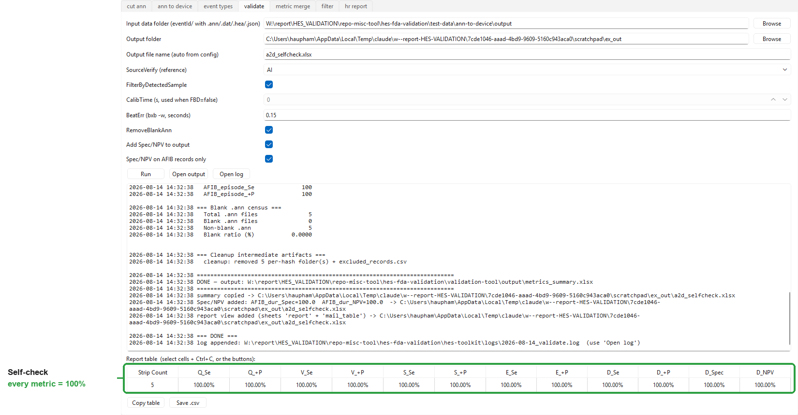

## Tab Event types

**Event types** gán cho mỗi sự kiện một rhythm (AFIB, Brady, Tachy, Pause, hoặc Sinus/Other) để thống kê bộ dữ liệu.

**Phân loại** — Dựa vào trường **rhythm** và **interpretation** trong `strip` của file **.json** (nhãn của kỹ thuật viên).

```
"strip": {
  "rhythm": [
    {
      "type": "AFIB",
      "isDeleted": false,
      "start": 47,
      "stop": 149942
    }
  ],
  "interpretation": "Atrial Fibrillation/Flutter"
}
```

**AFIB: strip.rhythm** chứa một đoạn **AFIB** chưa bị xoá.

**Pause / Tachy / Brady:** nhận diện bằng từ khoá trong **strip.interpretation**.

Nếu **strip.interpretation** rỗng hoặc là **"agree"**, dùng **aiPrediction.interpretation**.

Bảng dưới đây mô tả các quy tắc kèm ví dụ lấy từ bộ 900 sự kiện. (Phần cột ví dụ trong tài liệu gốc bị xáo trộn khi trích xuất từ PDF; các mảnh tiếng Anh được giữ nguyên văn.)

| **Rhythm**                                          | **Kích hoạt khi**                                                                                             | **Ví dụ**                   | **(sự kiện thực tế)**                                          |                                                   |
| --------------------------------------------------- | ------------------------------------------------------------------------------------------------------------- | --------------------------- | -------------------------------------------------------------- | ------------------------------------------------- |
| **AFIB**                                            | **strip.rhythm** có một đoạn với type = AFIB, chưa bị xoá                                                      | rhythm the text)            | run **type = AFIB** (from                                      | (from the field, not                              |
| **Pause**                                           | **strip.interpretation** chứa chữ **pause**                                                                    | "Sinus with                 | Rhythm at 46 bpm and SVE."                                     | and Pause 2.7s                                    |
| **Tachy**                                           | **strip.interpretation** chứa chữ **tachy**                                                                    | "Sinus PVCs"                | Tachycardia, Ventricular                                       | Trigeminals,                                      |
| **Brady**                                           | **strip.interpretation** chứa chữ **brady**                                                                    | "Sinus and                  | Bradycardia with Sinus PACs"                                   | Arrhythmia                                        |
| **Sinus/Other** **Đa rhythm** **Diễn giải sự kiện** | không quy tắc nào ở trên khớp **events:** Áp dụng ưu tiên **AFIB > Pause > Tachy >** **interpretation (real)** | "3rd Deg Runs" **Brady** so | Deg AVB with SVEs, SVE each event belongs to **Rules matched** | Couplets, SVE one bucket. **Kept** **(priority)** |
| "**Bradycardia** 69; Sinus 52"                      | 29 bpm and **Pause** 4.4s; **Atrial Fibrillation/Flutter**                                                     | 35-                         | AFIB · Pause · Brady                                           | **AFIB**                                          |
| "2nd degree AV 54"                                  | AV Block 26 bpm and **Pause** 2.5s; **Bradycardia** 27;                                                        | Sinus                       | Pause · Brady                                                  | **Pause**                                         |
| "**Atrial**                                         | **Fibrillation/Flutter** 93-233; Sinus **Tachycardia** 144"                                                    |                             | AFIB · Tachy                                                   | **AFIB**                                          |

**Lưu ý:** AFIB được xác định qua trường **rhythm**, không phải qua văn bản interpretation. Chỉ **Pause / Tachy / Brady** mới dùng so khớp văn bản.

**Chạy** trên bộ 900 sự kiện theo các bước 1–4 dưới đây.

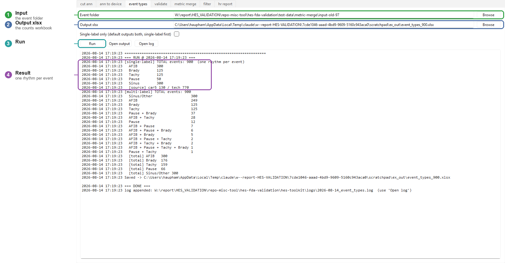

1. **Input** — **Event folder** = **..\test-data\metric-merge\input-old-97** (thư mục chứa các nhóm sự kiện).
2. **Output xlsx** = đặt ở đâu cũng được.
3. **Run**.
4. **Result** — **TOTAL 900**, mỗi sự kiện một rhythm: **AFIB 300 · Brady 125 · Tachy 125 · Pause 50 · Sinus/Other 300 = 900** (nguồn **car5 130 / tech 770**).

File **.xlsx** đầu ra — một sheet **Summary** chứa số lượng, cộng với một sheet cho mỗi rhythm (**friendlyId / recordHash / source / interpretation**):

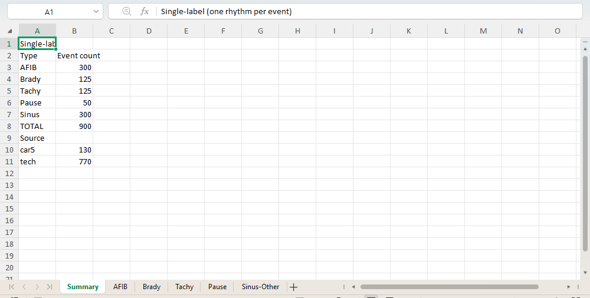

## Tab Filter

Một tab với hai chế độ lọc:

- **greedy** — giữ lại **N** bản ghi tốt nhất theo phương pháp maximin.
- **flag** — loại bỏ các bản ghi thấp hơn một ngưỡng chỉ số cố định.

Cả hai chế độ đều tính lại chỉ số cho các bản ghi còn lại và xuất ra bộ **selected**. Chế độ **flag** còn xuất thêm sheet **flagged**. Đầu vào: một hoặc nhiều file validate **.xlsx**.

### Dữ liệu demo

1. **Tải về** các bộ demo từ SharePoint:
- **demo_filter.xlsx** — 10 bản ghi cho **greedy** và tất cả chế độ **flag**.
- **demo_ceil.xlsx** — 6 bản ghi, chỉ dành cho chế độ **Ceil**.

Chọn đúng file trong **Inputs** trước khi chạy.

### Greedy

**Mode = greedy** loại bỏ từng bản ghi một cho đến khi còn lại **N**. Mỗi lần loại bỏ đều cải thiện chỉ số **Objective** yếu nhất, giữ cho bộ được chọn cân bằng.

| **Trường**    | **Mô tả**                                                                       |
| ------------- | ------------------------------------------------------------------------------- |
| **N**         | Số bản ghi cần giữ lại.                                                         |
| **Objective** | Các chỉ số cần tối ưu: **E_Se=0, E_+P=1, D_Se=2, D_+P=3, D_Spec=4, D_NPV=5**.   |
| **Ceil E_Se** | Ngưỡng trần tuỳ chọn cho **E_Se** để tránh nó tăng quá nhiều.                   |
| **Prefilter** | Loại bỏ các bản ghi có bất kỳ chỉ số nào ≤ 0. Nên bật.                          |

Các trường của công cụ được mô tả bên dưới.

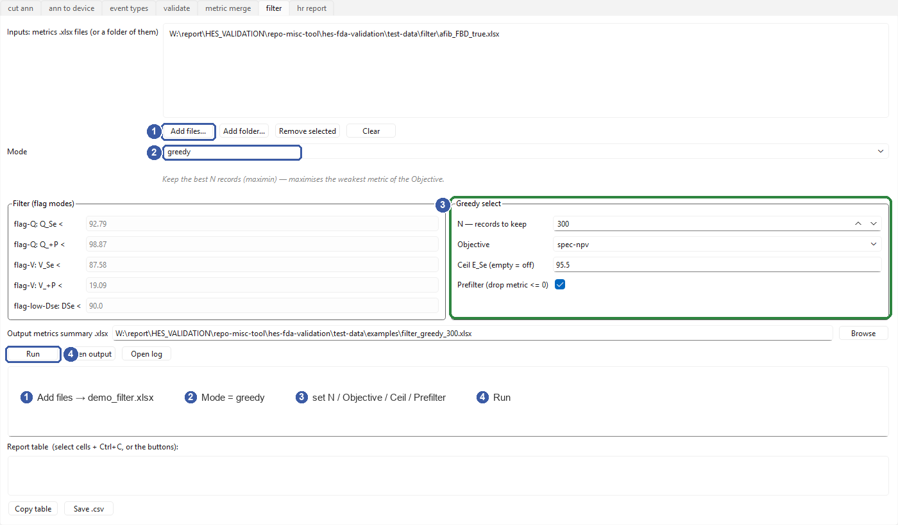

**Đầu ra:**

- **summary** — Số bản ghi đã chọn + 6 chỉ số gross.
- **epicmp_sumstats** — Mỗi dòng ứng với một bản ghi đã chọn.
- **selected** — Hash của các bản ghi đã chọn.

**Prefilter:** Loại bỏ các bản ghi có bất kỳ chỉ số nào ≤ 0 hoặc thiếu **D_Se** trước khi chọn. Hãy để **bật**.

Demo: **10 → 7** bản ghi sạch. Bộ AFIB thực tế 701 bản ghi: **701 → 575**.

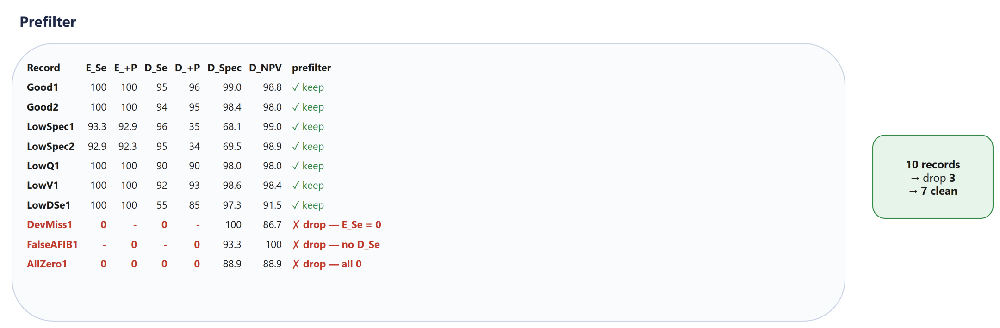

**Greedy hoạt động thế nào:** Mỗi vòng:

1. Xét 6 chỉ số của các bản ghi còn giữ lại.
2. Tìm chỉ số **Objective** yếu nhất.
3. Loại bỏ bản ghi mang lại cải thiện lớn nhất cho chỉ số đó.
4. Lặp lại cho đến khi còn **N** bản ghi.

**Objective** quyết định những chỉ số nào được xét. Không sử dụng trọng số.

**all6** — Theo dõi cả sáu chỉ số. Trong demo, chỉ số yếu nhất chuyển từ **D_+P** (vòng 1–2) sang **D_Se** (vòng 3).

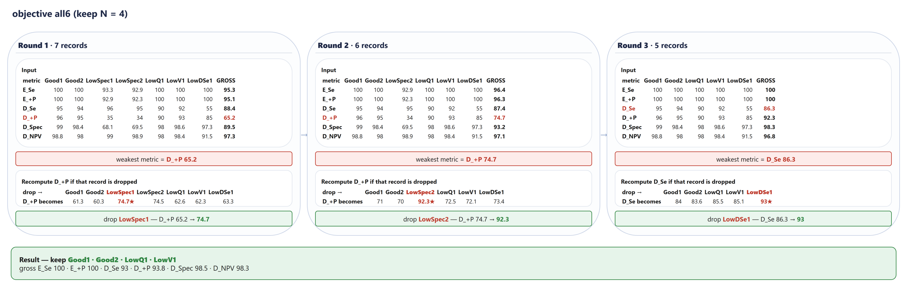

**spec-npv** — Chỉ tối ưu **D_Spec** và **D_NPV**. Nó loại **LowSpec1**, rồi đến **LowSpec2**; khi **D_Spec** đã cải thiện, **D_NPV** trở thành chỉ số yếu nhất và **LowDSe1** bị loại.

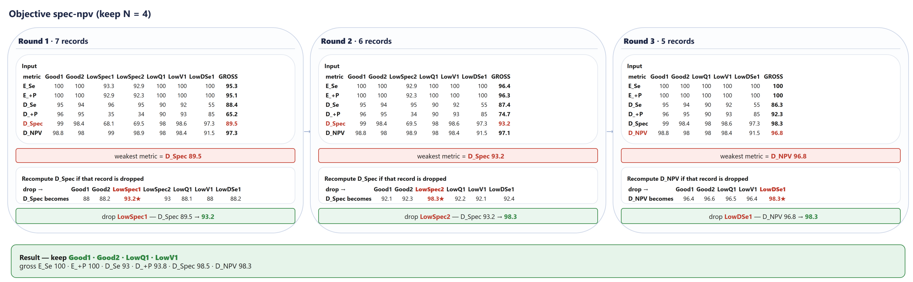

**sens** — Chỉ tối ưu **E_Se** và **D_Se**. Vì **D_Se** yếu nhất nên nó loại **LowDSe1** và giữ lại **LowSpec1/2** dù chúng có độ đặc hiệu thấp. Kết quả cuối **D_Spec giảm còn 83.0**.

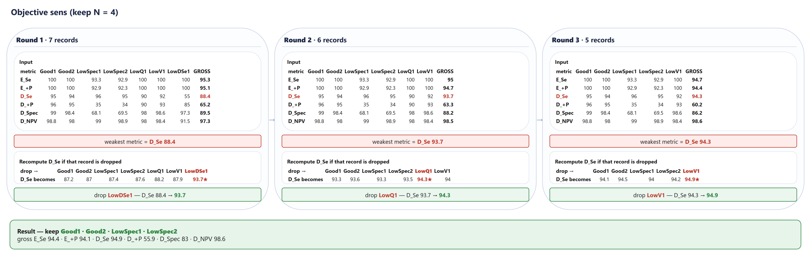

**Ceil E_Se** — Đặt giới hạn trên cho **E_Se** (ví dụ **95.5**). Greedy sẽ bỏ qua những lần loại bỏ làm E_Se vượt trần, nhờ đó Spec/NPV vẫn cải thiện được mà không làm E_Se tăng không cần thiết.

Ví dụ bên dưới dùng **demo_ceil.xlsx**.

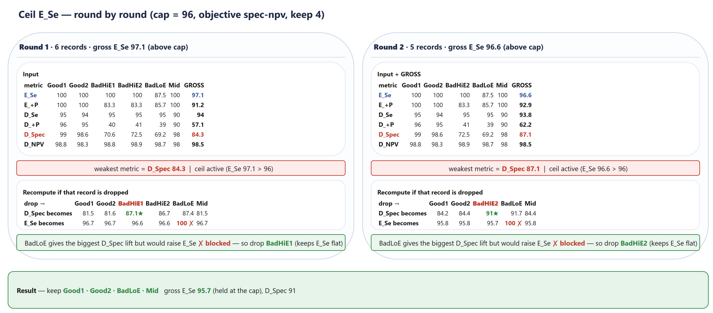

### Các chế độ flag

**Flag mode** loại bỏ các bản ghi không đạt một ngưỡng chỉ số cố định, rồi tính lại chỉ số gross của các bản ghi còn lại. Sheet **flagged** liệt kê các bản ghi đã bị loại để xem lại.

Chọn **Mode** và đặt ngưỡng; các trường của greedy sẽ bị vô hiệu hoá.

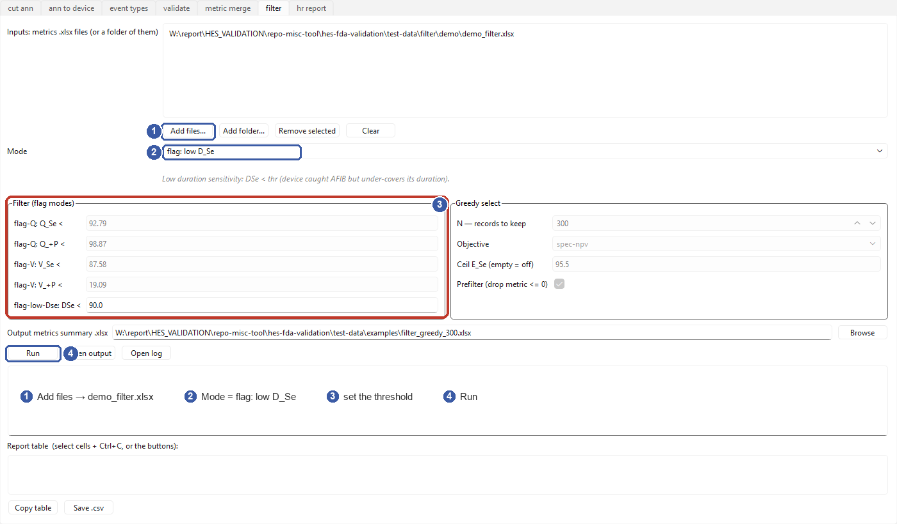

Có năm chế độ flag:

- **Low Q_Se / Q_+P** — Phát hiện nhịp.
- **Low V_Se / V_+P** — Phát hiện nhịp.
- **Low D_Se** — Độ nhạy theo thời lượng AFIB.
- **Device miss/false AFIB** — Lỗi phát hiện AFIB.
- **AFIB all-zero** — Các chỉ số AFIB đều bằng không.

Ví dụ: **Low D_Se < 90** loại bỏ các bản ghi dưới 90, rồi tính lại các chỉ số còn lại.

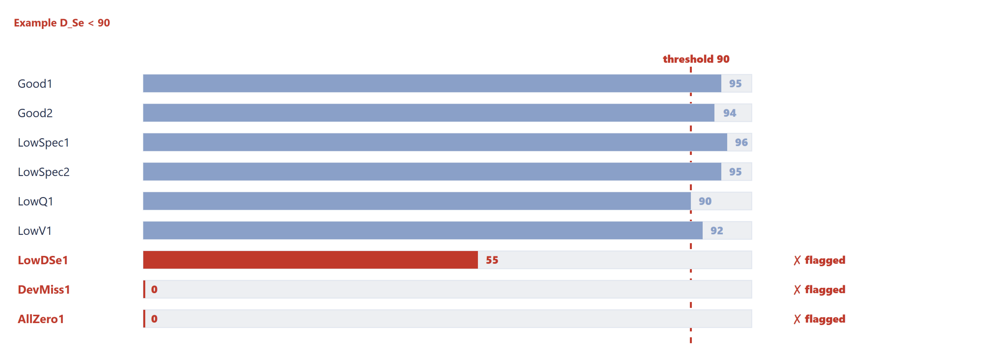

## End-to-end: tái lập bộ 300-AFIB đã chốt

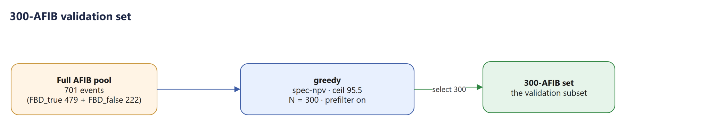

## Tab HR report

Nhịp tim trung bình trên các cơn AFIB (**avg_hr = 60/mean(RR/250)**) cộng với phân chia theo dải **<60 / 60–120 / >120** bpm.

**Cách chạy** (đánh dấu 1-4):

1. **Tải về** thư mục nguồn **..\test-data\full-dataset\Tech\AFIB\FBD_true** (479 sự kiện) từ **full-dataset** trên SharePoint (link ở mục Bộ dữ liệu phía trên).

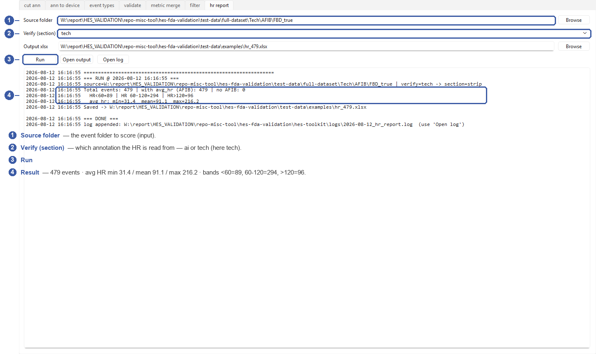

1. **Source folder** — thư mục sự kiện cần chấm điểm (đầu vào).
2. **Verify (section)** — nhịp tim được đọc từ nhãn nào: **ai** hoặc **tech** (ở đây là **tech**).
3. **Run**.
4. **Result** — 479 sự kiện; HR trung bình min 31.4 / mean 91.1 / max 216.2 bpm; các dải **<60**=89, **60–120**=294, **>120**=96.
