# HES Missing Event Investigation Tool — Guide

## Revision History

| **Date**   | **Version** | **Author** | **Note**                                                          |
| ---------- | ----------- | ---------- | ----------------------------------------------------------------- |
| 2026-08-12 | 1.0         | Hau Pham   | Initial version — full workflow tested end-to-end on 4 real cases |

## Purpose

Automates the HES "missing event" investigation workflow described in *[20250827] Report - HES Event Evaluation Workflow.docx*: given a study FID (or hash) and the event timestamp a technician reported (Brady/Tachy/Pause), it downloads the right data-all/.anb/report-hourly/device-log files from S3, converts anb->ann, aggregates the hourly event reports, parses the study's real settings straight from the device log, computes whether the event *should* have triggered, cross-checks the device log and report-hourly for what actually happened, shows the ECG waveform for a final visual sanity check, and drafts a ready-to-paste customer-reply write-up.

For how the tool works internally (pipeline steps, assessment logic, known bugs already fixed), see `CLAUDE.md` instead — this file is the usage guide.

## Prerequisites

- **Python 3.10+** (tested with 3.14 — every module uses `from __future__ import annotations`, no pinned-old-wheel constraint like some sibling tools have).
- AWS SSO access (profile `fw-btcy-sso`), for S3 downloads. Check session validity with:

  ```
  aws sts get-caller-identity --profile fw-btcy-sso
  ```

  A printed account/ARN means the session is valid. If expired:

  ```
  aws sso login --profile fw-btcy-sso
  ```

- SSH access to the `customer` host alias (resolved via your own `~/.ssh/config`), needed for FID → study hash resolution (issue 524). Check with:

  ```
  ssh customer "echo ok"
  ```

  If this hangs or fails, FID lookups won't work — either fix SSH access, or always pass `--hash`/a full hash directly instead of a FID.

- Run `setup.bat` once (creates `.venv` + installs `requirements.txt`):

  ```
  setup.bat
  ```

- Launch the GUI:

  ```
  run.bat
  ```

  Or use the CLI directly (for scripted/automated use — see "CLI usage reference" at the end of this guide):

  ```
  .venv\Scripts\python.exe src\main.py --fid 629209 --event-type Pause --date
  2026-06-19 --time 19:34:43
  ```

## GUI overview

Two tabs, both backed by the exact same pipeline the CLI calls (on a background thread, so the window stays responsive during S3 downloads). See the worked examples below for the full step-by-step flow.

**Input tab:**

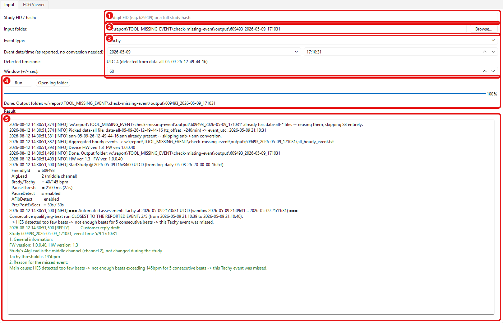

1. **Study FID / hash** — 6-digit FID or a full study hash
2. **Input folder** — optional; reuses the folder if it already has the data, else downloads into it
3. **Event type / date-time / window** — the reported event, exactly as given (timezone is auto-detected after Run)
4. **Run** — starts the pipeline; progress bar + status show live progress
5. **Result** — full log, ending in the conclusion + a ready-to-paste customer-reply draft (green)

**ECG Viewer tab** (auto-opens on success, centered on the event):

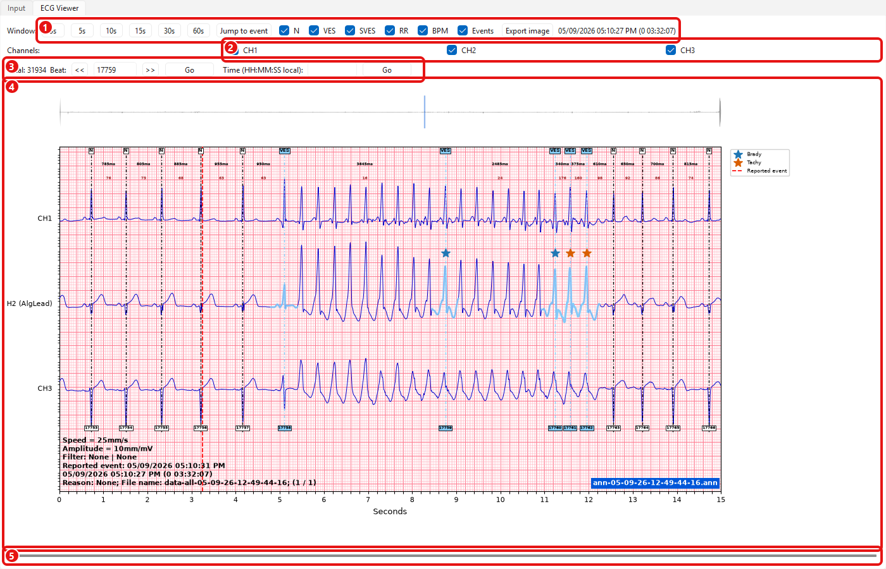

1. **Toolbar** — window length (3-60s), Jump to event, N/VES/SVES/RR/BPM/ Events show-hide toggles, Export image
2. **Channels** — per-channel show/hide
3. **Seek** — jump to a specific beat number or local time
4. **Chart** — minimap (top) + main waveform, colored beat markers, red dashed line = reported event
5. **Scrollbar** — page through the record

## Dependencies

- Python 3.10+, `aws` CLI on PATH (profile `fw-btcy-sso`), SSH access to the `customer` host alias.
- See `requirements.txt` (`wfdb`, `matplotlib`, `PySide6` — PySide6 is only needed for the GUI; the CLI doesn't import it).

# Worked examples: 4 real support-email cases, full

# workflow

Each example below is a **full, real, from-scratch GUI run** for a real "missing event" support case — Study FID only was entered (no shortcut folder), so every run shown here genuinely did: FID → hash resolution over real SSH (issue 524) → real `aws s3` downloads → anb→ann conversion → hourly-event aggregation → settings parsing → the automated assessment → the interactive ECG Viewer.

Each case's previously-downloaded folder was deleted right before its run so the tool couldn't shortcut to "reuse existing data" — every screenshot below is from a genuine live download, not a replay. Each screenshot's numbered markers are explained in its own caption right below it — the numbering restarts at 1 for every image, it does not carry across images.

## Example 1 — Study 609493, Tachy @ 2026-05-09 17:10:31

> Email: *Study 609493, Tachy event reported at 5/9 17:10:31*

**Step 1 — enter the study and event, then click Run**


1. Study FID typed into "Study FID / hash" (Input folder left empty)
2. Event type selected
3. Event date/time entered exactly as reported (local/study clock)
4. **Run** clicked

**Step 2 — mid-run (real SSH hash resolution + S3 download in progress)**

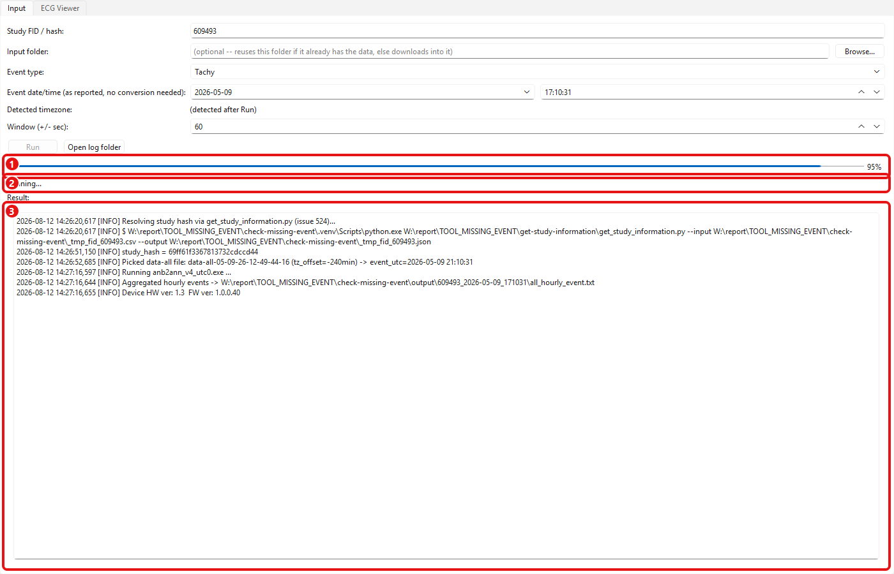

1. Progress bar at 95% — Run button is greyed out while busy
2. Status line: "Running..."
3. Live log: hash resolved via the real SSH/npm call, data-all file picked, anb→ann converted, hourly events aggregated, HW/FW version read

**Step 3 — final result**

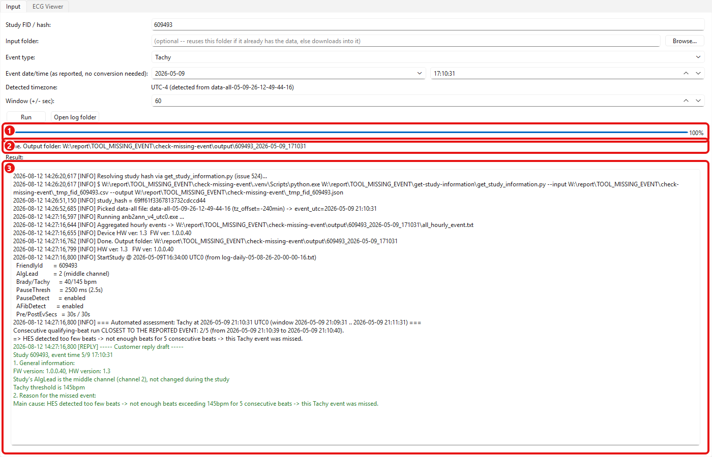

1. Progress bar reaches 100%
2. Status line: "Done. Output folder: ..."
3. Full log, ending in the automated assessment and the green ready-to-paste customer-reply draft

**Step 4 — ECG Viewer (auto-opened, centered on the event)**

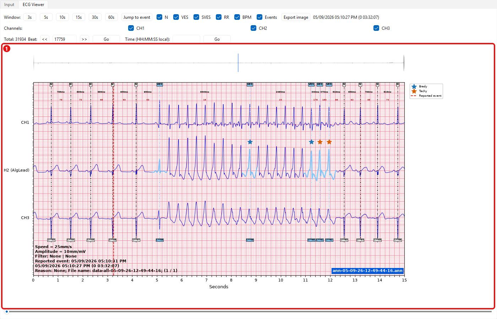

1. Waveform centered on the reported event, with the beat annotations HES actually produced

**Conclusion:** only a 2/5 consecutive-beat run near the reported time (21:10:39-21:10:40 UTC0) — not enough to trigger a Tachy event. AlgLead = channel 2 (middle), Tachy threshold 145bpm, FW 1.0.0.40 / HW 1.3.

## Example 2 — Study 608418, Tachy @ 2026-05-11 22:28:59

> Email: *Study 608418, Tachy event reported at 5/11 22:28:59*

**Step 1**

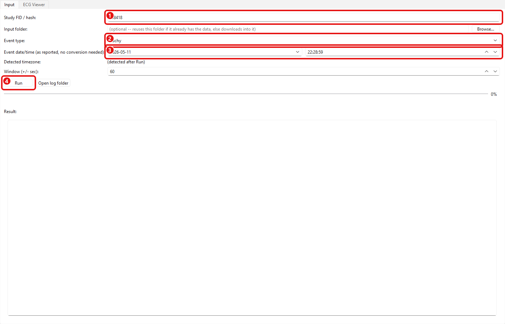

1. Study FID entered
2. Event type selected
3. Event date/time entered exactly as reported (local/study clock)
4. **Run** clicked

**Step 2 — mid-run**

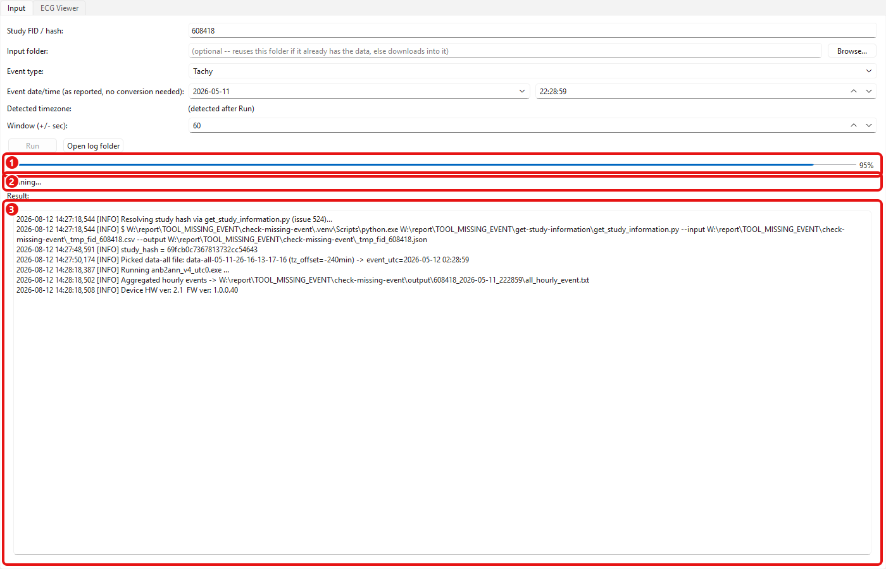

1. Progress bar mid-run
2. Status: "Running..."
3. Live log of the real SSH/S3 steps as they happen

**Step 3 — final result**

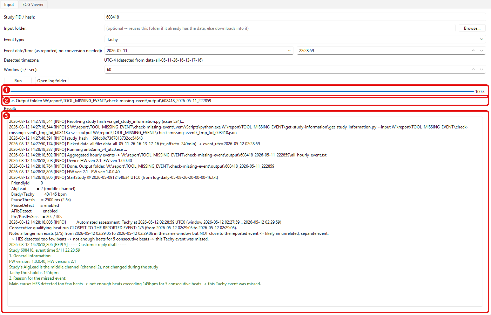

1. Progress bar at 100%
2. Status: "Done."
3. Full log and conclusion

**Step 4 — ECG Viewer**

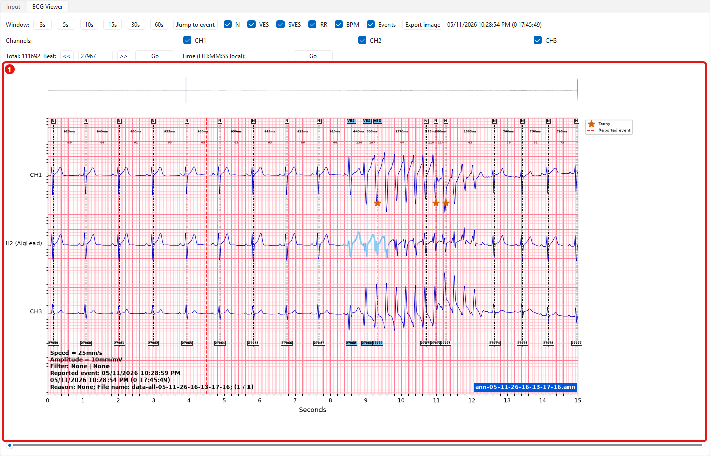

1. Waveform centered on the reported event

**Conclusion:** closest run is only 1/5 consecutive qualifying beats (a separate 2/5 run exists nearby but isn't close to the reported time, so it's flagged as a likely unrelated event). AlgLead = channel 2 (middle), Tachy threshold 145bpm, FW 1.0.0.40 / HW 2.1.

## Example 3 — Study 629209, Pause @ 2026-06-19 19:34:43

> Email: *Study 629209, Pause event reported at 6/19 19:34:43*

**Step 1**


1. Study FID entered
2. Event type selected
3. Event date/time entered exactly as reported (local/study clock)
4. **Run** clicked

**Step 2 — mid-run**


1. Progress bar mid-run
2. Status: "Running..."
3. Live log of the real SSH/S3 steps

**Step 3 — final result**

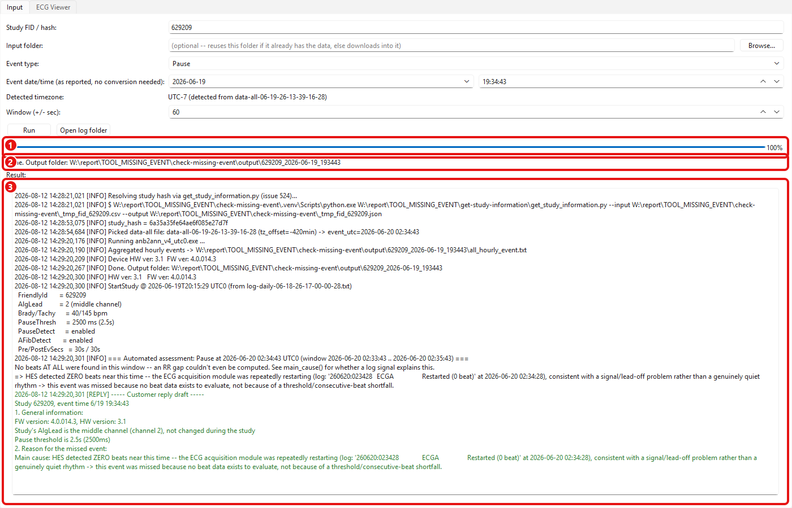

1. Progress bar at 100%
2. Status: "Done."
3. Full log and conclusion

**Step 4 — ECG Viewer**

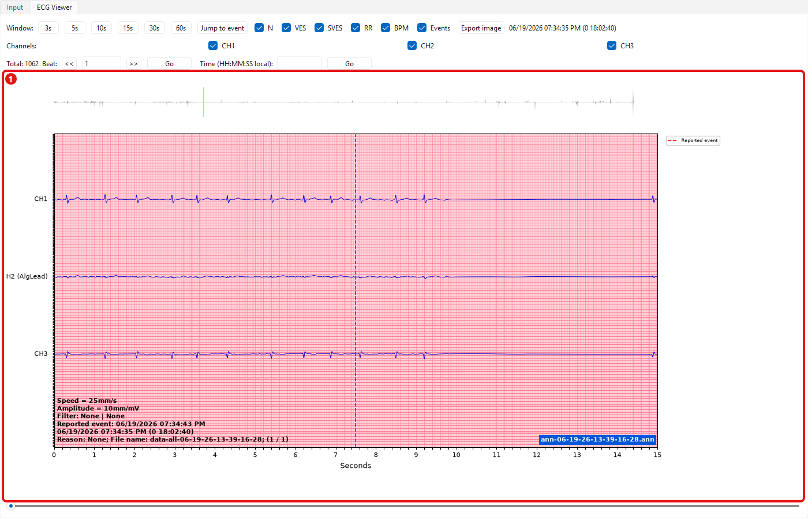

1. Waveform centered on the reported event — notice the trace goes completely flat right after the dashed "Reported event" line

**Conclusion: zero beats at all** were found in the ±60s window around the reported time — not "beats detected normally with no long-enough gap" as first assumed (see CLAUDE.md's zero-beats bug note). The device log shows the ECG acquisition module repeatedly restarting (`ECGA Restarted (0 beat)`, every ~30-100s for ~18 straight hours spanning this event), consistent with a signal/lead-off problem. This event was missed because there was no beat data to evaluate at all, not because of a threshold shortfall.

## Example 4 — Study 611744, Tachy/VT @ 2026-05-21 ~20:51:46

> Email: *"Can you tell me why the VT episode of 5/21 20:51 did not trigger please?"* ("VT" = Ventricular Tachycardia — same event category as "Tachy" in this tool/the device log, just the clinical name.)

**Step 1**

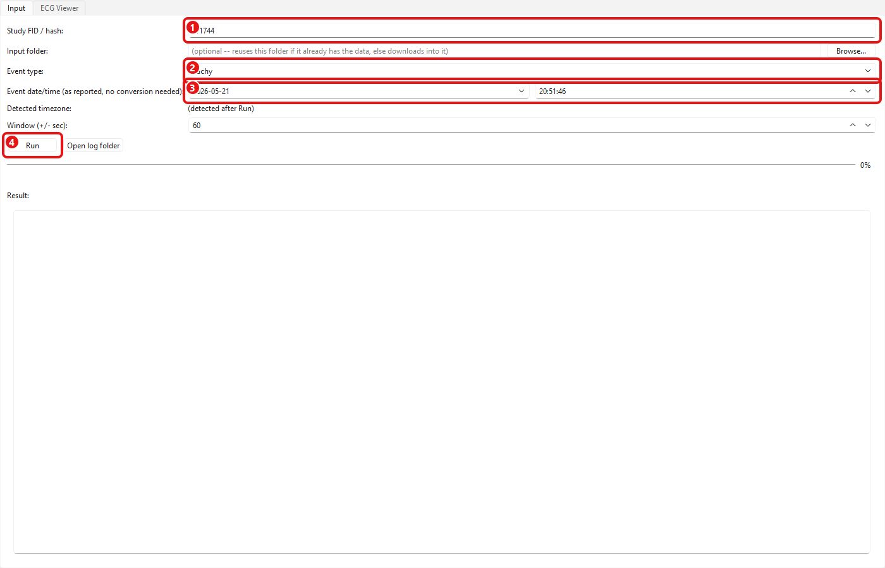

1. Study FID entered
2. Event type selected
3. Event date/time entered exactly as reported (local/study clock)
4. **Run** clicked

**Step 2 — mid-run**


1. Progress bar mid-run
2. Status: "Running..."
3. Live log of the real SSH/S3 steps

**Step 3 — final result**

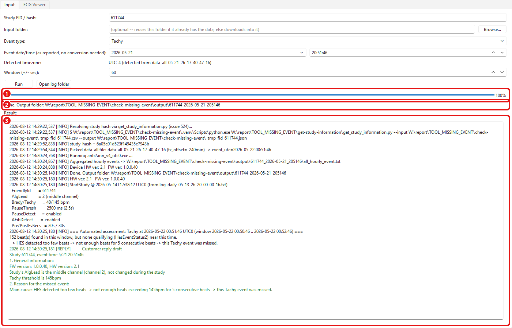

1. Progress bar at 100%
2. Status: "Done."
3. Full log and conclusion

**Step 4 — ECG Viewer**

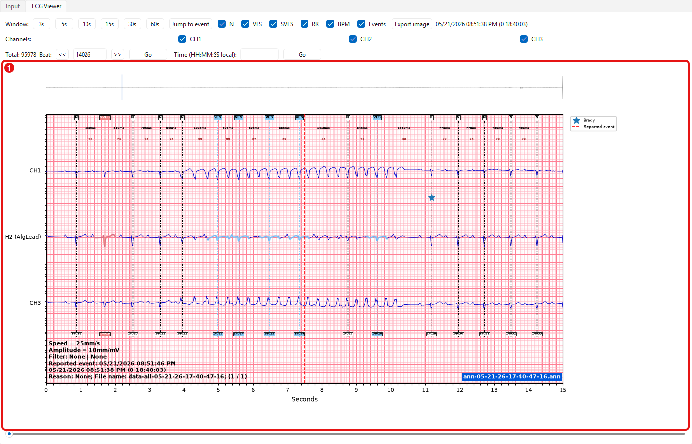

1. Waveform centered on the reported event

**Conclusion:** 152 beats were found in the window, but none qualified as Tachy (`HesEventStatus2`) — consistent with the answer already given for this case ("HES detected missed beats, heart rate stayed below the 145bpm threshold"). Unlike Example 3, this is a genuine "beats present but rate too low" situation, not a beat-detection dropout.

## CLI usage reference

For scripted/automated use (another tool or AI reading its output) instead of the GUI. Entry point: `src\main.py`.

```
.venv\Scripts\python.exe src\main.py --event-type {Brady,Tachy,Pause} --date YYYY-
MM-DD --time HH:MM:SS (--fid FID | --hash HASH | --local-dir DIR) [options]
```

### Flags

| **Flag**             | **Required**                                | **Description**                                                                                                       |
| -------------------- | ------------------------------------------- | --------------------------------------------------------------------------------------------------------------------- |
| `--fid`              | one of `--fid`/`--` `hash`/`--local-` `dir` | Study friendly ID (6 digits) — looked up via `get_study_information.py` (issue 524, real SSH)                         |
| `--hash`             |                                             | Study hash directly — skips the FID lookup entirely                                                                   |
| `--local-` `dir`     |                                             | A folder to reuse (if it already has `data-all-*.dat`) or download into (if empty/new) — see "double duty" note below |
| `--event-` `type`    | **yes**                                     | `Brady`, `Tachy`, or `Pause`                                                                                          |
| `--date`             | **yes**                                     | Event date, local/study clock, `YYYY-MM-DD`                                                                           |
| `--time`             | **yes**                                     | Event time, local/study clock, `HH:MM:SS`                                                                             |
| `--outdir`           |                                             | Output folder (default: `output/<fid_or_hash>_<date>_<time>/`)                                                        |
| `--` `window-` `sec` |                                             | ±seconds around the event to analyze/plot (default 60)                                                                |
| `--dry-` `run`       |                                             | Print the hash-resolution command without running it or anything after it                                             |
| `--no-` `plot`       |                                             | Skip generating `event_plot_overview.png`/`event_plot_closeup.png`                                                    |

Exactly one of `--fid`, `--hash`, `--local-dir` is required.

### Examples

```
# Real case, FID lookup + S3 download
.venv\Scripts\python.exe src\main.py --fid 629209 --event-type Pause --date 2026-
06-19 --time 19:34:43

# Already know the hash? Skip the FID lookup (issue 524 is slow, don't hammer it
per email)
.venv\Scripts\python.exe src\main.py --hash <study-hash> --event-type Tachy --date
2026-05-09 --time 17:10:31

# Offline demo/test, or re-opening a case you already downloaded (no AWS needed if
data's there)
.venv\Scripts\python.exe src\main.py --local-dir "output\609493_2026-05-09_171031"
--event-type Tachy --date 2026-05-09 --time 17:10:31

# Wider ±120s window, custom output folder, skip plotting
.venv\Scripts\python.exe src\main.py --fid 611744 --event-type Tachy --date 2026-
05-21 --time 20:51:46 --window-sec 120 --outdir "C:\cases\611744" --no-plot

# Just see the resolved hash without downloading anything
```

```
.venv\Scripts\python.exe src\main.py --fid 609493 --event-type Tachy --date 2026-
05-09 --time 17:10:31 --dry-run
```

### Notes

- `--date`/`--time` are the event timestamp **exactly as it appears in the recording site's own local clock** — the same clock used by the data-all/report-hourly file names and `all_hourly_event.txt`. Resolve any AM/PM or day/month ambiguity yourself before entering it; the tool does not guess.
- The tool derives the UTC0 offset for you from the tzcode embedded in the downloaded file names — you never need to pass a timezone.
- `--dry-run` only prints the hash-resolution command; the rest of the pipeline needs the real hash to know what to list/download, so nothing past that point is covered by dry-run.
- `--local-dir` serves double duty, decided by what's already in it: it **reuses** the folder if it already has `data-all-*.dat` files (skips hash resolution + all S3 downloads entirely, even if `--fid`/`--hash` is also given), or, if empty/new, uses it as the **download destination** instead of the default

  `output/<fid_or_hash>_<date>_<time>/` (requires `--fid`/`--hash` in that case).

- On success, prints the parsed study settings (if found) and the automated assessment to stdout; on an expected failure (e.g. no `data-all/` object, `PauseThresh` unknown), prints a clear one-line error and exits 1 rather than a raw traceback.
